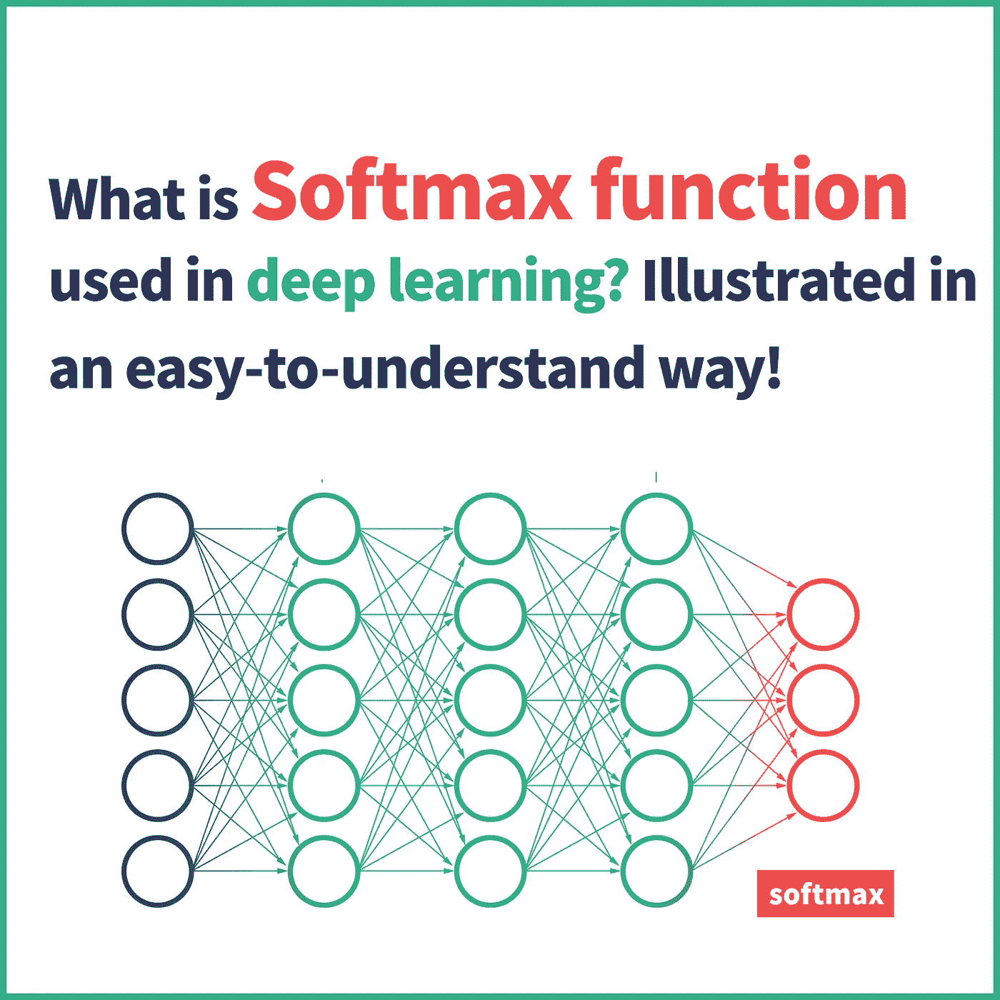
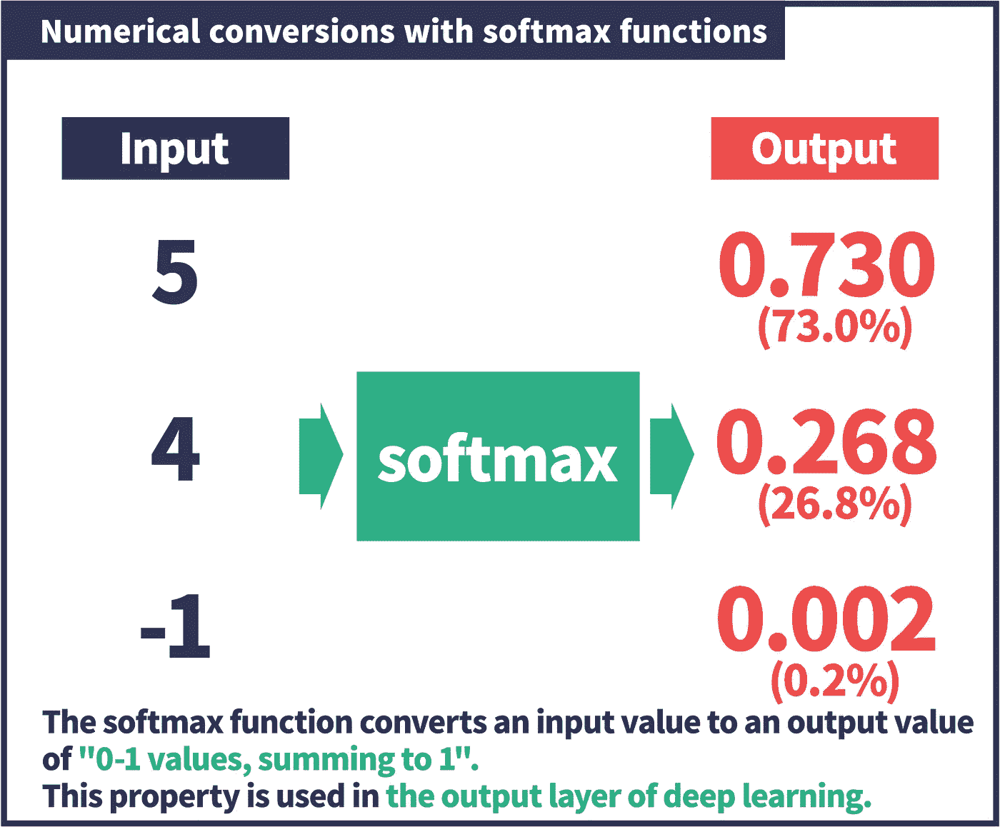
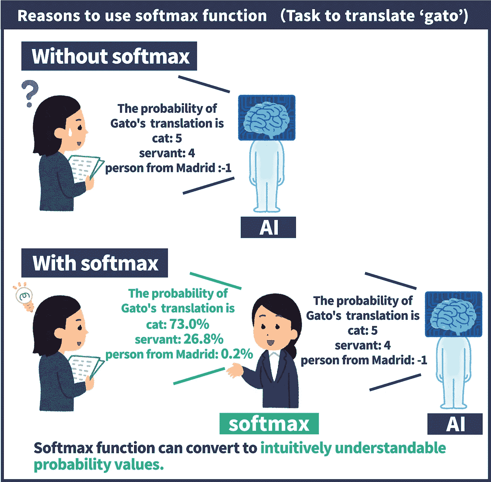
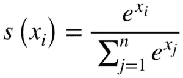
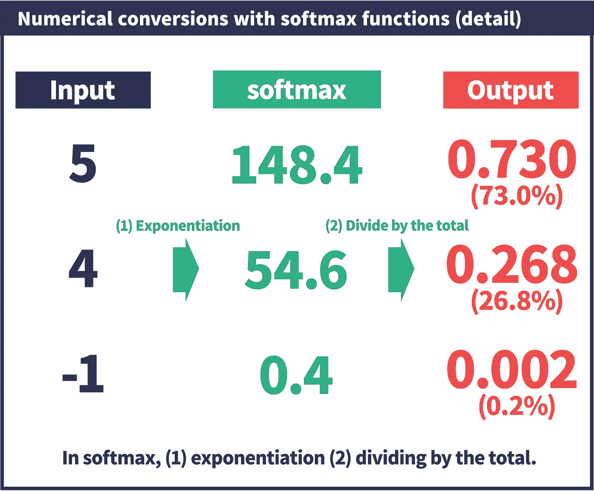
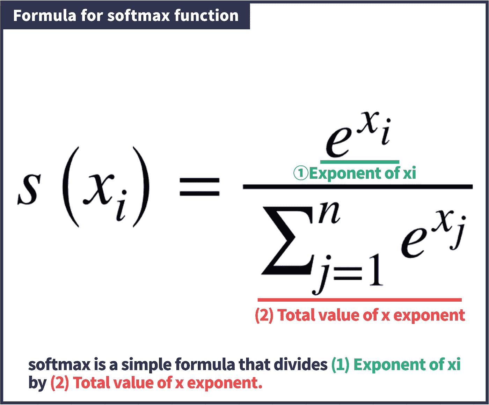

# Softmax 函数解释清楚且深入|深度学习基础

> 原文：<https://medium.com/mlearning-ai/what-is-the-softmax-function-used-in-deep-learning-illustrated-in-an-easy-to-understand-way-8b937fe13d49?source=collection_archive---------6----------------------->

softmax 函数广泛应用于深度学习模型中。然而，在许多情况下，论文和总结网站只是说“softmax”如“softmax 的结果~”，但没有对 softmax 的任何解释。
(Softmax 是自然语言之外广泛使用的一个至关重要的函数。)

什么是 softmax？“它是做什么的，”为了解决您的问题，我们将深入浅出地解释 softmax 函数！

# 第 1 章:用简单易懂的方式用插图解释 SOFTMAX 函数

在本章中，您将学习“什么是 Softmax 函数？它是如何工作的，为什么使用它”和“它在自然语言的实际模型中使用的情况”将使用插图以简单易懂的方式进行解释！

## 1.1 什么是 SOFTMAX 函数？

它是如何工作的，为什么使用它。
softmax 函数的工作原理用一句话来说，soft max 函数是**“一个将输入值转换为总和为 1 的 0–1 值的函数。**光是这个可能不太好理解，那我们来看看数字是怎么换算的。

如图所示，让我们考虑[5，4，-1]是输入值的情况。softmax 函数将输入值转换为“0–1 值，总和为 1”的输出值。在这种情况下，我们看到输入值[5，4，-1]被转换为[0.730，0.268，0.002]。我们可以看到，总和已经转换为概率值 1，0–1。

## 1.2 为什么使用 softmax 功能

接下来，我们将解释为什么使用 softmax。为什么我们需要“转换为 0–1 值，使总和为 1”？

简单来说，原因就是人类很难理解 AI 输出值的本来面目，**之后的处理也很困难。**

例如，考虑将西班牙语单词“gato”翻译成英语的任务。加托可能是“猫”、“仆人”、“马德里人”等等。人工智能将为这些可能的答案中的每一个给出一个概率值。**但是，问题是输出值很难理解。**我们来看一个插图。

如图所示，AI 产生的输出值如[猫:5，仆人:4，一个来自马德里的人:-1]。

如果不使用 softmax，人类很难理解“概率有多大？”。**如果有人说，“英文答案的概率对猫来说是 5，对马德里人来说是-1！”你会感到困惑，不是吗？**

另一方面，如果您使用 softmax，它会被转换为“0–1 的值，使得总和为 1”，这非常直观且易于理解。如图，如果告诉你“猫听影射的概率是 73%，女人听影射的概率是 0.2%”，就非常好理解了。

换句话说，softmax 就像是一个“AI 和人之间的翻译器”。Softmax 函数主要用在“最终层”，AI 产生的输出值在这里最终被转换。

如果你在论文或总结网站上听到有人说“soft max of ~”的结果，要明白“你是在把~的结果转换成一个容易理解的概率值。

## 1.3 在自然语言的实际模型中使用 Softmax 的场景

Softmax 在许多情况下被用作“分类问题的最后一层”。其实在 RNNLM 和 Attention 里也是作为最后一层。具体来说，RNNLM 用于“预测下一个单词”，注意力用于“翻译任务”，以生成每个任务的最终概率值。

RNNLM 和注意事项将在以下页面中深入解释。这两个模型在自然语言的历史上都是必不可少的，所以如果你感兴趣，请继续读下去。

注意在自然语言处理(NLP)是解释清楚和深入。

自然语言处理(NLP)中的 RNNLM 以深入易懂的方式进行了解释

## 第一章概要

*   softmax 函数将输入值转换为总和为 1 的 0–1 值
*   当有人说“softmax 的结果”时，你应该理解为“把~的结果转换成一个容易理解的概率。”

# 第 2 章:用公式深入解释 SOFTMAX

至此，您应该对 softmax 函数有了一个大致的了解。从这里开始，我们将使用数学公式来解释 softmax 函数。当然，这一章会有点难懂，但我们会尽可能简单地解释，所以不需要特别的数学知识。

如果你能彻底阅读和理解这一章，你应该能理解和解释 softmax 函数的公式。

## 整体工艺流程

首先，我们将解释整个流程。我将在本节开始时用一个更详细的图表版本来解释它。

如图所示，**soft max 函数取一个输入值，分两步将其转换为输出值。**

应用指数函数(e ),一切都转换成正数。(在示例中，您可以看到-1 被转换为 0.4，这是一个正值。)
除以总数。用(e)产生的数除以(e)中数的和。这导致“总计 1 个值”。
**按照这两个简单的步骤，我们已经“将输入值转换为总和为 1 的 0–1 值。**这是 softmax 函数的整个流程。

## 用公式详细解释

现在你理解了流程，让我们也看看公式。它可能在开始时看起来不容易理解，但是一旦你理解了这个过程的流程，它应该看起来像一个简单的公式。

你会看到这是一个很简单的公式，取 x 的指数，设为 ex，除以整体的总和。

## 第二章概要

*   Softmax 是一个简单的系统，它(1)取一个指数，(2)除以总数。
*   如果你理解这个过程的流程，这个公式也很简单。

# 摘要

**第 1 章**

*   softmax 函数将输入值转换为 0 到 1 之间的值，其中和为 1。
*   当有人说“softmax 的结果”时，应该理解为“把~的结果转换成一个容易理解的概率。

**第二章**

*   softmax 是一种简单的机制，它(1)取一个指数，然后(2)将其除以和。
*   如果你理解这个过程的流程，这个公式也很简单。

## 博客网址

 [## 自然言語処理(NLP)のSoftmax 関数をわかりやすく、深く解説 - イラストでわかるNLP｜自然言語処理

### 自然言語のモデルで広く使われているsoftmax 関数。しかし、論文やまとめサイトでは「〜の結果をsoftmaxする」のように、「softmaxする」と書かれているだけで、特にsoftmaxについて説明がない場合が多いのが現状です。…

nlpillustration.tech](http://nlpillustration.tech/?p=622) 

## 博客顶部

 [## イラストでわかるNLP｜自然言語処理

### 自然言語処理についてイラストでわかりやすく、深く解説します。

nlpillustration.tech](http://nlpillustration.tech/)  [## Mlearning.ai 提交建议

### 如何成为 Mlearning.ai 上的作家

medium.com](/mlearning-ai/mlearning-ai-submission-suggestions-b51e2b130bfb)