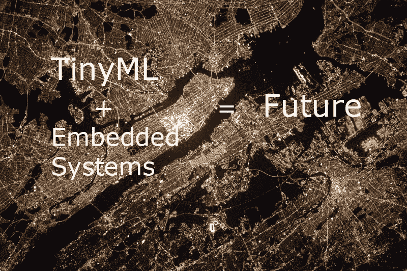
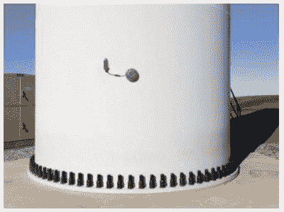
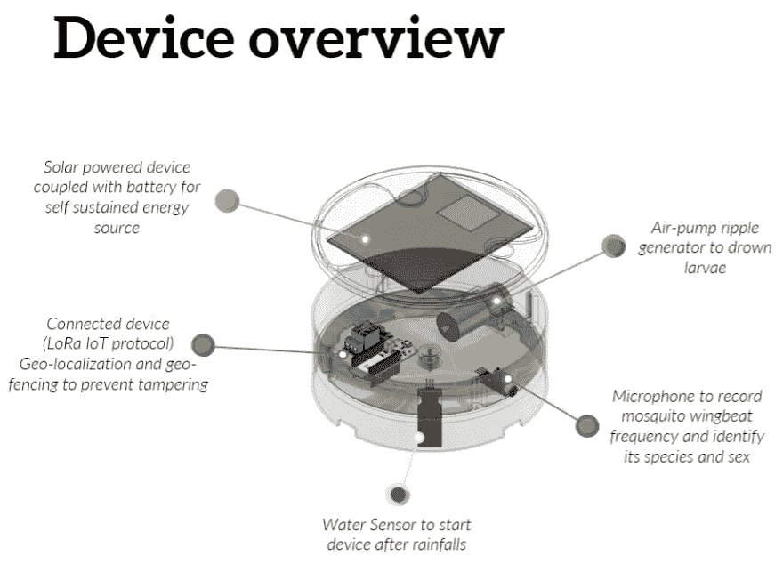

# 什么是 TinyML？为什么 TinyML 很快就会无处不在？

> 原文：<https://medium.com/mlearning-ai/what-is-tinyml-why-tinyml-will-soon-be-everywhere-ab595fb9b782?source=collection_archive---------8----------------------->

# **什么是 TinyML？**

TinyML 是一个前沿领域，它将机器学习(ML)的变革力量带到了小型设备和嵌入式系统的性能和功耗受限领域。在该领域的成功部署需要对应用程序、算法、硬件和软件有深入的了解。

ML applied on Microcontroller

# TinyML 的发展

TinyML 将很快无处不在，为下一代智能嵌入式设备提供动力。这些设备将位于我们的家中和非常偏远的地方，能够对工业和生态进行远程监控。如今，在这些远程监控设置中，99%的原始传感器数据被丢弃，这是机器学习的大量数据！

TinyML 可提供独特的解决方案:通过汇总和分析低功耗嵌入式设备边缘的数据，TinyML 可提供 **smart** 汇总统计，将这些先前丢失的模式、异常和高级分析考虑在内[ [1](https://www.mckinsey.com/~/media/McKinsey/Industries/Technology%20Media%20and%20Telecommunications/High%20Tech/Our%20Insights/The%20Internet%20of%20Things%20The%20value%20of%20digitizing%20the%20physical%20world/The-Internet-of-things-Mapping-the-value-beyond-the-hype.pdf) ] [ [2](https://hbr.org/webinar/2017/04/whats-your-data-strategy) ]。

在本文中，我们调查了一些对 TinyML 有巨大潜力的新兴应用领域。这个列表只是对即将出现的大量应用程序的一个小小的预览。

# TinyML 的应用

## 工业预测性维护:

在工业环境中，TinyML 已经被用于提供更智能的传感，从而实现高级监控，提高生产率和安全性。例如，远程风力涡轮机的维护和监控可能非常困难和耗时。然而，如果我们能够主动预测机器将会有故障，我们就可以在任何故障之前预测性地进行维护。这种“预测性维护”可以显著节约成本，因为它减少了停机时间，提高了系统的可用性，提高了产品的可靠性，从而为最终用户/客户提供了总体上更高质量的服务。

有许多 TinyML 应用程序用于预测性维护。例如，澳大利亚初创公司 Ping Services 推出了一种新型物联网设备，可以在涡轮机运行时持续自主地对其进行检查。通过磁性附着在任何涡轮机的外部(注意下图中的小设备)，并分析边缘的详细数据和云中的汇总数据，该设备可以在涡轮机内部出现问题之前有效地警告任何潜在问题[ [3](https://www.pingmonitor.co/) ][ [4](https://www.engineering.com/story/iot-device-detects-wind-turbine-faults-in-the-field) ]。

## 农业:

每天，木薯为 5 亿多非洲人提供食物。然而，这一重要的稳定不断受到各种疾病的攻击。由阿曼达·拉姆查兰博士领导的 PlantVillage 团队开发了 Nuru 应用程序，以帮助农民识别和治疗这些疾病。通过在手机上使用 TensorFlow Lite 运行机器学习，该应用程序无需访问互联网即可实现实时缓解，而访问互联网是许多偏远农民的关键要求(见下图中的系统运行情况)。该系统的下一代将走得更远——利用 tinyML 和微控制器的 TensorFlow 等技术，在远程农场部署传感器，以实现更好的跟踪和分析[ [5](https://grow.google/intl/europe/story/transforming-farmers%E2%80%99-lives-with-just-a-mobile-phone) ]。

## 医疗保健:

太阳能吓唬蚊子项目部署了小型智能物联网(IoT)机器人平台，以帮助遏制疟疾、登革热和寨卡病毒等蚊媒传染病的传播。该系统通过搅动可能含有蚊子幼虫的水来扰乱蚊子的繁殖周期。该系统使用雨水和声音传感器来确定何时需要搅动水以节省电池，并使其能够无限期地依靠太阳能运行。它还通过低功耗低速通信协议发送智能汇总统计数据和警报，以警告可能的蚊子大规模繁殖事件。通过使该系统自给自足、体积小、价格合理，这些设备可以广泛部署，防止蚊子传播。所有必要的组件都包含在一个比足球小的组件中。

## 野生动物保护:

在陆地上:

TinyML 也已经被用于生态和环境监测。例如，在过去的 10 年里，印度的西里古里-贾拉拉巴德铁路发生了 200 多起与大象相撞的致命事故。来自加泰罗尼亚理工大学应用生物声学实验室的研究人员设计了一个智能声学和热传感器系统，使用太阳能运行的定制机器学习模型作为早期预警系统(见下图——具有自持能源的一体化封装允许靠近铁路，而不需要额外的基础设施，如电力线)[ [7](https://www.zdnet.com/article/elephants-vs-trains-this-is-how-ai-helps-ensure-they-dont-collide/) 。

## 在海里:

类似的系统也被部署在西雅图和温哥华附近的水道，以防止繁忙航道上的鲸鱼袭击。这些智能 ML 供电的传感器能够实现持续的实时监控和更高的传感器部署密度，从而提高整体系统效率和功效[ [8](https://graphics.wsj.com/glider/google-builds-ai-to-help-ships-and-whales-coexist-f4b74f53-bba5-442f-90a4-e42dfb13dad2?mod=e2twd) ]。

如今，TinyML 的其他现有部署有很多。

我希望您能从这篇关于 TinyML 及其应用的文章中获得一些新的东西。

快乐学习，敬请关注😊。

# 参考资料:

1.  [物联网:描绘宣传之外的价值](https://www.mckinsey.com/~/media/McKinsey/Industries/Technology%20Media%20and%20Telecommunications/High%20Tech/Our%20Insights/The%20Internet%20of%20Things%20The%20value%20of%20digitizing%20the%20physical%20world/The-Internet-of-things-Mapping-the-value-beyond-the-hype.pdf)
2.  [您的数据策略是什么](https://hbr.org/webinar/2017/04/whats-your-data-strategy)
3.  [准确的数据意味着更少的停机时间和改进的风力涡轮机叶片性能](https://pingmonitor.co/)
4.  [IOT 装置现场检测风机故障](https://www.engineering.com/story/iot-device-detects-wind-turbine-faults-in-the-field)
5.  [用一部手机改变农民的生活](https://grow.google/intl/europe/story/transforming-farmers%E2%80%99-lives-with-just-a-mobile-phone)
6.  [太阳能吓蚊子](https://hackaday.io/project/174575-solar-scare-mosquito-20)
7.  [大象 vs 火车:这就是人工智能如何帮助确保它们不会相撞](https://www.zdnet.com/article/elephants-vs-trains-this-is-how-ai-helps-ensure-they-dont-collide/)
8.  [谷歌造 AI 助船鲸共存](https://graphics.wsj.com/glider/google-builds-ai-to-help-ships-and-whales-coexist-f4b74f53-bba5-442f-90a4-e42dfb13dad2?mod=e2twd)

 [## Mlearning.ai 提交建议

### 如何成为 Mlearning.ai 上的作家

medium.com](/mlearning-ai/mlearning-ai-submission-suggestions-b51e2b130bfb)