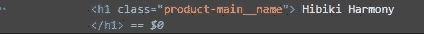

# 什么是 web 抓取，我如何从 Web 上抓取我的数据？！

> 原文：<https://medium.com/mlearning-ai/what-is-web-scraping-and-how-can-i-scrape-my-data-from-the-web-e1adfd438a3e?source=collection_archive---------5----------------------->

W eb 抓取是利用机器人从网站中提取内容和数据的过程。

与只复制屏幕上显示的像素的屏幕抓取不同，网络抓取提取潜在的 HTML 代码，以及存储在数据库中的数据。然后，抓取工具可以将整个网站内容复制到其他地方。


Photo by [Ilya Pavlov](https://unsplash.com/@ilyapavlov?utm_source=medium&utm_medium=referral) on [Unsplash](https://unsplash.com?utm_source=medium&utm_medium=referral)

网络抓取用于各种依赖数据采集的数字业务。合法的使用案例包括:

*   搜索引擎机器人抓取网站，分析其内容，并对其进行排名。
*   价格比较网站部署机器人自动获取联合卖家网站的价格和产品描述。
*   市场研究公司使用抓取工具从论坛和社交媒体中提取数据(例如，用于情感分析)。

网络抓取也被用于非法目的，包括降低价格和窃取版权内容。被“掠夺者”盯上的在线实体可能会遭受严重的财务损失，尤其是如果它是一家严重依赖竞争性定价模式或内容分发交易的企业。

# 我如何从网上搜集数据？

网络搜集经历已知的阶段，这些阶段除了在某些情况下不会改变，但是网络搜集的基本阶段是:

*   识别独特的 HTML 站点结构
*   提取和转换内容
*   存储抓取的数据

本文使用 Python 的一个名为 Beautiful Soup 的 web 抓取框架的实现来讨论 Web 抓取中涉及的步骤。**抓取网页的步骤:**

1.  向您想要访问的网页的 URL 发送 HTTP 请求。服务器通过返回网页的 HTML 内容来响应请求。对于这个任务，我们将使用第三方 HTTP 库来处理 python 请求。
2.  一旦我们访问了 HTML 内容，就剩下解析数据的任务了。由于大多数 HTML 数据是嵌套的，我们不能简单地通过字符串处理来提取数据。我们需要一个解析器来创建 HTML 数据的嵌套/树结构。有许多可用的 HTML 解析器库，但最先进的是 lxml。
3.  现在，我们需要做的就是导航和搜索我们创建的解析树，即树遍历。对于这个任务，我们将使用另一个第三方 python 库，[【美汤】](http://www.crummy.com/software/BeautifulSoup/)。这是一个 Python 库，用于从 HTML 和 XML 文件中提取数据。
4.  在我们提取数据后，我们希望将它们存储在 CSV 或表中，我们将使用 pandas 库来完成这项任务。

**安装所需的第三方库**

```
pip install requests
pip install bs4
pip install pandas
```

**从网页访问 HTML 内容**

```
import requests
URL = "https://www.thewhiskyexchange.com/p/29388/hibiki-harmony"
r = requests.get(URL)
print(r.content)
```

让我们试着理解这段代码。

*   首先导入请求库。
*   然后，指定要抓取的网页的 URL。
*   向指定的 URL 发送 HTTP 请求，并将来自服务器的响应保存在名为 r 的响应对象中。
*   现在，作为 print r.content 来获取网页的**原始 HTML 内容**。它属于“字符串”类型。

注意:有时你可能会得到一个错误“不接受”,所以尝试添加一个浏览器用户代理，如下所示。从这里找到你的基于设备和浏览器的用户代理【https://deviceatlas.com/blog/list-of-user-agent-strings 

```
headers = {'User-Agent': "Mozilla/5.0 (Windows NT 10.0; Win64; x64) AppleWebKit/537.36 (KHTML, like Gecko) Chrome/42.0.2311.135 Safari/537.36 Edge/12.246"}
# Here the user agent is for Edge browser on windows 10\. You can find your browser user agent from the above given link.
r = requests.get(url=URL, headers=headers)
print(r.content)
```

**解析 HTML 内容**

```
import requests
from bs4 import BeautifulSoup

URL = "https://www.thewhiskyexchange.com/p/29388/hibiki-harmony"
r = requests.get(URL)

soup = BeautifulSoup(r.content, 'lxml') # If this line causes an error, run 'pip install lxml' or install html5lib
print(soup.prettify())
```

BeautifulSoup 库的一个非常好的地方是它建立在 html5lib、lxml、html.parser 等 HTML 解析库之上。所以 BeautifulSoup 对象和指定解析器库可以同时创建。在上面的例子中，

```
soup = BeautifulSoup(r.content, 'lxml')
```

我们通过传递两个参数来创建一个 BeautifulSoup 对象:

*   **r.content** :是原始的 HTML 内容。
*   lxml :指定我们想要使用的 HTML 解析器。

现在**soup . pretify()**被打印出来，它给出了从原始 HTML 内容创建的解析树的可视化表示。

## **在解析树中搜索和导航**

现在，我们想从 HTML 内容中提取一些有用的数据。soup 对象包含嵌套结构中的所有数据，这些数据可以通过编程方式提取。在我们的例子中，我们正在抓取一个包含一些产品的网页。因此，我们希望创建一个程序来保存“名称”、“浓度”、“评级”、“描述”、“股票 _ 行动”和“价格”(以及所有与它们相关的信息)。

```
#Python program to scrape website 
#and save products infomation from website
import requests
from bs4 import BeautifulSoup
import pandas as pd

URL = "https://www.thewhiskyexchange.com/p/29388/hibiki-harmony"
r = requests.get(URL)
soup = BeautifulSoup(r.content , 'lxml')
name = soup.find('h1', class_ = 'product-main__name').text.strip()
concentration = soup.find('p' , class_ = 'product-main__data').text.strip()
try:
    rating = soup.find('div', class_="review-overview").text.strip()
except:
    rating = 'no rating'
desc = soup.find('div', class_="product-main__description").find('p').text.strip()
stock_action = soup.find('p',class_="product-action__stock-flag").text.strip()
price = soup.find('p',class_="product-action__price").text.strip()

wisky = {
        'Name':name,
        'Concentration':concentration,
        'Rating':rating,
        'Description':desc,
        'Stock_Action':stock_action,
        'Price':price
        }
df = pd.DataFrame(wisky, index = [1])
df.to_csv('japanes_wisky_store_data.csv',index = False)
```

在继续之前，我们建议您浏览我们使用 soup.prettify()方法打印的网页的 HTML 内容，并尝试找到一种模式或导航到该信息的方法。关于“名称”、“集中度”、“评级”、“描述”、“股票 _ 行动”和“价格”。

*   注意，名称位于“h1”容器中，该容器的类是“product-main__name”。因此，我们使用 **find()** 方法找到‘h1’元素:

```
name = soup.find('h1', class_ = 'product-main__name').text.strip()
```

*   第一个参数是要搜索的 HTML 标记，第二个参数是一个字典类型的元素，用于指定与该标记相关联的附加属性。 **find()** 方法返回第一个匹配的元素。你可以试着打印**table . pretify()**来了解这段代码做了什么。
*   我们从它的文本中提取我的。文本并通过 strip()删除空格和其他内容
*   我们可以通过右键单击，然后单击 inspect，了解我想要的术语的标签和属性，从而了解名称和其他名称的标签。
*   通过知道术语的标签和属性，我可以像在程序中一样通过 find()提取它。



我可以对术语“集中度”、“评级”、“描述”、“股票 _ 行动”和“价格”执行相同的步骤。

我们创建了一个字典来保存我们产品的所有信息。

这是笔记本，它包含了从网站上抓取所有产品的完整代码。[代码](https://github.com/talalatef/Data-Science-Portofolio/blob/main/Web-Scraping/japanes_wisky/product_scraping.ipynb)

最后，我们可以说我们对网络抓取有了一个很好的看法，并且知道它的发展阶段:

*   识别独特的 HTML 站点结构
*   提取和转换内容
*   存储抓取的数据

数据提取是一个例行程序，除了在简单的情况下不会失败，我们将面临的最大挑战是，我们没有机会使用页面的 HTML 文件，所以我们将使用另一种方法，即我们将通过 selenium library 提取数据，这是另一个可能在未来讨论的问题。

**如果你想要一个学习网页抓取的好课程，我建议你看这个** [**课程**](https://youtube.com/playlist?list=PLRzwgpycm-Fio7EyivRKOBN4D3tfQ_rpu) ，我的文章就摘自其中。

如果您发现我的文章对您有用，我希望您支持我，并关注我以获得更多有用的文章😊😊。

[](/mlearning-ai/mlearning-ai-submission-suggestions-b51e2b130bfb) [## Mlearning.ai 提交建议

### 如何成为 Mlearning.ai 上的作家

medium.com](/mlearning-ai/mlearning-ai-submission-suggestions-b51e2b130bfb)