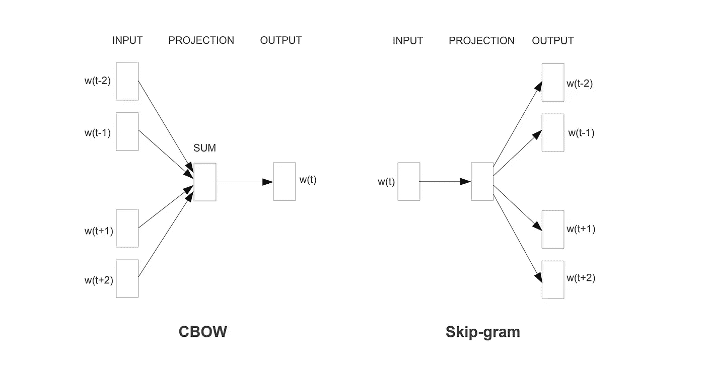

# Word2Vec 是什么？

> 原文：<https://medium.com/mlearning-ai/what-is-word2vec-bf2c5090f0b8?source=collection_archive---------4----------------------->

Word2Vec 是用 n 维向量表示的单词。它从论文[向量空间](https://arxiv.org/pdf/1301.3781.pdf)中单词表示的有效估计开始。在这篇论文中，Mikolov 等人。根据以下动机提出了两种新方法(跳格法和连续词袋法):

1.  改变传统技术中对单词的处理方式。单词都是像 n-gram 或单词包这样的技术中的原子单位，它们之间的相似性没有被考虑在内。
2.  另一个动机是处理方法的数据限制。本文以语音识别中领域相关数据的缺乏为例说明了这种局限性。
3.  基于神经网络的语言模型明显优于 N-gram 模型。

基于这些原因，他们认为需要创建更先进的模型来提高 NLP 任务的质量。在这篇论文之前，我们已经尝试过将单词表示为向量，就像 Mikolov 在[的基于神经网络的高度屈折语言语言模型](http://www.fit.vutbr.cz/research/groups/speech/publi/2009/mikolov_ic2009_nnlm_4.pdf)中所做的那样。在这篇早期的论文中，他们使用简单的模型来学习连续的单词向量，并在这些表示的基础上训练神经网络模型。事实上，word2vec 方法可以被认为是这种早期尝试的更完整和成功的版本。这个版本被称为 Word2vec，在大多数 NLP 应用程序中被广泛用作预处理步骤。

**连续词袋法**

为 Word2Vec 表示提出的第一个模型是 CBOW 模型。一层网络被训练用于单词的表示。对于这个网络，作为一个参数，在一个训练步骤中作为输入的单词数可以由一个“窗口”来确定。窗口从输出字的两边取相同数量的字来创建输入。网络的输入是窗口中单词的一个热矢量表示的总和，真实输出是窗口中间单词的一个热矢量表示。换句话说，对一个单词的邻居进行分类，结果一定是那个单词(也就是很多单词:)。在处理过程中，窗口在单词列表中滑动，其中每个输出单词的权重不变。因此，当训练结束时，我们有与不同单词一样多的权重，这些权重将是输出单词的 word2vec 表示。

CBOW and Skip-gram models

**连续跳格模式**

CBOW 的相同逻辑适用于此，但方式相反。输入是一个热矢量表示的单词，输出是相邻单词的一个热矢量表示的总和。这一次，权重是输入单词的表示形式。

因此，相似的单词应该有相似的表达。这是根据论文实现的，更重要的是，单词向量的加法和减法给出了有意义的结果。例如，向量(“最大”)-向量(“大”)+向量(“小”)给出的向量与向量(“最小”)的余弦相似度非常接近。作为另一个例子，“法国对巴黎就像德国对柏林”的关系可以通过单词向量之间的相同代数运算来观察。

如前所述，这种方法被用作 NLP 应用程序的开始步骤，因此单词首先被转换成数字表示，word 2 vectors。

 [## Mlearning.ai 提交建议

### 如何成为移动人工智能的作者

medium.com](/mlearning-ai/mlearning-ai-submission-suggestions-b51e2b130bfb)