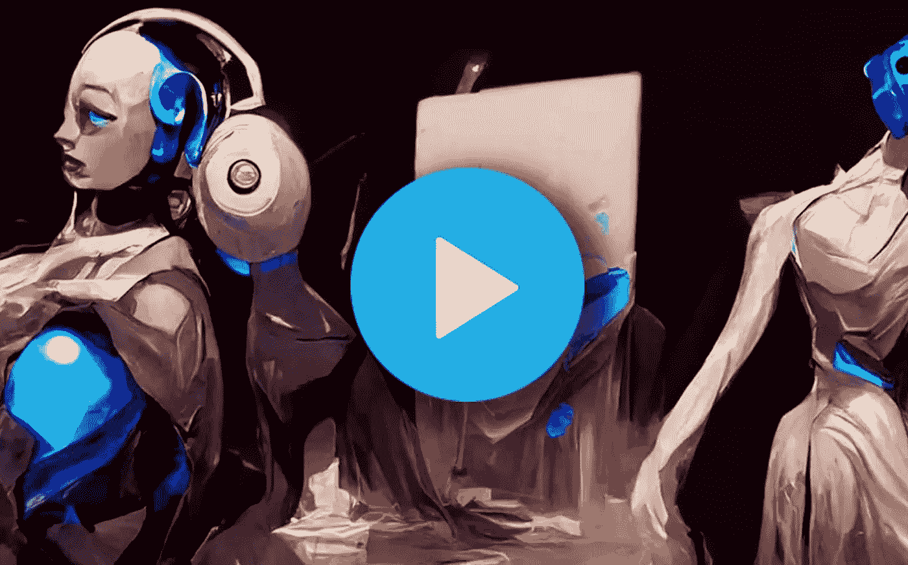

# 你对 AI 艺术有什么看法？

> 原文：<https://medium.com/mlearning-ai/what-is-your-opinion-about-ai-art-f22aa6608877?source=collection_archive---------5----------------------->

## [机器学习艺术](https://mlearning.substack.com/)

[3D Dancing Muses generated by AI art Robot](https://mlearning.substack.com/p/is-ai-art-really-art?r=9hp4d&s=w&utm_campaign=post&utm_medium=web)

我一直对一些关于艺术及其对我们的意义的最有趣的问题着迷。创作一件艺术品往往不仅仅是将两种或两种以上的元素结合在一起。这也是关于艺术家如何为他们的决定产生意义和理由。

*   【2022 年 4 月— AI 美工工具更新可以在这里找到➡️****⬅️****