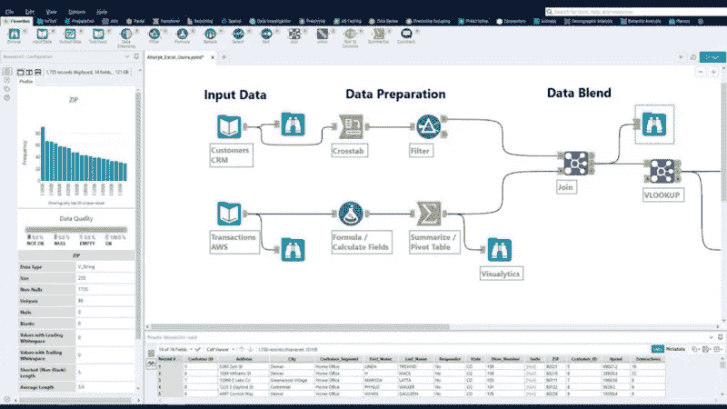

# 那究竟是什么？Alteryx 版本

> 原文：<https://medium.com/mlearning-ai/what-on-earth-is-that-alteryx-edition-1a92da141445?source=collection_archive---------3----------------------->

## 探索数据分析工具和包的广阔世界的一系列不定长度的文章

Alteryx Workflow

# 关于该系列:

我最近参加了一个数据分析师职位的面试，当面试开始谈到一个我在“Alteryx”之前从未使用过的包时，像任何紧张的求职者一样，我慌了。说服自己获得这个角色的关键(剧透:我没有)以及未来在数据世界的所有成功都取决于我摆脱 zoom 电话并成为 Alteryx 专家的能力。

当你在寻找数据方面的工作时，工作板上有 101 种公司希望体验的软件包、平台和技术。似乎没有两家公司使用相同的工具&每一家都认为自己的工具集比下一家好。正如上面的短文所强调的，这让你，求职者，感觉你需要把它们都学会，昨天就掌握了。

这当然是一项不切实际且艰巨的任务，对于想要进军数据世界的人来说，这不是最佳策略。

要学的东西太多了。

所以这个系列支持不同的方法。从各种包(从前面提到的 Alteryx 开始)中获得的一系列高层次信息，将允许您进行一般性发言，并熟悉首轮面试的技术。这样你就不用把周末浪费在这上面了！

# 关于 Alteryx 的所有信息:

# 1.Alteryx 是一种执行数据分析的无代码方式

Alteryx(发音为“all — tear — ix”)声称“简单、强大、极其简单”。它的主要卖点是，几乎没有编码经验的人可以对任何数据执行一系列高级分析。

# 2.你需要 Windows 来运行 Alteryx

Alteryx 只能在 PC 上运行，不能在 Mac 上运行，所以如果你在 Mac 上并且想尝试一下，你需要在虚拟环境中运行 Windows 查看[这篇](https://www.howtogeek.com/187359/5-ways-to-run-windows-software-on-a-mac/)文章，了解如何操作。

# 3.Alteryx 是一个“拖放”工作流

Alteryx 接口有各种各样的工具，您可以将它们拖入一个窗口，并与另一个工具连接。这可以像拖动“导入数据”并将其连接到“排序”工具以将所有数据分为两类一样简单，也可以像大量数据操作和各种统计功能一样复杂。Alteryx 的好处是，您不需要担心如何使测试在统计上合理，您只需要连接数据流&让 Alteryx 来完成剩下的工作。这对于拥有较小数据团队的团队或没有强大数学背景的个人来说是一大优势。

# 4.Alteryx 是一个黑盒

这是 Alteryx 中我发现最陌生和最难适应的部分(主要是因为使用 Python)。这意味着，当您将工具拖到屏幕上时，没有快速简单的“健全性检查”来直观地验证您正在对数据做您想要做的事情。Alteryx 支持一种简化的处理数据的方法，其中分析师知道他们想要对数据做什么，而不是探索性的或不太线性的处理加载到数据中的数据的方法。

# 5.分享见解和获取数据很容易

你的数据的报告和共享与 Alteryx 融合在一起，这使得它可以很容易地共享到该公司可能使用的另一个平台，如 Tableau。相反，从 Salesforce data 到 Hadoop analytics，查询任何数据都非常容易，这对于拥有大量来源数据的公司来说是一大优势。

# 底线

Alteryx 有一个陡峭的学习曲线，因为它的工作流程与许多数据分析师可能熟悉的非常不同，该公司为该平台提供了大量培训，如果你加入使用 Alteryx 的团队，你可能会利用这些培训。通过这种培训，您将能够对大数据进行高质量的分析，否则，如果您尝试用 R 或 Python 构建相同的管道，您将需要数年才能掌握。

# 红旗

Alteryx 标榜自己是低代码的，这意味着如果它被列为工作描述中的一项技能，或者在面试中出现，那么这个角色很可能也是低代码的角色。这意味着你不会在该公司摆弄最新的神经网络模型，而是你的角色可能是维护公司希望衡量的非常具体的数据流管道和预先建立的分析。这不一定会破坏交易，但在接受这个职位之前，你应该意识到这一点。

# 还感兴趣吗？

Alteryx 有一个月的免费试用，你可以在这里下载[。](https://www.alteryx.com/designer-trial/alteryx-free-trial)