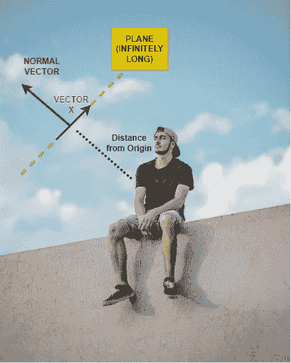
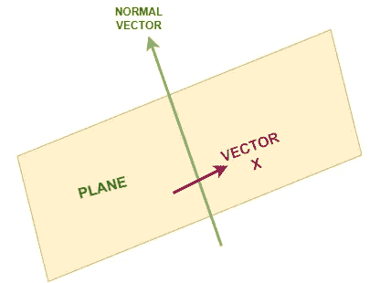

# 什么是真正的平面方程？

> 原文：<https://medium.com/mlearning-ai/what-really-is-an-equation-of-a-plane-7f4f325ad444?source=collection_archive---------5----------------------->

当你看到一个平面的方程时，你会想到什么？你是怎么解读的？这是机器学习中的一个关键概念。我想告诉你一个方程如何完全代表你卧室里的一个平面。😃

Photo by [Sebastián León Prado](https://unsplash.com/@elmundoderabbit?utm_source=medium&utm_medium=referral) on [Unsplash](https://unsplash.com?utm_source=medium&utm_medium=referral)

## 什么是飞机？

简单来说，在我们的三维世界中，一个平面是一个直的无限长的东西，它将空间分成两半。这里有一个虚拟的例子:

Will Francis on Unsplash

在上图中，想象一个无限长的东西，充当道路和草地之间的分隔物。我希望你得到一个粗略的想法，这就足够了。现在想象一下，当你读这篇文章的时候，一架飞机就在你身边，好吗？太好了！🙌

如果我想知道你刚刚想象的那架飞机，你会怎么告诉我？我不能进入你的大脑，对吗？你不能拍照，因为它在你的想象中，哈哈。这就是为什么你需要一个方程来表示一个平面，以便其他人可以在机器学习、AI 等中利用它。

## **创建平面方程:**

首先，我们需要一个原点 O，假设你现在坐的地方是我们的原点 O(x = 0，y=0，z = 0→3 个可爱的维度)。

**我们只需要两样东西来代表我们的飞机，有人猜吗？**
1。 ***距离*** *→那个平面离原点 O 有多远？*
2。 ***方向*** *→平面从原点 O 在什么方向？*

Credit: Alex Ware Unsplash

我们将使用上面的图像作为参考。
你首先要想到的是平面离原点 o 有多远
要做到这一点，想象一个**矢量 X** 这是无限长平面的一部分，这个特殊的矢量正好与平面的方向完美融合。
还有没错，这个矢量 X 到原点 O 的*距离就是*平面*到原点的距离，常识呃？
酷，现在我们有了距离平面的距离，因为我们刚刚想象的向量 X。*

**接下来就是知道飞机的方向了。我们肯定知道飞机可以面向任何方向，对吗？
我们将再次需要另一个叫做**法向量**的特殊向量的帮助来得到平面的方向。准备好了吗？**

在上图中，假设你想象了一个法向量(绿色),它的方向与你看到的方向相同，如果是这样，那么你的平面(黄色)将垂直于这个法向量(与平面成 90 度)。现在来概括一下。

***无论你想象法向量的哪个方向，* *你平面的方向都要垂直于这个法向量*** ，好吗？我的意思是，我们知道我们已经想象了平面上的向量 X 所以基本上，*法向量垂直于向量 X* ？考虑一会儿吧。

完美，我们有两个向量(法向量&向量 X)，可以完全表示一个平面。

***快问*** : *两个矢量互相垂直会怎么样？是的，他们的点积是零。*所以我们可以写:

*W =法向量(比如三维)
X =向量 X(比如三维)*

因此， *W.X=0*

现在，如果*平面不通过原点*，那么你可能需要做一些调整，并添加远离原点的额外位。
让我们称那个额外的位为截距***【w0】***并将其添加到我们上面的等式中。

*W.X + w0 = 0*

惊人的工作！我们已经算出了刚才想象的一个平面的方程，并在上面进行了推广。如果你展开 W.X 之间的点积，你会得到这样的结果:

*w1.x1 + w2.x2 + w3.x3 + w0 = 0* (三维示例)

如果你忘记了为什么等式的右边是零，那么让我提醒你，当两个向量相互垂直时，它们的点积是零。😅

干得漂亮！我们现在理解了平面方程的基本原理。

# **结论:**

1.  一般来说，我们只需要两个向量就可以完全定位一个平面。
2.  位于平面上的第一个向量 X 用于计算平面到原点的距离。
3.  垂直于平面的法向量用来寻找平面从原点的方向。
4.  因为法向量和向量 X 是垂直的，我们取它们之间的点积，得到一个平面的方程。
5.  法向量和向量 X 可以是任意维数，一个或两个甚至 100+。这条线的方程仍然保持不变。

跟着我，我才刚刚开始。感谢阅读，干杯！🍻

# **联系我:**

*邮箱:saurav@guptasaurav.com
领英:*[*https://www.linkedin.com/in/sauravgupta20*](https://www.linkedin.com/in/sauravgupta20/)

 [## Mlearning.ai 提交建议

### 如何成为 Mlearning.ai 上的作家

medium.com](/mlearning-ai/mlearning-ai-submission-suggestions-b51e2b130bfb)