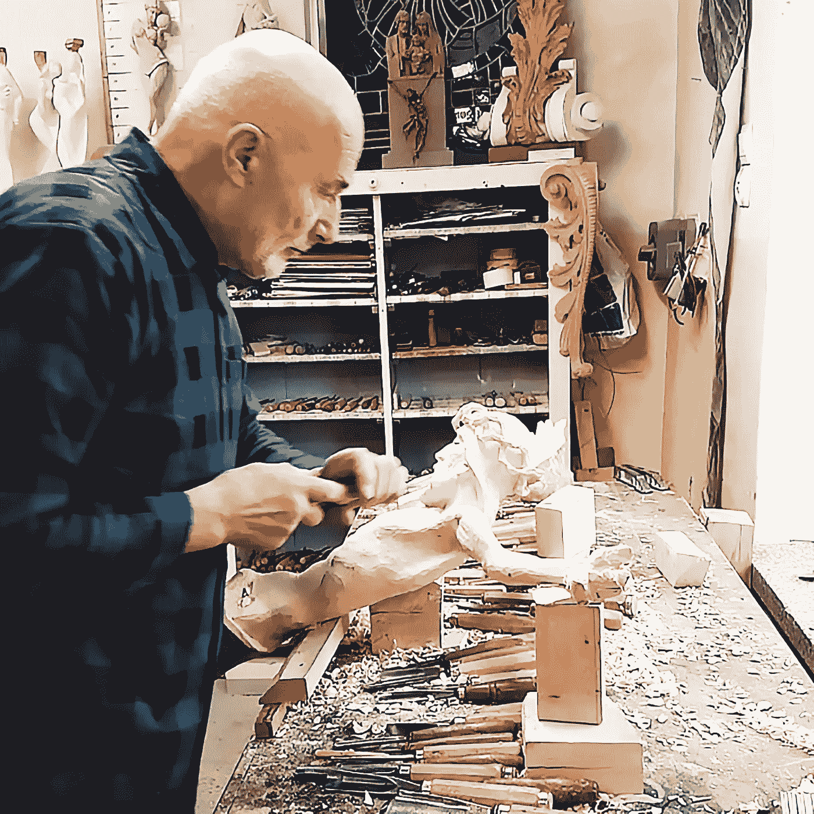

# 宗教能做些什么来帮助 AI？

> 原文：<https://medium.com/mlearning-ai/what-religion-can-do-for-ai-b604caa1dda6?source=collection_archive---------7----------------------->

## 艾艺术

## 自主算法备选方案

[https://www.instagram.com/gross_bildhauer/](https://www.instagram.com/gross_bildhauer/)

几年前，我和 [ML 顾问](https://medium.com/mlearning-ai/mlconsultants/home)一起为一群工程师进行培训。其中一个工程师问我[机器学习](https://www.linkedin.com/company/mlearning-ai/)是不是一个宗教派别。我不由自主地笑了。这个问题让我吃惊，也让我思考。这是关于[一个被](/mlearning-ai/how-i-use-gpt3-in-my-art-61e0a2d07f2)的力量变成不朽的人工智能艺术家…