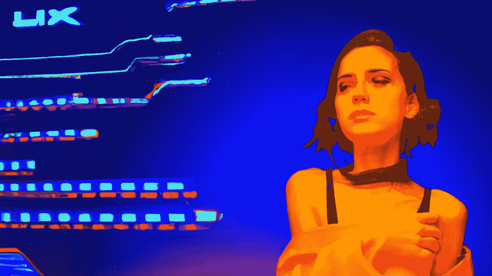

# 从事 AI 美术工作需要哪些技能？

> 原文：<https://medium.com/mlearning-ai/what-skills-do-you-need-to-work-in-ai-art-9e0dc3129cd7?source=collection_archive---------4----------------------->

## [你应该知道的新人工智能艺术发生器](https://mlearning.substack.com/p/new-ai-art-generators-you-should?r=z7zu8&s=w&utm_campaign=post&utm_medium=web)

## 哪里可以创作 AI 艺术？

[New AI Art Generators You Should Know About](https://mlearning.substack.com/p/new-ai-art-generators-you-should?r=z7zu8&s=w&utm_campaign=post&utm_medium=web)

每周，一项**机器学习**突破都会在人工智能实验室中回响。不幸的是，要跟上 ML 的所有新发展变得越来越难。但是 [AI 美工](https://mlearning.substack.com/p/coming-soon?r=z7zu8&s=w&utm_campaign=post&utm_medium=web)去哪里找最新的免费工具呢？