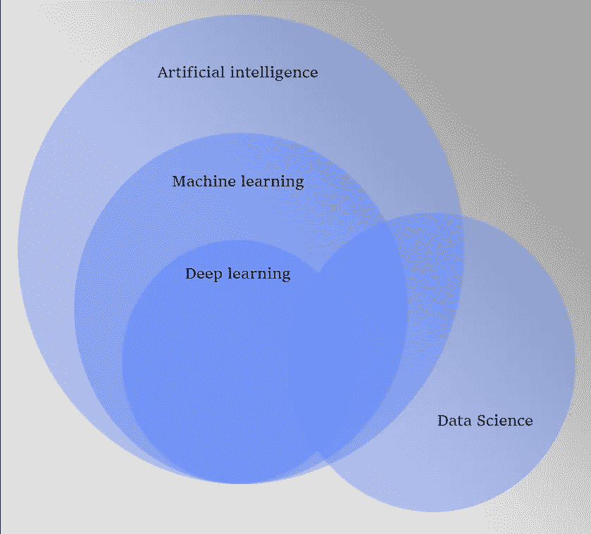

# 数据科学、机器学习和人工智能之间有什么区别

> 原文：<https://medium.com/mlearning-ai/what-the-difference-between-data-science-machine-learning-artificial-intelligence-d82f3ab1d6ea?source=collection_archive---------6----------------------->

Image by Author

当你听到计算机科学这个词时，你会想到什么？

你能想到一个能遵循指令和下棋的机器吗？或者仅仅是想创造一些人造的东西，比如机器人？这些都是人工智能(AI)的经典例子。但是我们谈论的是计算机科学…