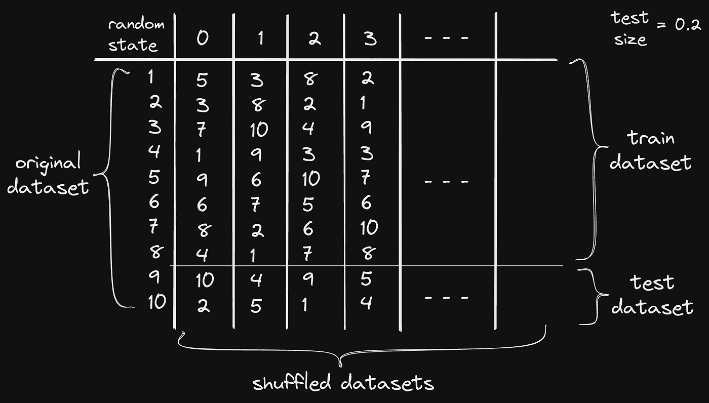
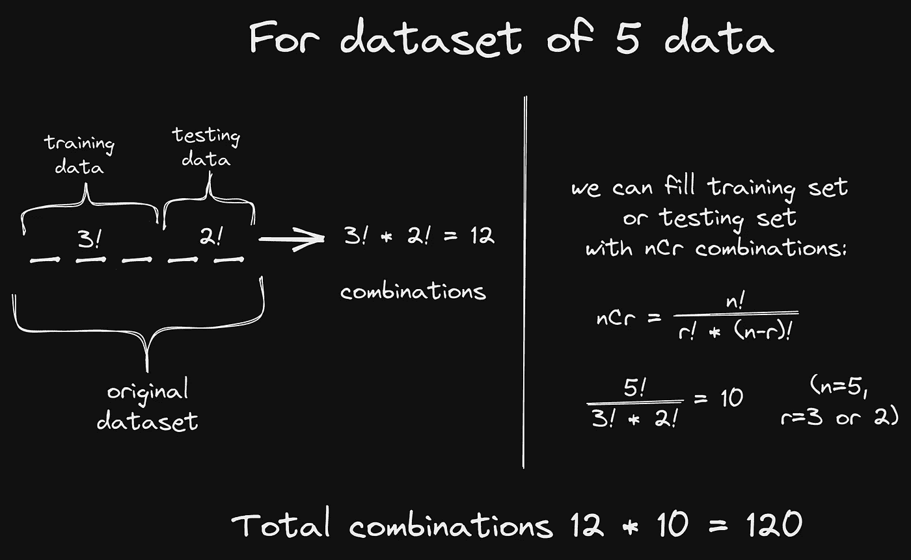

# 什么是 random_state？

> 原文：<https://medium.com/mlearning-ai/what-the-heck-is-random-state-24a7a8389f3d?source=collection_archive---------0----------------------->

## random_state = 0 或 42 或无

Image from [Unsplash](https://unsplash.com/photos/uKlneQRwaxY)

如果你在**机器学习**中把数据集分成训练和测试或者在任何超参数中，也许你以前都用过`random_state`。大多数人用`random_state`的值为 **0** 或 **42** 。但是你真的知道它到底是什么吗？那我们开始吧，了解一下是什么。

## 这是什么？

在 **Scikit-learn** 中，它控制在应用分割之前应用于数据的混洗。我们在`train_test_split`中使用它将数据分成训练和测试数据集。它采用下列值之一。

*   **无(默认)** 它使用来自`numpy.random`的全局随机状态实例。如果我们用`random_state=none`调用同一个函数，那么每次执行都会产生不同的结果。
*   **一个整数** 如果我们对`random_state`使用任何一个整数值，那么它将会对一个整数值产生相同的结果。如果我们改变`random_state`的值，那么只有结果会不同。

> `**random_state**` **不能为负！！！**

## 让我们看看它是如何工作的

假设我们有从 1 到 10 的 10 个数字的数据集，现在如果我们想把它分成训练数据集和测试数据集，测试数据集的大小是整个数据集的 20%。

训练数据集有 8 个，测试数据集有 2 个数据样本。因此，我们确保随机进程每次都会输出相同的结果，这使得代码具有可重复性。因为如果我们不混洗数据集，那么每次都会产生不同的数据集，并且每次都用不同的数据来训练模型是不好的。

对于所有随机数据集，每个数据集分配一个`random_state`值。这意味着一个`random_state`值有一个固定的数据集。这意味着每次我们运行值为 1 的代码时，都会产生相同的分割数据集。

为了更好的直觉，请看下图。

Image of how random_state works

*   我想向你澄清一件事。我看到大多数人都在用`random_state = 42`，连我也用过。根据上图，对于值 42 的`random_state`有一个固定的混洗数据集。这意味着每当我们使用 42 作为`random_state`，它将返回一个混洗的数据集。

所以， **42 不是** `**random_state**` **的专用号。**

## 让我们看看如何使用它来分割数据集。

这里，我们使用葡萄酒质量数据集和线性回归模型。保持简单，因为我们主要是`random_state`，而不是准确性。

Use of random_state in splitting

在上面的代码中，对于`random_state`为 0，`mean_squared_error`为 0.3847197820124。如果我们尝试不同的`random_state,`值，那么每次的误差都会不同。

*   对于`random_state = 1`，得到`mean_squared_error`0。46660 . 68686868661
*   对于`random_state = 69`,得到`mean_squared_error`0。36860 . 68888888861
*   对于`random_state = 143`，得到`mean_squared_error` 0。46860 . 68868688661

## 但是有多少种随机状态是可能的呢？🤔

我做过一个实验，通过打乱原始数据集，我们能得到多少个**独特的数据集**？

From GIPHY

我取了一个由 5 个数据组成的数据集(只是简单的 1，2，3，4，5)并分成训练和测试数据集 2000 次，用`random_state` 1 到 2000。我将这 2000 个混洗数据集存储在列表中。在这个列表中，我找到了 **120 个独特的数据集**。

这意味着我们可以假设对于 5 个数据的数据集，我们总共有 120 个数据集的唯一组合，这意味着我们可以将`random_state`设置在 0 到 119 之间。您可以将`random_state`设置为大于 119，然后它将给出 120 个唯一数据集中一个数据集。

根据我的理解，我可以这样解释:

Total unique combination of random_state

## 我们为什么需要它？

From GIPHY

*   想象一下，我们正在进行房价预测。在数据集中，从上到下，卧室的数量在增加，或者公寓的面积在增加。这被称为偏差数据。
    如果我们只是拆分数据而不进行混洗，它将在训练数据集上给出良好的性能，但在测试上给出较差的性能。为此，我们需要对数据进行洗牌。所以，如果我们使用`random_state`就可以避免这个问题。
*   当我们分割数据时，我们希望每次数据集的结果都是一致的。这意味着如果我们重新运行代码，那么训练和测试数据集每次都将保持不变。假设我想让你得到和我测试我的代码时一样的结果。为此需要`random_state`。
*   对于不同的`random_state`，我们可以看到性能上的差异。根据，我们在上面的例子中看到，不同的`random_state`给出不同的`mean_squared_error`。这意味着如果你随机选择`random_state`的值，如果你幸运的话，那么这个`random_state`的错误分数将会最小化。

## 随机状态的其他用途

*   **K 在 K means 中表示** ，`random_state`决定质心初始化的随机数生成。我们可以用一个整数值来确定随机性。此外，当我们希望每次都生成相同的集群时，这也很有用。
*   **随机森林** 在随机森林分类器和回归中，`random_state`控制构建树时使用的样本自举的随机性，以及在每个节点寻找最佳分割时要考虑的特征的采样。
*   **决策树** 在决策树分类器或回归中，当我们想找到控制分裂节点随机性的最佳特征时，`random_state`很有帮助。它将描述树的结构。
*   **随机搜索简历**
*   **分层折叠**

`random_state`在机器学习中其他很多地方都有使用，但大多数时候它用于数据的随机性或洗牌。

所以`random_state`到此为止！

点击这里查看我的另一个关于机器学习的博客👉 [**中等**](https://kishanmodasiya.medium.com/) **。**

谢谢你阅读它。如果你喜欢，那就给它鼓掌，分享一下。

From GIPHY

关注更多关于 [**中的**](https://kishanmodasiya.medium.com/) ，我会在这里分享更多机器学习的东西。这里是我的[**推特**](https://twitter.com/kishumds) ，关注并连接我那里，随时 DM。

*更多内容请看*[***plain English . io***](https://plainenglish.io/)*。报名参加我们的* [***免费周报***](http://newsletter.plainenglish.io/) *。关注我们关于*[***Twitter***](https://twitter.com/inPlainEngHQ)*和*[***LinkedIn***](https://www.linkedin.com/company/inplainenglish/)*。查看我们的* [***社区不和谐***](https://discord.gg/GtDtUAvyhW) *加入我们的* [***人才集体***](https://inplainenglish.pallet.com/talent/welcome) *。*

 [## Mlearning.ai 提交建议

### 如何成为 Mlearning.ai 上的作家

medium.com](/mlearning-ai/mlearning-ai-submission-suggestions-b51e2b130bfb)