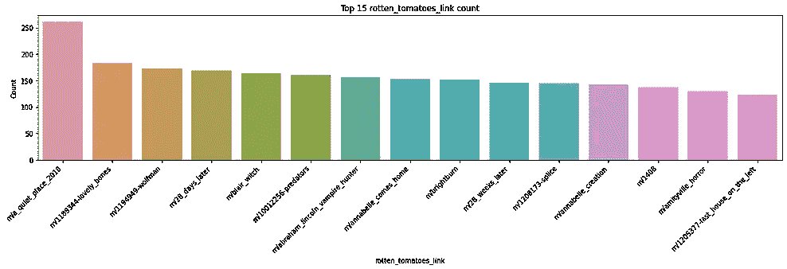
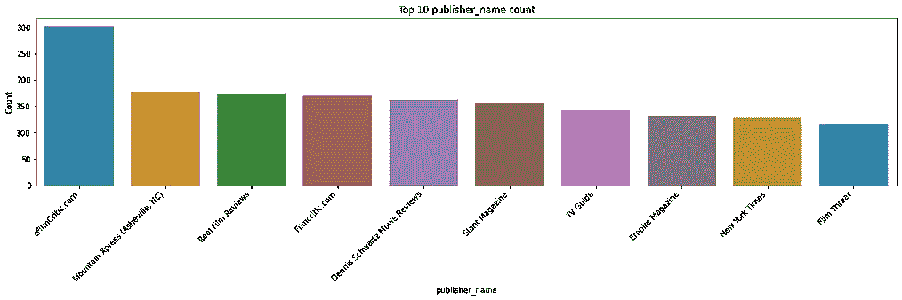
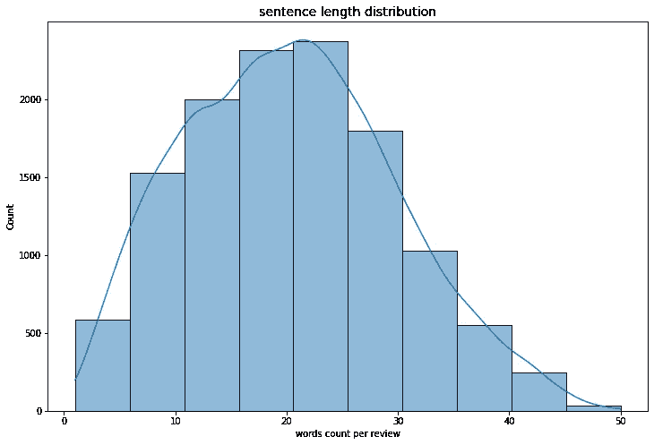
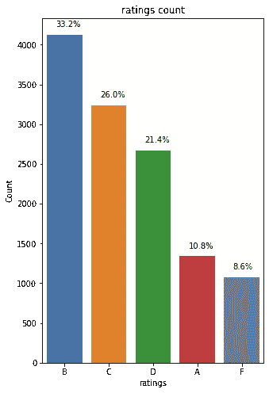
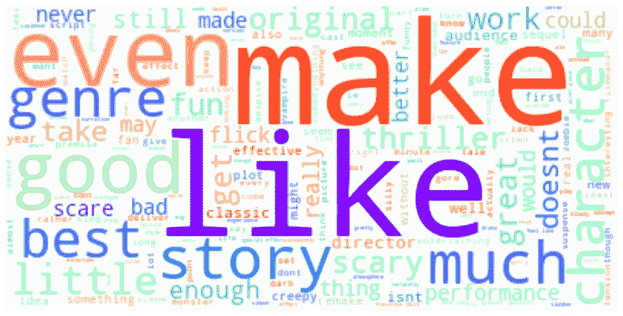
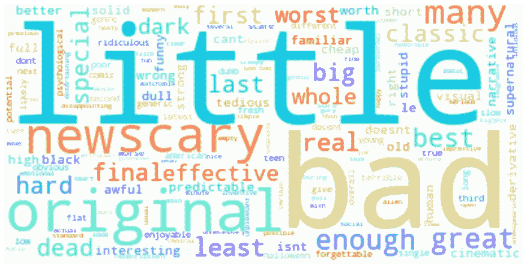
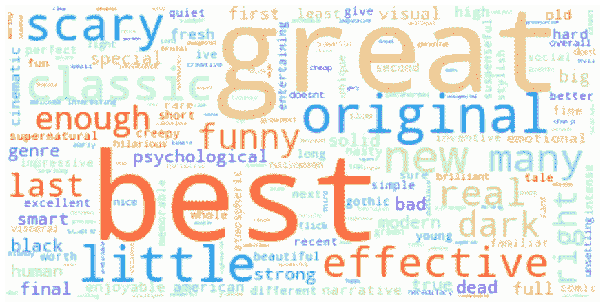
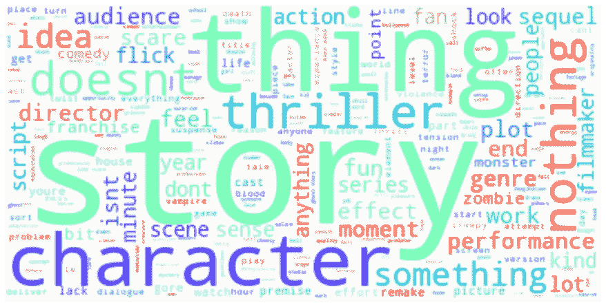

# 当我们谈论恐怖电影(NLP)时，我们谈论的是什么

> 原文：<https://medium.com/mlearning-ai/what-we-talk-about-when-we-talk-about-horror-movies-nlp-40e5ae7f985?source=collection_archive---------9----------------------->

从[上一个 EDA 项目](/@asunadch/horror-movie-analysis-eda-d199befd38bb)中，我们发现恐怖片非常不受欢迎，评分也很低。现在，让我们试着找到关于评论家们不喜欢的恐怖电影的答案，以及什么是好的恐怖电影的答案。这个项目使用的数据集来自 [Kaggle](https://www.kaggle.com/datasets/stefanoleone992/rotten-tomatoes-movies-and-critic-reviews-dataset?select=rotten_tomatoes_critic_reviews.csv) ，完整的笔记本在我的 [Github](https://github.com/Asuna-sama-1/Horror_movies) 上。

**第 1 部分:数据清理**

**第二部分:数据探索**

**第 3 部分:文本数据提取和探索**

**第四部分:见解**

Photo by [Rosie Sun](https://unsplash.com/@rosiesun?utm_source=medium&utm_medium=referral) on [Unsplash](https://unsplash.com?utm_source=medium&utm_medium=referral)

## 第 1 部分:数据清理

1.  复制
2.  空值
3.  一致地

收视率数据很乱。有些是 0-10 级，有些是 0-5 级，有些是 A-F 级。我们数据清理的最后一步是将评级统一到 A B C D 和 f 级。

## 第 2 部分:数据探索

**最受好评的电影&顶级发行商**

eFilmCritic.com 是最“努力工作”的出版商，总共为恐怖电影写了 304 篇评论。

最受诟病的电影是 2019 年的《我们》，其次是 2020 年的《隐形人》。

**收视率分布&评论内容长度**

Sentence Length Distribution( left) Rating Distribution (right)

句子长度向右倾斜，平均 20 个单词。最长的句子有 50 个单词；最短的句子只包含一个单词。

评级数据遵循指数分布。由于大多数评论率都处于中间偏下的水平，大约有 17.2%的评论处于极端水平。具体来说，B 是最常见的评级(33.6%)，第二常见的评级是 C，占所有评级的 27.6%。

## 第 3 部分:文本数据探索

## 文本数据处理步骤

1.  转换成小写
2.  从段落转换成句子
3.  从段落转换成句子
4.  删除空白
5.  删除标点符号
6.  删除号码
7.  删除停用词
8.  词干分析(不使用，因为唯一单词的数量不多)
9.  词汇化

在这一点上，外部文本被清理并被词条化为关键字列表。

WordCloud of Lemmatized reviews

上面的 WordCloud，我们可以看出评论家们提到了很多关于原著的故事，并且经常将恐怖电影与惊悚联系在一起。为了获得更多的信息，让我们将来用词性来处理文本！

## 词性

自然语言工具包(NLTK)是最全面和最著名的 Python NLP 库之一，有许多第三代扩展。
这个项目使用 *nltk.pos_tag* 来提取形容词、名词和二元语法。

> 当我们谈论恐怖电影时

## **第四部分:见解**

**形容词(情绪)**

Negative Adjective (left) Positive Adjective (right)

Negative Noun (left) Positive Noun (right)

*   负面评论通常更关注人物、情节、对话和剧本，而正面评论则更关注表演。
*   与惊悚片或经典类型相关的恐怖电影通常更受评论家的喜爱。
*   不管评分如何，评论家在写评论时都把重点放在了故事上。
*   评论家不喜欢恐怖电影的恐怖性。
*   大多数评论家对恐怖电影的评级持保守态度；他们倾向于给出平均评级。

完整的笔记本和简单的分类模型可以在这里查看[。](https://github.com/Asuna-sama-1/Horror_movies)

 [## Mlearning.ai 提交建议

### 如何成为 Mlearning.ai 上的作家

medium.com](/mlearning-ai/mlearning-ai-submission-suggestions-b51e2b130bfb)