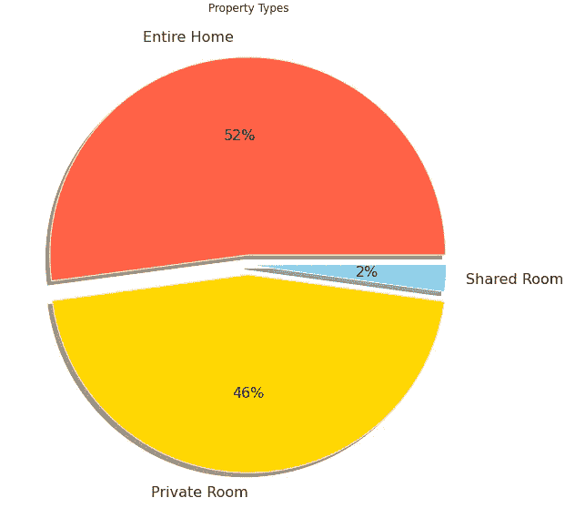
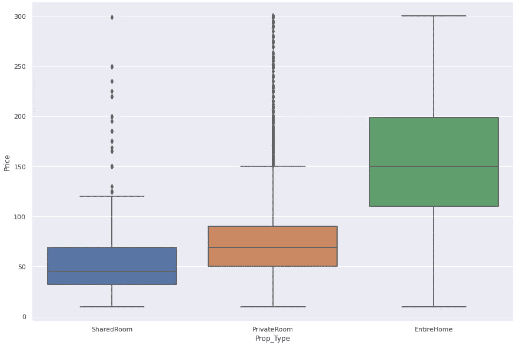
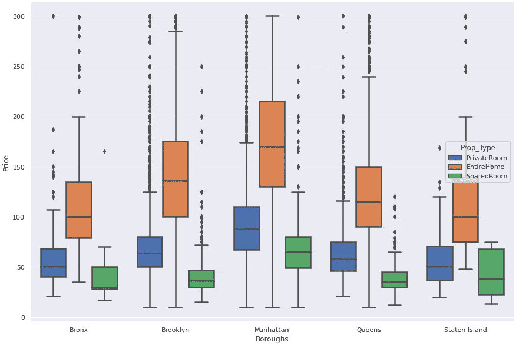
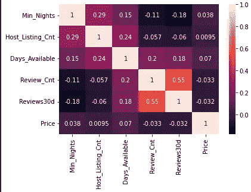
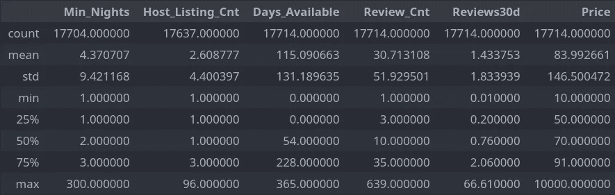
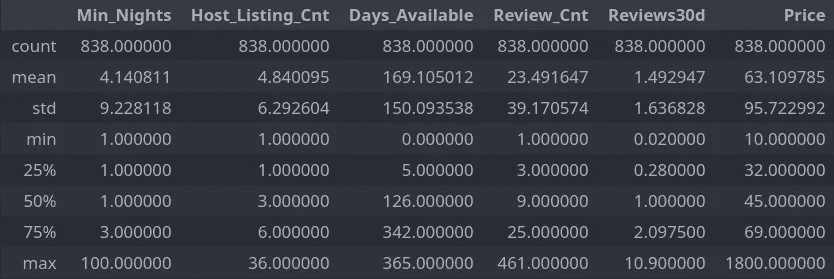
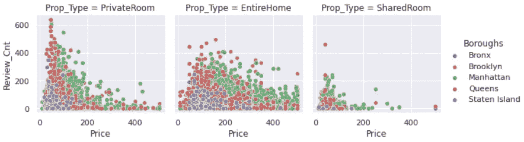

# 关于纽约的 airbnb，你需要知道什么

> 原文：<https://medium.com/mlearning-ai/what-you-need-to-know-about-airbnb-in-nyc-92ab935144f6?source=collection_archive---------9----------------------->

**简介:**

Airbnb 已经成为酒店的热门替代选择，允许任何人将自己的房产出租给其他人一段时间。如果你住在纽约，你可能会想知道你的房产能卖多少钱。如果你不是纽约人，那么你可能正在寻找 airbnb 房源。本文旨在回答一些围绕房产类型及其在 airbnb 上定价的问题。

**出现的问题:**

> 什么样的属性是可用的和最需要的？
> 
> 那么，我们如何知道纽约市 Airbnb 的“合理价格”是多少，以及它如何因区而异？
> 
> 如果你在纽约有一处房产，你应该如何设置你的列表，使其具有吸引力？

# **第一部分:不同种类的房产类型**

有 3 种不同类型的房产可以在 airbnb 上列出:**共享房间**、**私人房间**或**整个家庭**。下面是每个属性类型的组成。

Figure 1: The percentage of listings of each property type

我们看到，大部分房源是整个住宅或一个私人房间，它们合起来构成了所有 airbnb 房源的 98%。

大多数列表是针对整个家庭的( **52%** )。

没有太多的合租房间列表，这并不奇怪，因为对合租房间的需求很可能很低，因为大多数人都不想合租一个房间。

# **第二部分:在纽约购买 airbnb 的合理价格是多少？**

Figure 2: Median price for each of the three property types

整个房屋列表中最常见的价格是大约 150 美元(T21)，其次是 70 美元(T22)和 45 美元(T25)，分别是私人房间和共享房间。需要注意的一点是，整个住宅列表的可变性远远大于共享房间和私人房间列表。因此，为了在 airbnb 上获得公平的交易，它们应该在中间值附近，但我们也可以按区来看。

# **第三部分:各区价格**

Figure 3: The median price of property type based on the five boroughs

上面的方框图显示了曼哈顿在所有三种房产列表中的最高价格。

现在我们知道了价格的样子。我们可能想知道哪些房产在纽约最受欢迎，或者换句话说，哪些类型的房产需求最大，这些房源的可用天数将会减少。我们也可以用评论作为指标，看看哪些房产最受欢迎。

# **第四部分:从数据中获得更深刻的见解**

Figure 4: Correlation Matrix of some of the features from the data set

从这个相关矩阵中，我们可以推断出最低住宿天数、主机列表天数和可用天数之间的关系。因此，这表明 airbnb 列表的最低住宿天数越高，该列表可用的天数就越多。提供了一些见解，即人们希望获得一个短期的 airbnb，而不是必须停留更长的时间。

Figure 5: Summary Statistics for only **Entire Home** Listings

Figure 6: Summary Statistics for **Private Room** Listings

Figure 7: Summary Statistics for **Shared Room** Listings

正如我们所看到的，整个房屋列表最少可用，中位数为 **43** 天。这可能是最好的，如果你试图列出一个 airbnb 做整个家。

我们可以看到**全屋**房源的需求最高，因为它们的可用性低于私人房间或合租房间。

我们还可以研究评论和价格之间的关系，因为人们会认为一个列表的评论数量与价格相关。接近中间价的价格有更多的评论，表明这些房源出租得更多。

# **第五部分:如何给 airbnb 上的房产定价？**

Figure 8: Scatter plot of Price to Review count with the hue being the boroughs

更接近中间价格的房产列表往往具有最高的评论数量。随着价格偏离中间值，评论数量开始减少。这是有道理的，因为价格更高的房源往往会有更少的人租用，从而导致更少的评论。

请注意，**包房**的评论数量比**整栋房屋**的评论数量下降得更快。这可能表明，人们不愿意为一个私人房间支付那么多，而是更灵活地为整个住宅清单花费更多。

**结论:**

> 什么样的属性是可用的和最需要的？

整个家庭比私人房间或共享房间有更大的需求。此外，评论最多的**列表是那些在**中值价格**附近的列表。**

> 那么，我们如何知道纽约市 Airbnb 的“合理价格”是多少，以及它如何因区而异？

现在我们看了所有这些。我们对 airbnb 市场有了更好的了解。提到的最公平价格是每种财产类型的中间价格。布朗克斯最便宜，曼哈顿价格较高。

> 如果你在纽约有一处房产，你应该如何设置你的列表，使其具有吸引力？

那么，有了这些数据，我们应该如何在 airbnb 上列出一处房产呢？为了获得最佳效果，如果你想更快地租出整栋房子，以**较低的最低夜数**，我们认为这样可以减少挂牌出售的天数。对于整栋房屋，我们知道人们愿意花更多的钱，所以那些价格更高的房子最有利可图。

还有很多其他的东西我们可以深入研究，如果你感兴趣的话，我已经链接了一个 github，里面有我用过和没用过的所有图表。也有一些模型被开发来尝试基于数据集中的其他特征来预测区或资产类型。

将 airbnb 的数据与酒店/汽车旅馆的数据进行比较，并了解顾客在选择房源时的偏好差异，将会很有意思。

**Github:**[https://Github . com/defunSM/Data-Science-Machine-Learning-Portfolio/tree/main/NYC _ Airbnb](https://github.com/defunSM/Data-Science-Machine-Learning-Portfolio/tree/main/NYC_Airbnb)

 [## Mlearning.ai 提交建议

### 如何成为 Mlearning.ai 上的作家

medium.com](/mlearning-ai/mlearning-ai-submission-suggestions-b51e2b130bfb)