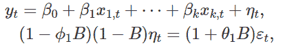
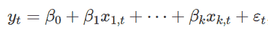
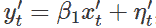
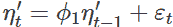
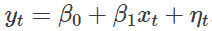

# 关于动态回归你应该知道什么

> 原文：<https://medium.com/mlearning-ai/what-you-should-know-about-dynamic-regression-b8b4e74eb32e?source=collection_archive---------2----------------------->

带有 ARIMA 误差的回归模型

Photo by [Markus Spiske](https://unsplash.com/@markusspiske?utm_source=unsplash&utm_medium=referral&utm_content=creditCopyText) on [Unsplash](https://unsplash.com/?utm_source=unsplash&utm_medium=referral&utm_content=creditCopyText)

这篇博客介绍了带有 ARIMA 误差的动态回归模型。我们将回答 4 个问题:

*   这是什么？
*   我们为什么需要它？
*   我们什么时候使用它？
*   如何用 R 来构建？

**问题 1:有 ARIMA 误差的动态回归模型是什么？**

具有 ARIMA 误差的动态回归模型使用 ARIMA 模型对自相关回归误差η(t)进行建模，并且将不相关的 ARIMA 误差ε(t)作为残差。例如，如果η(t)遵循 ARIMA(1，1，1)模型，我们可以将动态回归写成:

其中ε(t)是白噪声序列。

**问题 2:我们为什么需要它？**

您可能已经知道，回归模型的一个基本假设是

回归的残差是具有相同正态分布的独立随机变量。然而，如果回归的误差包含自相关性呢？我们可以使用传统的普通最小二乘法来估计系数吗？像 f 检验这样有意义的统计检验可靠吗？我们的答案是否定的。在处理时间序列数据时，这样的问题并不少见。

与线性回归模型不同，ARIMA 模型具有不相关的残差，但由于残差的高标准误差，它们的预测价值值得怀疑。另一方面，虽然 ARIMA 模型允许包含来自一个序列的过去观察的信息，但是它们没有利用其他统计上重要的信息。

为了解决这些问题，我们求助于具有 ARIMA 误差的动态回归模型，即将线性回归和 ARIMA 结合成一个强大的回归模型来预测时间序列数据。注意，在具有 ARIMA 误差的动态回归模型中，有两种类型的误差项，一种是来自回归模型的误差，我们用η(t)表示，另一种是来自 ARIMA 模型的误差，我们用ε(t)表示。只有 ARIMA 模型误差被认为是不相关的。

**问题 3:我们什么时候使用它？**

如上所述，带有 ARIMA 误差的动态回归模型对于由相关回归误差引起的问题是一个可行的解决方案。当我们使用时间序列变量进行回归时，回归误差显示自相关是很常见的。时间序列数据的一些例子包括:

*   公司的年度利润
*   产品的季度销售结果
*   月降雨量
*   每周零售额
*   每日股票价格
*   每小时电力需求

要分析这个模型是否有必要，可以先拟合一个普通的回归，并存储回归误差。然后检查回归误差的时间序列结构。如果它显示自相关，我们从假设 ARIMA 模型的合理简单猜测开始，诊断我们的初始猜测是否合适，并用新识别的回归误差的 ARMA 模型重新拟合整个模型，直到 ARIMA 误差成为白噪声序列。

**问题 4:如何用 R 来构建？**

R 包**寓言**提供了一组常用的时间序列预测模型，包括自动 ARIMA 建模。如果公式中包含外生预测因子，函数 **ARIMA()** 符合带有 ARIMA 误差的回归模型。例如，命令“ARIMA(y ~ x + pdq(1，1，0))”将适合该模型

在哪里

是一个 AR(1)错误。这相当于模型

其中η(t)是 ARIMA(1，1，0)误差。

关于何时需要求差，我们可以对回归误差进行 KPSS 检验。如果有必要求差，那么回归模型中的所有变量都要求差。但是返回的最终模型将按照原始变量来表示，即使它是使用差分变量来估计的。

此外，函数 **ARIMA()** 可以通过不指定 pdq()组件来帮助我们选择回归误差的最佳 ARIMA 模型。但是，对于一个 ARIMA 模型来说，AR 结构和 MA 结构的组合有很多，R 基于修正的 Akaike 的信息准则(AICc)选择最佳模型，而贝叶斯信息准则(BIC)也是实践中的一个重要指标。考虑到这样的原因，我们不应该放弃自己的估计。

**参考文献**

[1]hynd man，R. J .和 Athanasopoulos，g,《预测:原理和实践》, OTexts，第 3 版，2020 年

[2]应用时间序列建模和预测，理查德·哈里斯和罗伯特·索利斯，2003 年第一版

[3]《时间序列分析:预测与控制》，作者:乔治·博克斯、格温里姆·詹金斯、格雷戈里·c·赖因塞尔、格里塔·m·永，2015 年第 5 版

 [## Mlearning.ai 提交建议

### 如何成为 Mlearning.ai 上的作家

medium.com](/mlearning-ai/mlearning-ai-submission-suggestions-b51e2b130bfb)