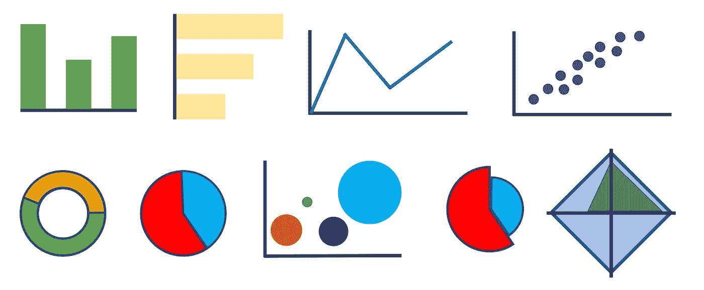

# 你想说什么，用图表来表达

> 原文：<https://medium.com/mlearning-ai/what-you-want-to-say-do-it-with-graphs-3046ab0fe5bf?source=collection_archive---------4----------------------->

## 改进您的下一个仪表板的图表和建议列表

浏览网页时，我看到一个页面，它允许你创建图表来可视化用户加载的数据。它允许你免费绘制图表，尽管它有一个付费版本。它允许您给图形一个基本格式，并将其导出为图像。它叫查特。这是一个基本的…