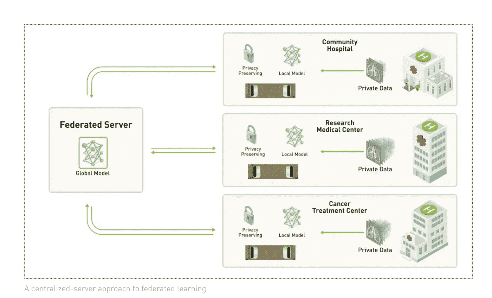
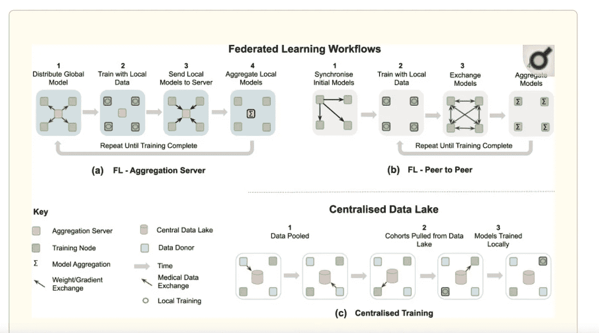

# 什么是联合学习，为什么它是医学人工智能未来的关键

> 原文：<https://medium.com/mlearning-ai/whats-federated-learning-and-why-it-s-key-to-the-future-of-medical-ai-e53c6869a849?source=collection_archive---------3----------------------->

## 虽然人工智能已经成为许多行业的主流，但它在医疗保健领域仍然落后。这主要是由于监管和隐私问题阻碍了对关键数据的访问。但是，一种新兴的机器学习技术——“联合学习”——正在通过生成精确而强大的人工智能模型来保护数据隐私，从而改变医疗保健领域的创新。

**健康数据隐私难题**

新冠肺炎疫情强调了人工智能(AI)和机器学习(ML)如何在帮助我们更好地理解和解决全球健康危机方面发挥关键作用——[ML 专业知识](https://www.weforum.org/agenda/2020/05/how-ai-and-machine-learning-are-helping-to-fight-covid-19/)最近已被应用于扩大客户沟通，了解新冠肺炎如何传播，以及加快研究和治疗。

但人工智能在医疗保健领域的承诺远远不止与疫情作战。正如[普华永道](https://www.pwc.com/gx/en/industries/healthcare/publications/ai-robotics-new-health/transforming-healthcare.html)指出的，人工智能和机器人在医疗保健领域的潜力是巨大的*。人工智能研究和最近在 ML 和深度学习方面的进展导致了放射学、病理学、基因组学和其他领域的破坏性创新，如早期诊断和检测[阿尔茨海默氏症](https://venturebeat.com/2020/10/22/ibm-and-pfizer-claim-ai-can-predict-alzheimers-onset-with-71-accuracy/)、[糖尿病](https://venturebeat.com/2020/11/20/ibm-claims-its-ai-can-improve-neonatal-outcomes-and-predict-the-onset-of-type-1-diabetes/)、[乳腺癌](https://venturebeat.com/2020/10/14/googles-breast-cancer-predicting-ai-research-is-useless-without-transparency-critics-say/)和[精神分裂症](https://venturebeat.com/2020/10/02/ibm-joins-nih-effort-to-diagnose-schizophrenia-using-ai/)。更多能够改善临床实践和拯救生命的[医疗 AI 用例](https://www.health.gov.au/ministers/the-hon-greg-hunt-mp/media/79-million-to-turn-brilliant-ideas-into-new-treatments)(如医疗设备、药物发现和精准医疗)已经处于 R & D 阶段。*

*虽然人工智能已经成为许多行业的主流，但医疗保健仍然落后。也不是因为缺乏数据。现代医疗保健系统收集了海量的医疗数据——仅在 2020 年就产生了多达 [2，314 EB](https://www.statista.com/statistics/1037970/global-healthcare-data-volume/)的新医疗数据。*

*然而，主要由于监管、法律和隐私问题，医疗数据在人工智能技术中没有得到充分利用。*

*当然，当涉及到个人医疗状况、健康保险记录和基因信息等健康数据时，坚持充分的隐私保护是有意义的。我们应确保此类数据仅在数据主体理解并同意的情况下以负责任的方式共享和使用。*

*但是，虽然许多司法管辖区的法律保护医疗保健提供商和保险公司收集的数据，但它们[并没有很好地处理当今数字世界产生和收集的许多其他类型的健康数据](https://healthdatasharing.org/wp-content/uploads/2020/07/RT2-Privacy-Summary-Report-FINAL-2020.07.28.pdf)。医疗保健人工智能的[监管仍处于初级阶段](https://www.ey.com/en_au/law/how-the-challenge-of-regulating-ai-in-healthcare-is-escalating)，监管机构正在迎头赶上。虽然欧盟和美国都在这一领域采取了试探性的措施，但仍没有具体的法律出台。*

*世界卫生组织直到最近才概述了人工智能健康伦理的原则，当时它在 2021 年 6 月发布了关于“人工智能健康伦理和治理”的[指南](https://www.who.int/publications-detail-redirect/9789240029200)。*

*但是，要使这一领域的法规现代化，还需要做更多的工作。*

*HIPAA(美国健康保险和便携性责任法案)仅保护由特定医疗保健实体(包括医疗保健计划、医疗保健提供商和医疗保健票据交换所)收集的数据。澳大利亚的隐私法案也是如此，该法案保护医院、健康诊所、健身房和减肥诊所等“提供健康服务”的组织收集的健康数据。因此，以新方式收集的新型数据，如健身追踪器、数字基因分析平台、物联网设备或医疗技术软件，不在这项立法的范围内。*

*世界各地的现行法规也没有考虑到健康数据在人工智能中的使用可能带来的所有可能的危害，也没有就健康数据应该如何在新兴技术中安全和道德地使用提供明确的指导。*

*这使得患者、医疗保健提供商和私营公司越来越不确定这些法律涵盖和不涵盖哪些数据，以及在人工智能环境下的数据共享方面，他们可以做什么和不可以做什么。*

*由于监管压力、缺乏法律清晰度以及围绕获得患者同意的技术和行政挑战(特别是大量历史数据)，医疗数据收集者一直不愿意与其他组织(无论是学术界、其他行业参与者还是人工智能初创公司)分享他们的数据。但这种情况正在开始改变。*

## ***医疗 AI 的数据依赖***

*人工智能工具通常需要数据集来表示现实世界中问题或人群的底层数据分布。但在医疗人工智能领域，这种需求甚至更加迫切。*

*训练基于人工智能的医疗工具(如肿瘤检测器)需要非常大的数据库，该数据库将包含所有可能的解剖结构、病理和输入数据类型的全部范围。*

*这种数据集很难获得，因为医疗数据高度分布在众多医院、实验室或地理位置上。因此，医学人工智能倾向于使用来自少数有限来源的精心策划的数据集来开发。*

*这可能会对工具的*准确性*产生不利影响(因为例如，根据一家医院的数据训练的算法在另一家医院使用时可能表现不佳)，并导致*偏差*问题，因为特定的数据集方面，如人口统计(性别、年龄)或技术失衡(如采集协议、设备制造商)可能会扭曲模型的预测。*

***对于捕捉真实世界差异和分布的模型，如疾病模式、社会经济和遗传因素之间的微妙关系，以及复杂和罕见的病例，模型必须暴露于不同的病例。这只能通过访问*大型*和*多样化*数据集来实现。***

*然而，这种类型的高质量数据很难获得，而且成本很高，因为医疗保健组织的法律和数据治理协议对其进行了严格的监管和控制。*

## ***联合学习如何拯救医疗技术***

*进入[联合学习](https://en.wikipedia.org/wiki/Federated_learning)(FL)——一种[机器学习](https://en.wikipedia.org/wiki/Machine_learning)技术，将模型带给数据，而不是数据带给模型。*

*与标准的 ML 方法不同，FL 跨*多个分散的边缘设备或* [*服务器*](https://en.wikipedia.org/wiki/Server_(computing)) 训练模型，保存本地[数据样本](https://en.wikipedia.org/wiki/Data)、**，而不显式访问数据样本**。*

**

*Source: [NVIDIA — What Is Federated Learning](https://blogs.nvidia.com/blog/2019/10/13/what-is-federated-learning/)*

*FL 是由 Google 在 2017 年首次推出的[，旨在基于用户与移动设备的交互成功训练模型，并为 Android 用户改善用户体验。正如谷歌当时解释的那样，这项新技术使手机能够协作学习一个共享的预测模型*，同时将所有训练数据保存在设备*上，将机器学习的能力与将数据存储在云中的需求分离开来。**谷歌称赞 FL 能够以更低的延迟和更少的功耗生成更智能的模型，同时确保隐私。**](https://ai.googleblog.com/2017/04/federated-learning-collaborative.html)*

> ***至关重要的是，在医疗保健领域，FL 使多个参与者能够在不共享底层数据的情况下构建一个准确、稳健的 ML 模型，从而将隐私设计融入模型，解决数据隐私、数据安全和数据访问权限等关键问题。***

*每个数据控制器都定义了自己的治理流程和相关的隐私政策，控制数据访问，并能够撤销数据访问。这包括培训和验证阶段。*

*这意味着 FL 可以创造新的机会，如实现罕见疾病的新研究，这些疾病的发病率很低，每个机构的数据集都太小。*

*2020 年 9 月,《自然数字医学》发表了一篇引人入胜的论文----------------------------------------------《数字医学》杂志发表了一篇名为《[联邦学习下的数字健康的未来》---------------------------------------------------------------------《数字医学》探讨了 FL 如何为数字健康的未来](https://www.nature.com/articles/s41746-020-00323-1)*

*该论文指出，FL 对医疗保健的巨大吸引力在于，它能够以协作的方式获得见解，即以共识模型的形式，**而无需将患者数据移出其所在机构的防火墙**。取而代之的是，ML 过程在每个参与机构本地发生，并且只有模型特征(参数、梯度)被传送到中央服务器(也称为“聚合服务器”)。然后，中央服务器汇集本地节点的模型结果，生成一个全局模型，由所有节点共享，*而不访问任何数据*。交换的参数可以在学习轮之间共享之前进行[加密](https://en.wikipedia.org/wiki/Encryption)以扩展隐私，并且[同态加密](https://en.wikipedia.org/wiki/Homomorphic_encryption)方案可以用于直接对加密的数据进行计算，而无需事先解密。*

**

*How FL works in comparison to standard centralised ML — By Creative Commons licence from: [The future of digital health with federated learning](https://www.ncbi.nlm.nih.gov/pmc/articles/PMC7490367/)*

*这不同于传统的集中式 ML 训练方法/工作流程，在传统的集中式 ML 训练方法/工作流程中，中央数据湖从数据采集站点提取数据，并且在中央数据湖内进行本地独立训练。*

*FL [作为大规模精准医疗的推动者，拥有巨大的潜力](https://www.ncbi.nlm.nih.gov/pmc/articles/PMC7490367/)，可以产生产生公正决策的人工智能模型，最佳地反映个人的生理状况，并对罕见疾病敏感，同时尊重数据治理和隐私问题。这有助于克服标准 ML 方法的局限性，标准 ML 方法需要一个集中式数据池。*

## ***艾占村***

*上周(2021 年 9 月 15 日),一项由五大洲 20 家医院参与的多医院计划实现了将 FL 应用于医疗技术的一个重要里程碑[。](https://blogs.nvidia.com/blog/2021/09/15/federated-learning-nature-medicine/)*

*由新冠肺炎危机引发的这一倡议表明，保护隐私的 FL 技术如何能够创建健壮的人工智能模型，这些模型可以在各种组织中很好地工作，即使是在受机密或稀疏数据限制的行业中。*

*这项被称为“考试”(或 EMR CXR 人工智能模型)的合作由[麻省总医院](https://www.massgeneralbrigham.org/)、[英伟达](https://www.nvidia.com/en-us/)和健康初创公司[犀牛健康](https://www.rhinohealth.com/)领导，训练了一个神经网络，预测患有新冠肺炎症状的患者在到达急诊室后 24 和 72 小时可能需要的补充氧气水平。这是迄今为止最大、最多样化的临床 FL 研究之一。*

*考试合作者创建了一个人工智能模型，该模型从每个参与医院的胸部 x 光图像、患者生命体征、人口统计数据和实验室值中学习，而无需查看每个位置的私人服务器中的私人数据。*

*每家医院都在本地 NVIDIA GPUs 上训练了一个相同的神经网络副本。在训练过程中，每家医院定期只向中央服务器发送更新的模型权重，在那里，神经网络的全球版本将它们聚合起来，形成新的全球模型。*

*对该领域来说，有趣且极具前景的是，最终的模型不仅保护了隐私，而且与在任何单一地点训练的类似模型相比,**表现出了性能提升**,人工智能模型的平均性能提高了 16%,通用性平均提高了 38%。*

*这不仅在医疗保健领域是一个重大突破，在医疗保健领域，其他大规模的 FL 计划正在进行中，如乳房 x 线照片评估的[研究](https://blogs.nvidia.com/blog/2020/04/15/federated-learning-mammogram-assessment/)和制药巨头拜耳的[工作培训脾脏分割的人工智能模型。**许多其他行业也面临类似的数据挑战(能源、银行、自动驾驶汽车、保险等。)现在可以利用这项开创性的技术来推动进一步的创新，并改善欺诈检测、自动驾驶技术和风险预测等方面。**](https://www.nvidia.com/en-us/on-demand/session/gtcspring21-e32541/)*

## ***FL 挑战依然存在***

*虽然 FL 有许多优点，但重要的是要记住，与标准的 ML 技术类似，FL 仍然受到诸如偏差、标准化和数据质量等性能挑战的影响。此外，在医疗数据环境中，FL 面临一些具体问题:*

*   ***数据多样性** —医疗数据本质上是多样而复杂的。它有结构化和非结构化两种形式。采集差异、医疗设备品牌或当地人口统计等因素也会影响数据的多样性。集成来自多个来源的数据和元数据很棘手。此外，数据可能不会在参与机构之间均匀分布。*
*   ***隐私&安全**——虽然 FL 提供了比标准 ML 模型更高的隐私保护，但它仍然存在一些隐私和安全风险。可能会有信息泄露给敌对各方。使用 FL 时可能需要进行权衡，因为与标准 ML 模型相比，在某些情况下性能可能会有所下降。研究人员正在探索差异性隐私，为 FL 增加另一层隐私。*
*   ***可追溯性和可问责性** —医疗人工智能工具既可解释又可复制，这一点至关重要。然而，在 FL 中，我们处理的是在硬件、软件和网络差异很大的环境中进行的多方计算。这意味着研究人员不能轻易地调查地面数据，以理解任何奇怪或意想不到的结果，或找到模型预测的原因。*
*   ***系统架构** —便于访问多个机构/节点持有的数据的 FL 系统需要考虑数据完整性、加密和不同计算资源的需求。*

## ***如何提高 FL 采用率***

> ***“联合学习具有将人工智能创新引入临床工作流程的变革力量。”***
> 
> *- [菲奥娜·吉尔伯特，剑桥大学医学院放射科主任](https://blogs.nvidia.com/blog/2021/09/15/federated-learning-nature-medicine/)*

*FL 已经证明，在医疗保健领域大规模采用人工智能时，它可以成为游戏规则的改变者。*

*是时候了:*

*   ***政府**通过有意义的资助、监管和公私部门合作计划，全力支持并推动医疗行业的数字化转型；*
*   ***医疗保健组织**投资 IT 和数据基础设施，支持与学术界、人工智能研究人员和医疗科技初创公司的深度合作，并推动开放数据计划，以消除数据共享的行政障碍；和*
*   ***风险投资基金**支持并投资有前途的人工智能健康科技和生物技术公司，即使这需要勇敢面对更长期的观点。*

*最终，社会、消费者、患者和医疗从业者将成为这项开创性技术的最大受益者。*

## ***延伸阅读***

*VentureBeat — [联合学习如何在一个注重隐私的世界里塑造人工智能的未来](http://could shape the future of AI in a privacy-obsessed world)*

*[什么是联合学习](https://blogs.nvidia.com/blog/2019/10/13/what-is-federated-learning/)英伟达博客*

*[医学人工智能需要联合学习，每个行业也是如此](https://blogs.nvidia.com/blog/2021/09/15/federated-learning-nature-medicine/)英伟达博客*

*[通过联合学习实现数字医疗的未来](https://www.ncbi.nlm.nih.gov/pmc/articles/PMC7490367/)*

*美国卫生与公众服务部[关于平衡隐私与健康数据访问的总结报告](https://healthdatasharing.org/wp-content/uploads/2020/07/RT2-Privacy-Summary-Report-FINAL-2020.07.28.pdf)*