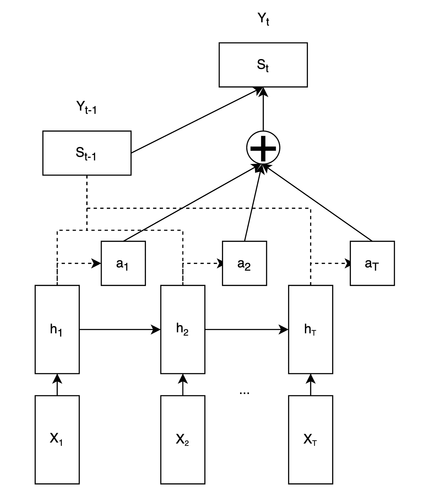
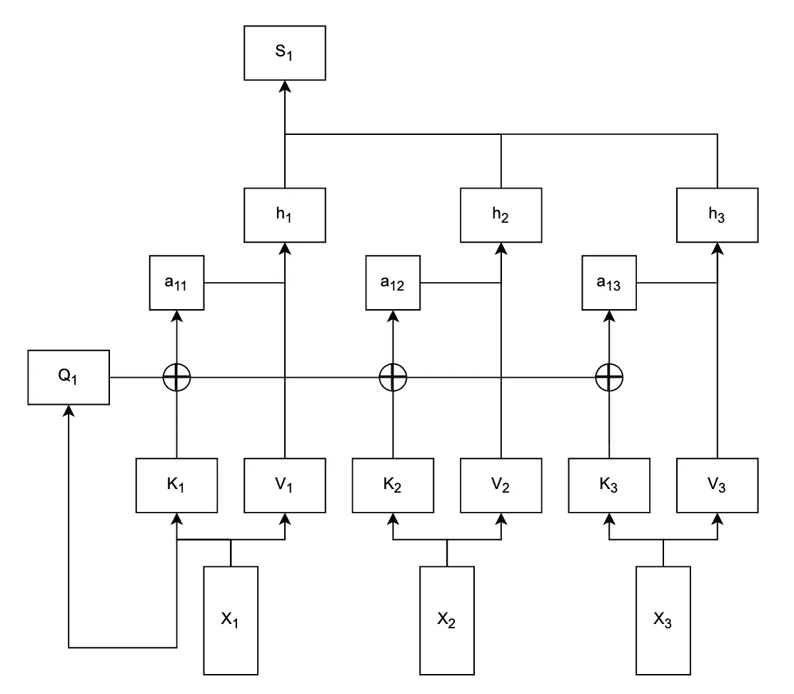

# 《变形金刚》架构中的自我关注和关注有什么区别？

> 原文：<https://medium.com/mlearning-ai/whats-the-difference-between-self-attention-and-attention-in-transformer-architecture-3780404382f3?source=collection_archive---------0----------------------->

## 如果你仍然分不清哪个是哪个，你需要一篇文章

您是否有兴趣了解 transformer 架构，这是一种用于自然语言处理(NLP)任务的流行神经网络模型？如果是这样，你可能听说过自我关注和注意力，这两个相关但不同的概念是变形金刚模型的核心。在这篇博文中，我们将解释在 transformer 架构中**自我关注**和**关注**的区别，以及为什么它们对 transformer 模型的性能很重要。

我们不会深究这些算法所涉及的数学——已经有像这篇文章一样的博客文章[，它们比我能解释得更好。相反，我们的目标是从高层次上了解他们的差异。](https://towardsdatascience.com/illustrated-self-attention-2d627e33b20a)

Photo by [Samule Sun](https://unsplash.com/@samule?utm_source=medium&utm_medium=referral) on [Unsplash](https://unsplash.com?utm_source=medium&utm_medium=referral)

# 注意力

自我关注和关注都是允许变压器模型在进行预测时关注输入或输出序列的不同部分的机制。这些机制对于 transformer 模型在语言翻译、文本摘要和情感分析等任务中的性能至关重要，在这些任务中，模型需要理解输入和输出序列中不同单词或短语之间的关系。

注意力指的是变压器模型在进行预测时关注另一个序列的不同部分的能力。这通常用于编码器-解码器架构，其中编码器对输入序列进行矢量化，而解码器在进行预测时会关注整个*输入的编码表示。例如，在语言翻译任务中，编码器处理源语言句子并生成其编码表示，然后解码器在生成目标语言的翻译时关注该编码表示。*

Decoder using attention mechanism to produce a single output Yt from encoder-
created vectors h

有什么大不了的？以前，如果您使用像 LSTM 这样的递归架构，您的架构会遇到很大的瓶颈——输入序列必须编码到单个摘要向量中，解码器必须在后续解码步骤中进一步传递其信息。这意味着我们能够传播的信息量是非常有限的，而且保留信息的窗口比注意力的情况要短得多。

现在，信息窗口实际上是无限的(只受硬件能力的限制)，因为您可以从输入序列的任何元素中访问信息。

# 自我关注

另一方面，自我关注指的是变压器模型在进行预测时关注**输入**序列的不同部分的能力。这个名字来源于这样一个事实:与“常规”注意力相反，**自我注意力指的是当前被编码的相同序列。**

Encoder with self-attention mechanism replacing recurrence. Each input t
gets encoded into vector ht

这一突破类似于 attention 的突破——在递归架构中，编码器必须将所有需要的信息压缩到一组向量中，这些向量由递归单元传递。您可能已经看到了这种情况:如果信息窗口太大，这种设置也容易“忘记”一些事实。

**自我关注让我们在对每个输入元素进行编码的同时，能够看到序列的整体背景**。这里不会发生遗忘，因为我们保留信息的窗口正好和我们需要的一样大(至少在自我关注的基础版本中)。

# 结论

总之，自我注意允许变换器模型关注同一输入序列的不同部分，而注意允许变换器模型关注另一序列的不同部分。这两种机制对于转换器模型在 NLP 任务中的性能都很重要，因为它们允许模型理解输入和输出序列中不同元素之间的关系，并做出更准确的预测。

自我关注和关注是 transformer 架构中的两个关键概念，transformer 架构是 NLP 任务中使用的一个强大的神经网络模型。理解这两种机制之间的区别以及它们是如何工作的，可以帮助您理解 transformer 模型的功能和局限性，并在您自己的 NLP 项目中有效地使用它们。

 [## Mlearning.ai 提交建议

### 如何成为 Mlearning.ai 上的作家

medium.com](/mlearning-ai/mlearning-ai-submission-suggestions-b51e2b130bfb)