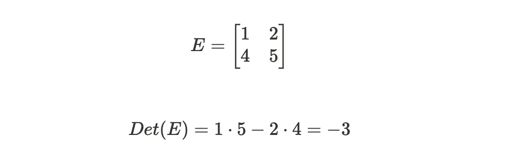
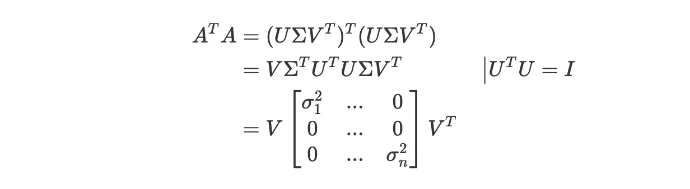
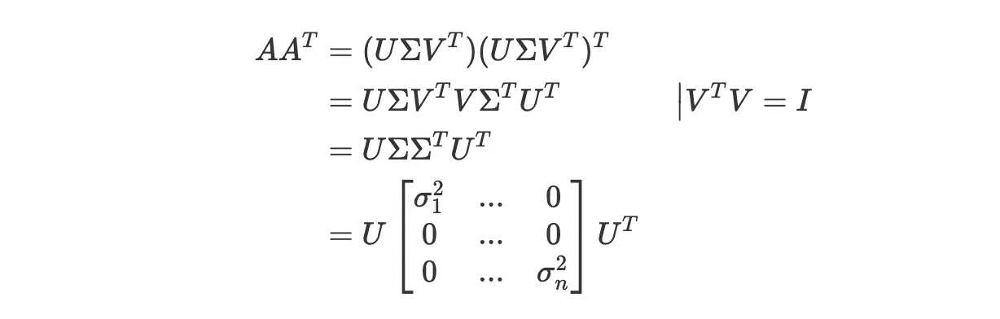

# 矩阵分解的意义是什么？

> 原文：<https://medium.com/mlearning-ai/whats-the-point-of-matrix-decompositions-15435781658f?source=collection_archive---------5----------------------->

这个话题是我脑海中的一个大黑洞，所以我试图将帮助我理解**特征分解**和**奇异值分解(SVD)** 的信息汇集在一起。

为此，我将快速概括**决定因素**和**基础**。如果你已经很熟悉了，可以直接跳到**特征分解**这一段。

# 决定因素

一个行列式通过某种变换 ***E*** 回答面积如何缩放的问题？

例如:

所以在这个给定的例子中 ***E*** 的行列式，或者说一个变换的缩放因子，就是 ***-3*** 。负行列式现在是什么意思？这意味着空间的方向已经颠倒或者轴已经翻转。所以行列式***-3*** 就意味着轴翻转过来，面积按 ***3*** 缩放。

一个有趣的性质是当一个变换的行列式等于 ***0*** 时。这意味着变换的面积将变为零，因为基向量彼此对齐。这种情况降低了向量的维数。

# 基础

坐标系的基本向量描述了坐标系中轴的方向。例如，二维坐标系可以通过基向量 ***x*** 和 ***y*** 来描述。

所以无论何时你在这个基础上描述任何东西，这些值都会和基础向量成比例。这些基向量包含什么值并不重要，所以它们也可以是:

所以要把一个矢量 ***x_b*** 从坐标系 ***b*** 平移到我们的坐标系 ***a*** 中，我们可以使用坐标系的平移。我们知道 ***b*** 的基向量是如何在基 ***a*** 中表示的:

所以为了翻译 ***x_b*** 我们将每个基向量 ***b*** 与向量 ***x*** 的某个坐标相乘:

因此，我们有一个转换矩阵，它从基 ***b → a*** :

为了反过来，从基础 ***a →b*** 我们需要 ***T*** 什么是*(我不涵盖如何计算逆)。*

*为了将一个变换***【oₐ】***从一个基础 ***a*** 转换到基础 ***b*** 需要完成以下操作:*

**

*首先，我们从 base ***b → a*** 转换为 ***T*** 。然后，在我们使用逆变换***【t⁻***】将其再次变换回基数***【b】***之前，我们在基数 a 中应用变换*。因此，将矢量 ***v*** 转换为如下形式:**

****

# **特征分解**

**特征向量 ***v*** 是某个矩阵变换 ***A*** 不通过这个变换改变方向的向量。但它可以被拉伸或压缩一个因子，这个因子叫做特征值 ***λ*** 。因此，对其特征值*的变换 ***A*** 将给出与仅仅拉伸或挤压特征向量 ***v*** 相同的结果。***

****

**如果特征值等于 ***1*** ，那么特征向量描述的是矩阵变换的旋转轴。**

**为了计算特征向量，我们可以将该方程转化为以下形式:**

****

**所以****A-λI***和 ***v*** 的乘积需要为零。一个变换( ***A - λI*** )和一个向量( ***v*** )的乘积只有在相关联的变换 ***A - λI*** 将向量 ***v*** 挤压到一个更低维的空间中时才能变成零——这意味着行列式(通过变换的面积缩放因子)必须为零！这是在低维空间中，因为基本向量排列成相同的方向，因此它们没有打开一个区域(行列式描述的)。***

**在低维向量中 ***v*** 变成了一个点而不是一个向量。**

## **特征向量现在有什么用？**

**特征向量对于计算对矩阵复杂但对对角矩阵简单的运算很有帮助，因为它们可以将矩阵转换成对角形式。在对角线形式的计算中，像矩阵的乘方要容易得多。**

**为此，矩阵必须被带入特征向量的基向量表示，称为**特征基**。如果矩阵有足够的特征向量(最少的轴数)，转换将保证一个可以应用复杂计算的**对角矩阵**表示。那么结果可以很容易地被带回原点坐标系。对角矩阵包含对角线上的特征值，即特征基中特定轴的比例因子。**

## **摘要**

*   **将变换引入特征基:**

****

*   **将特征基中的对角矩阵带到原始基中:**

****

## **例子**

**为了利用这一点，这里有一个例子:**

**我们有一个变换矩阵 ***A*** ，我们想对其应用一个运算，例如将它提升到幂 ***b*** 。由于这个操作对于非对角矩阵来说是复杂的，所以我们希望采用对角形式。为此我们需要特征向量 ***p*** 来构建矩阵 ***P*** 的列。**

****

**我们将 ***A*** 带入了本征基，其中这种变换通过对角矩阵 ***D*** 来说明。**

**现在，我们可以将我们想要的操作应用到 ***D*** 并将其带回我们的原点:**

****

**仅此而已！**

# **奇异值分解**

**为什么会有另一种形式的分解？特征分解还不够吗？**

**可惜没有！特征分解只适用于方阵。奇异值分解处理所有类型的矩阵，并且始终存在！**

**但是概念保持不变:**

****

**我们有一个变换*，它可以分成三个操作，将变换带入另一个发生挤压或拉伸的基底。与本征分解相反，我们没有另外一个基，而是有两个。其原因是原点矩阵*的给定维数。它可以是 ***m×n*** 的形式，而不是正方形。****

**首先， ***大小为 ***(n×n)*** 的 V^T*** 将一个矢量从基 ***A*** 带入基 ***B*** 。**

*然后***【σ】******(m×n)***像*一样对基向量执行缩放，因为它是对角矩阵。然而，它不仅应用变换，而且将计算从基数 ***B*** 变换到基数 ***C*** 。**

**最后，大小为 ***(m×m)*** 的 ***U*** 将计算从基数 ***C*** 带回基数 ***A*** 。**

**特征分解和奇异值分解有着密切的联系。在下面我们可以看到为什么。**

## **催单**

**我们知道，对于方阵***a∈*ℝ*^{n×n}***总有一个矩阵 ***P*** 可以将矩阵转化为特征基。**

**一个矩阵 ***一个*** 可以通过乘以逆矩阵*变换成一个方阵:***

******

## ***德拉贡诺夫狙击步枪（Snayperskaya Vinyovka Dragunov 的缩写）***

***对于奇异值分解我们需要找出的是形状为 ***n×n*** 和形状为 ***m×m*** 的*矩阵。所以我们先从 ***V、*** 右边的——奇异向量开始，因为 ***V*** 的右边部分是方程***a = uσv^t***并说明了 *n×n* 的基础。相应地，我们通过计算形状 ***m×m*** 的*来执行左奇异向量。*****

## ***右奇异向量 *V****

***这一知识有助于我们将形状为 ***n×n*** 的矩形矩阵 ***A*** 变成正方形，然后允许我们应用特征分解:***

****

**用奇异值分解方程对其进行分解，还可以得到以下结果:**

****

**这两个公式看起来非常相似，并导致这样的假设:**

****

**相应地，我们可以应用*的特征分解来计算特征矩阵 ***P*** 等于 ***V*** 。***

## **左奇异向量 U**

**类似于右奇异向量，我们想得到一个形状为 ***n×n*** 的矩阵，我们可以通过***【aa^t】***得到。**

**相应地，我们可以计算构成矩阵 ***P*** 的特征向量，该矩阵等于*。***

******

***为此，我们可以找到 u 中的特征向量。***

## ***奇异值**σ*****

***为了获得奇异值*，我们必须从右奇异或左奇异向量中取出已经计算的对角矩阵***【d(σ^{t}σ)***并求平方根。这很容易，因为 ***D*** 是一个对角线矩阵，包含对角线上的特征值。****

*****σ***形状为*，若 ***m≠n*** 较大轴用零填充。***

**例如:**

****

## **有什么好处？**

**通过奇异值分解可以得到重要的信息。**中的奇异值*σ*中的奇异值**告诉矩阵的每个值是如何判别的。因此，如果一个值很高，这意味着某个维度对于数据表示很重要。因此，如果维度很低，就不能携带大量信息。**

**这对我们有什么帮助？**

**这有助于我们识别对全局不重要的维度。例如，我们可以删除不包含重要信息的维度来压缩数据。**

# **结论**

**特征分解和奇异值分解的关键要点是，您可以将矩阵转换为另一种基，以便简化复杂的运算(特征分解)，或者通过只考虑最有意义的数据点(SVD)来压缩数据。**

** [## Mlearning.ai 提交建议

### 如何成为 Mlearning.ai 上的作家

medium.com](/mlearning-ai/mlearning-ai-submission-suggestions-b51e2b130bfb)**