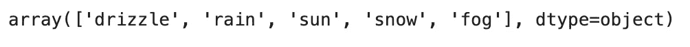
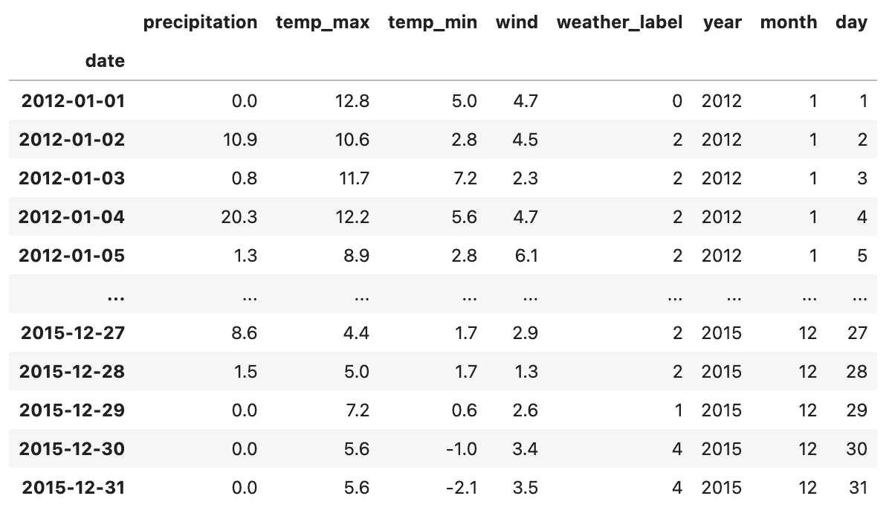
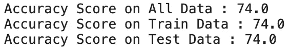
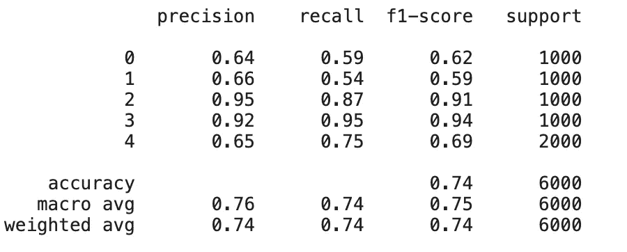

# 明天天气如何？下雨还是晴天

> 原文：<https://medium.com/mlearning-ai/whats-tomorrow-weather-rainy-or-sunny-82f8c2672a39?source=collection_archive---------4----------------------->


Image by [pixabay](https://pixabay.com/photos/rain-street-city-port-1479303/)

我们所有人都肯定对明天要做什么有某种计划(尽管不一定完美)。但有时生活并不按照我们的方式发展，我相信我们中的一些人在前一天的郊游计划后经历了一个下雨和暴风雨的一天(我知道这很糟糕，但我们仍然必须继续前进)。

因此，我认为如果你们目前正在工作或学习数据科学，我相信你们会在没有意识到之前遇到天气预报模型。

在本文中，我将展示如何利用朴素贝叶斯和 Python 来开发我们自己的天气预测模型(为了更好的明天)。

指导方针:

1.  数据预处理
2.  模型开发
3.  模型检验

## 1.数据预处理

```
df = pd.read_csv('/kaggle/input/weather-prediction/seattle-weather.csv')df['weather'].unique()
```



嗯，这是相当的天气，如果你是我，那么我总是计划我的一天，如果明天是晴天。

```
from sklearn.preprocessing import LabelEncoder#Turn our Text Values into numeric Values ( e.g. 1,2,3,etc )
le = LabelEncoder()df['weather_label'] = le.fit_transform(df['weather'])#Store labels and name for final use
weather_dict = dict(zip(df['weather_label'], df['weather']))#Preprocess Datetime Columns
def date_time(df) :

    df['date'] = pd.to_datetime(df['date'])
    df['year'] = df['date'].dt.year #Generate Year Column
    df['month'] = df['date'].dt.month #Generate Month Column
    df['day'] = df['date'].dt.day

    return dfdf_final = date_time(df)df_final = df_final.drop(['weather'],axis=1).set_index('date')
df_final
```



因此，下面是上述代码的摘要:

1.  从我们的数据集，我们可以看到我们的目标值(预测值)是天气，但由于它是文本(或字符串)形式的，我们需要在以后将其转换为机器学习模型的数值。因此，来自 sklearn 的 LabelEncoder 会自动将我们现有的文本值转换成数值。
2.  我在上面创建的 weather_dict 对象只是为了在我们的模型开发之后使用，以便它可以转换回天气的名称。或者你可以使用 LabelEncoder 的 inverse_transform。
3.  最后，我们使用上面的 date 列生成一些额外的列，并删除模型中未使用的列。

## 2.模型开发

```
from sklearn.model_selection import train_test_split
from sklearn.naive_bayes import GaussianNB
from imblearn.over_sampling import SMOTE
from imblearn.under_sampling import RandomUnderSampler
from sklearn.metrics import accuracy_score, classification_report#Preprocess Data for Machine Learning Development
X = df_final.drop(['weather_label'], axis = 1)
y = df_final['weather_label']over_strategy = {0 : 1000, 1 : 1000, 2 : 1000, 3 : 1000, 4 : 2000}
under_strategy = {0 : 1000, 1 : 1000, 2 : 1000, 3 : 1000, 4 : 2000}oversample = SMOTE(sampling_strategy = over_strategy)
undersample = RandomUnderSampler(sampling_strategy = under_strategy)X_final,y = oversample.fit_resample(X,y)
X_final,y = undersample.fit_resample(X_final, y)X_train,X_test,y_train,y_test = train_test_split(X_final,y,random_state = 10, test_size = 0.2)#Model Development
model = GaussianNB()np.random.seed(10)
model.fit(X_train,y_train)pred_all = model.predict(X_final)
pred_train = model.predict(X_train)
pred_test = model.predict(X_test)print(f'Accuracy Score on All Data : {round(accuracy_score(y, pred_all),2)*100}')
print(f'Accuracy Score on Train Data : {round(accuracy_score(y_train, pred_train),2)*100}')
print(f'Accuracy Score on Test Data : {round(accuracy_score(y_test, pred_test),2)*100}')
```



以下是对上述过程的描述:

1.  首先，我们将数据集分为特征和目标变量。
2.  然后，您可以看到我使用了 sklearn.over_sampling 和 sklearn.under_sampling 中的两个函数，我使用这两个函数的主要原因是，由于原始数据提供了一个不平衡的类(这会影响我们的模型性能)，所以我希望用平衡的类来训练所有数据集。
3.  然后，转换我们的数据集，并使用 SMOTE(来自过采样)和 RandomUnderSampler(来自欠采样)进行重新采样。并使用 train_test_split 将我们的数据集分为训练和测试。
4.  接下来，我们开始使用 sklearn.naive_bayes 中的 GaussianNB()构建我们的模型，然后我们简单地使用我们的训练集训练我们的数据，然后使用测试数据集上的模型进行预测。
5.  最后，我们使用测试集来评估我们的模型。

因此，我们可以看到，上述所有分数的输出都是 74%，这可以被视为一个好模型，因为它没有过度适应我们的训练集，为了更好地细分我们的每个目标类，这里是细分。



我们可以看到，我们的模型对天气 2 和 3(雨和雪)的预测精度和 f1 值超过 90%，而对其余天气的预测精度和 f1 值平均为 65%。

最初，在我写这篇文章之前，我开发了这个没有任何重采样方法的模型，它在训练集上产生了 85%的准确性，而在我们的测试数据集上只有 54%(这显然表明我们的模型超过了我们的数据)。在我们使用 SMOTE 和 RandomUnderSampler 对其进行重采样后，模型稳定下来，并在预测未知数据时显示出更好的模型性能。

好了，我希望这个天气预报模型可以帮助你们计划一个更好的明天！

此外，如果你喜欢阅读我的文章，请随时订阅我的时事通讯，我计划每月发布两次(或更多)新的阅读。

如果你有任何意见或反馈，请给我。下一篇文章再见！

参考资料:

[](https://www.kaggle.com/kelvinprawtama/weather-prediction-using-naive-bayes-algorithm) [## 基于朴素贝叶斯算法的天气预测

### 使用 Kaggle 笔记本探索和运行机器学习代码|使用来自天气预测的数据

www.kaggle.com](https://www.kaggle.com/kelvinprawtama/weather-prediction-using-naive-bayes-algorithm) [](/mlearning-ai/mlearning-ai-submission-suggestions-b51e2b130bfb) [## Mlearning.ai 提交建议

### 如何成为 Mlearning.ai 上的作家

medium.com](/mlearning-ai/mlearning-ai-submission-suggestions-b51e2b130bfb)