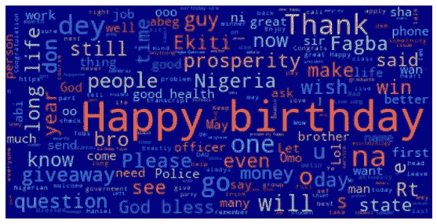
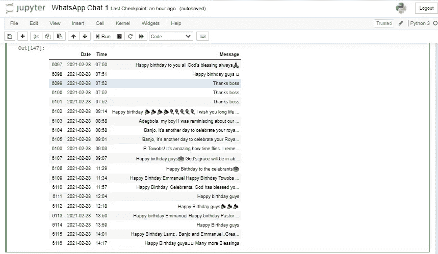
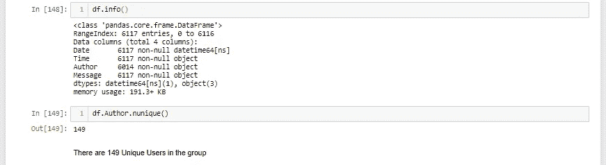
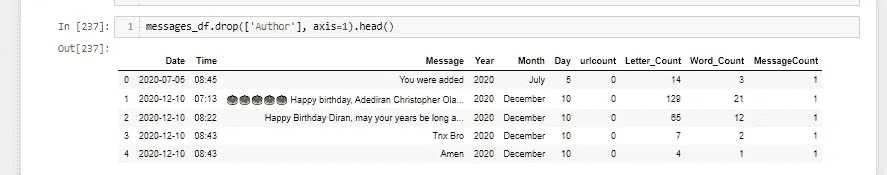
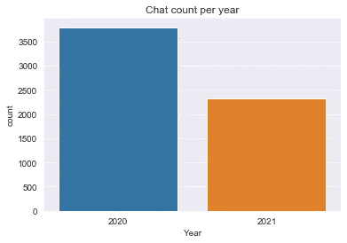
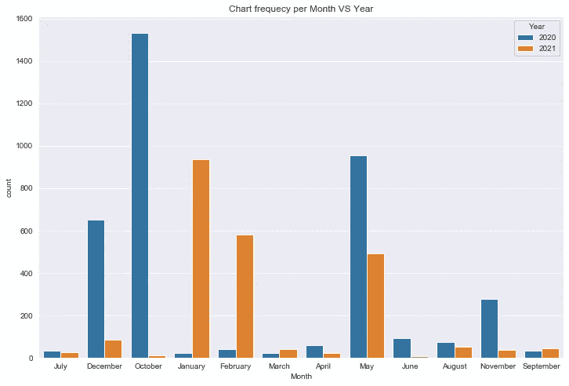
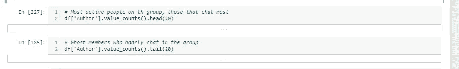
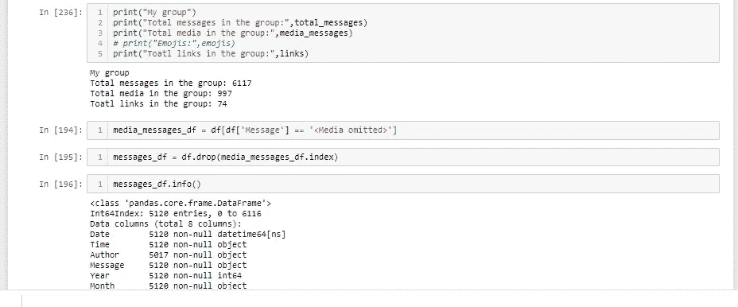

# WhatsApp 群聊分析

> 原文：<https://medium.com/mlearning-ai/whatsapp-group-chat-analysis-2d93e3ea32a3?source=collection_archive---------4----------------------->

## 使用 Python 从 WhatsApp 聊天中获得见解

word cloud for the group

WhatsApp Messenger，简称 WhatsApp，是脸书公司旗下的跨平台集中式消息和语音 IP 服务。它允许用户发送文本消息和语音消息，进行语音和视频通话，以及共享图像、文档、用户位置和其他内容。

在本文中，您将学习如何分析来自 whatsApp 群聊的数据，并从数据中获得洞察力。源代码可以在 **GitHub** 上找到。

# **概述**

*   数据析取
*   数据录入，清洗和准备
*   分析
*   Wordcloud

**数据提取**

如何从 WhatsApp 中提取数据

*   打开 WhatsApp
*   打开您想要分析其聊天的特定群组
*   点击右上角的汉堡图标(菜单图标或 3 个圆点)
*   点击更多
*   单击导出聊天(由您决定是否包含媒体)—对于此分析，不需要媒体。
*   选择电子邮件
*   输入目的地电子邮件地址(您可以发送给自己)
*   去邮箱下载聊天*只有*，你会将一些其他的东西比如联系人分享到群里
*   将其保存在您的工作目录中

**数据输入、清理和准备**

使用的库如下面的代码所示

libraries

从聊天中提取日期和时间的功能

extracts date and time

提取作者(用户)的功能

gets Authors(Users)

获得每个聊天(消息)的数据点的功能

gets data point

获取数据

gets the data

将数据转换为 pandas dataframe 对象

to pandas dataframe

**分析**

检查前几行和信息()

出于隐私考虑，我删除了作者一栏

df.info()

df.info

我执行了功能工程，将日期列转换为 pandas DateTime 序列，并获得月、年和日列作为新功能。

feature engineering

显示 2020 年比 2021 年有更多消息的计数图

Chat in 2020 vs 2021

一个计数图，显示每年每月的聊天次数

chat per month vs year

下面的代码行显示了最活跃和最不活跃的用户

Most and least active users

发送到群组的消息、媒体和链接的数量

Messages, media and links

**Wordcloud**

单词云(也称为标签云或艺术字)是数据的简单可视化，其中单词根据它们在文本中出现的频率以不同的大小显示。

wordcloud plot

该组中最常用的单词

group wordcloud

用户最常用的单词

user wordcloud

如果这篇文章帮助你理解了使用 python 进行 WhatsApp 聊天数据分析的一些内容，请与你的朋友分享。感谢阅读！

检查完整的[代码](https://github.com/Tiamiyu1/WhatsApp-Group-Chat-Analysis)

在 [Linkedin](https://linkedin.com/in/tiamiyu1) 上联系我

# 参考

1.  [https://thecleverprogrammer . com/2020/08/06/whatsapp-group-chat-analysis/](https://thecleverprogrammer.com/2020/08/06/whatsapp-group-chat-analysis/)
2.  [https://medium.com/@elishatofunmi](/@elishatofunmi)
3.  繁星酒店
4.  维基网
5.  谷歌
6.  Stackoverflow

 [## Mlearning.ai 提交建议

### 如何成为 Mlearning.ai 上的作家

medium.com](/mlearning-ai/mlearning-ai-submission-suggestions-b51e2b130bfb)