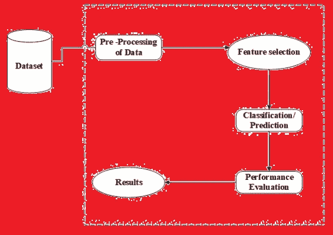
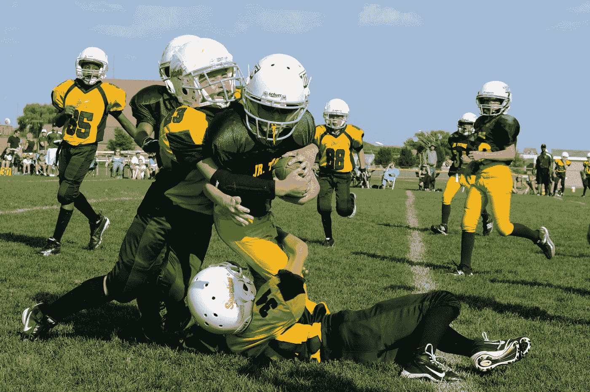
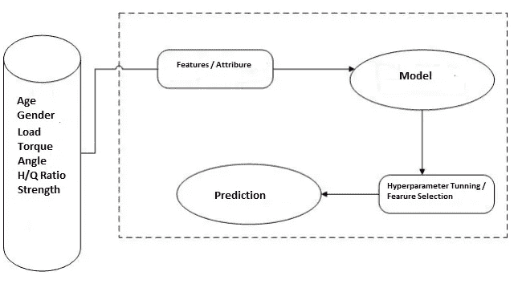
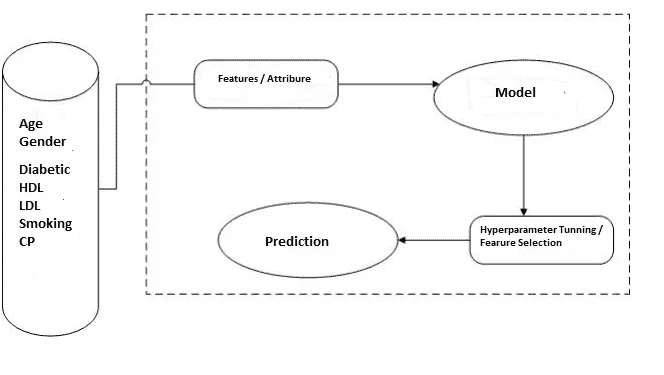
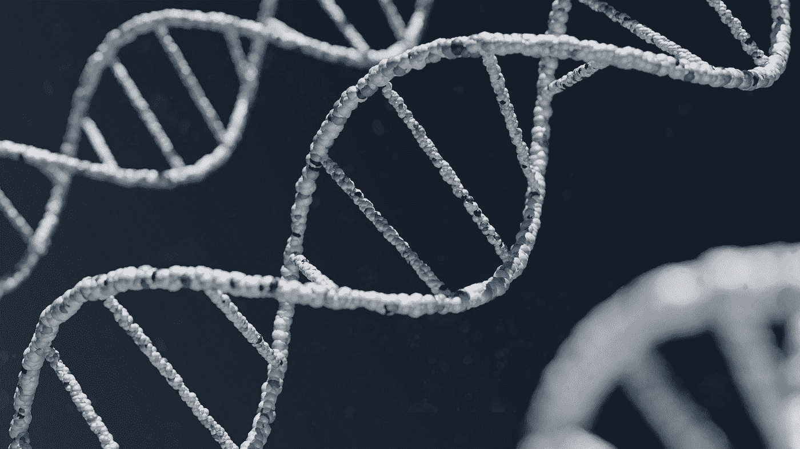

# 当数学遇到生物科学:数据科学的含义

> 原文：<https://medium.com/mlearning-ai/when-mathematics-meets-bio-science-data-science-implication-d63da43335c6?source=collection_archive---------9----------------------->

入学后在数学和生物之间做出选择时，我和我的校长进行了一次健康的讨论。在那些学生时代，数学总是伴随着计算机应用的香料，它增加了更多的味道，尽管我选择了生物学，因为我觉得了解你体内的东西是多么令人着迷。现在，今天我可以把这两个方面联系起来，如果你深入人体，它将为你提供大量的数据。

Data Science Workflow

在这篇博客中，我将从以下几个方面讨论数据科学在人体中的作用:

1.  **人体生理学**

Photo by [Robina Weermeijer](https://unsplash.com/@averey?utm_source=medium&utm_medium=referral) on [Unsplash](https://unsplash.com?utm_source=medium&utm_medium=referral)

通俗地说，生理就是身体内部发生的一切好事。在最近的十年里，在人类生理学中应用数学模型的跨学科领域已经有了巨大的发展，并且还在继续发展。研究人员获取数据的能力不断提高是这一增长背后的原因之一。由于更快的采样技术和更好的获取侵入性和非侵入性数据的手段，从各种研究中获得的生理数据量正在急剧膨胀。

此外，数据的时间和空间分辨率比几年前高得多。例如，非侵入性磁共振成像(MRI)测量可以提供关于血液速度作为时间的函数的信息，以及心脏和直径小到几毫米的动脉中的三个空间坐标。另一项最新成就是通过观察毛细血管氧含量的变化来描绘大脑中神经元活动的能力。

由于数据量巨大，这些模型可以提供关于它们预测的功能的定性和定量信息，并建议进行额外的试验。我相信这样的模型对于更好地理解潜在的生理学功能是必需的，并且从长远来看，数学模型可能有助于新的数学和生理学理论的产生。

以下是一些例子:

*   对与压力感受器系统相关的时间延迟进行建模可以提供对 Mayer 波(平均动脉压的特定振荡)原因的深入了解。
*   可以通过模拟脉搏波沿着主动脉的传播来解释脉搏轮廓中的重搏切迹的存在以及重搏切迹如何在整个主动脉中变化。
*   模拟从坐姿到站姿转换后对突然低血压的脑血流动力学反应，可以帮助我们更好地理解大脑自动调节。

此外，模型可以帮助避免歧义、误解和白费力气。只有使用数学才能清楚地定义大多数(如果不是全部)概念。如果不提供数学描述，晦涩和歧义迟早会出现。例如，当一些学者提供不同的单一指标来表征心室的收缩状况时，就存在模糊性。其中一些指标严重依赖于循环系统；因此，它们不是描述心室的收缩状态，而是描述心室和血管系统之间的相互作用。

从今以后，如果有先进的技术手段来帮助从人体收集具有“n”个属性的数据(可以是标记的数据，也可以不是)，它可以帮助揭开各种问题的神秘面纱，并有助于医学科学。

**2。生物力学**

Photo by [Keith Johnston](https://unsplash.com/@acfb5071?utm_source=medium&utm_medium=referral) on [Unsplash](https://unsplash.com?utm_source=medium&utm_medium=referral)

简单来说，生物力学是研究人体在静止或运动时的力和角度。动力学(当我们谈论力的时候)和运动学(当我们谈论角度的时候)是生物力学的两大支柱。它有助于识别受角度影响的各种活动(行走、跑步或运动)时的力分布。了解力的路径是至关重要的，因为它不仅可以防止受伤，还可以使特定肌肉发挥最佳性能。例如，虽然投掷是一个连续的、流畅的运动，但它可以分为六个不同的阶段。这些部分包括:上紧(可变地存在，因为如果运动员从伸展段投掷，这将是不存在的)、早期上紧、晚期上紧、加速、减速和跟进。

每个阶段的动力学和运动学的整合有助于识别导致力的衰减和运动效率下降的棘手运动，因此，如果我们能够找出有缺陷的运动学(内在的和外在的)，它有助于产生最佳的力(取决于人、地面反作用力、肌肉力、关节力、重力)。

通过收集这些数据，我们可以建立一个有标签数据的监督学习模型，如良好的生物力学和有缺陷的生物力学，这有助于了解导致疼痛、性能下降等问题的漏洞。

**3。伤害/疾病预测**

Photo by [Ben Hershey](https://unsplash.com/@benhershey?utm_source=medium&utm_medium=referral) on [Unsplash](https://unsplash.com?utm_source=medium&utm_medium=referral)

很难确定损伤和疾病，因为许多因素都会导致损伤或疾病，博客的这一部分分为两个部分:

*   伤害预测——伤害可能发生在任何人身上，如果发生事故，更准确地说是碰撞伤害，这是我们无法控制的事情。然而，当我们深入研究受伤的类型时，它被分为两种类型:创伤性受伤和非创伤性受伤。非创伤性损伤是过劳性损伤，在这种损伤中，我们可以控制并防止它的发生。

**Workflow Injury Prediction**

> 向运动员询问受伤情况，他们会给你一个更好的解释。

受伤可能会影响表现、时间和金钱，引用如下:

> 预防胜于治疗…！！

我们可以通过使用数据科学来防止伤害，你会怎么想？

损伤发生在解剖区域和施加在组织上的一定负荷不对称的情况下，在创伤性损伤的情况下，负荷是突然的，导致组织破损，然而，在过度使用损伤(非创伤性)的情况下，负荷逐渐增加，导致周期性的磨损。

如果你能监测到**不对称**和**负载**，我们就能防止受伤。不对称可以通过前面讨论的生物力学的含义来监控。

负荷监测在体育运动中起着至关重要的作用，有助于将运动员分为:

a)训练不足——也会导致受伤

b)最佳——受伤的可能性非常小

c)过度训练——受伤的机会更多

*   疾病——几个起作用的风险因素，如糖尿病、高血压、胆固醇过高、脉搏不规则等，使疾病的诊断变得困难。已经使用各种数据挖掘和神经网络技术确定了人的疾病严重程度。各种方法，例如 K-最近邻算法(KNN)、决策树(DT)、遗传算法(GA)和朴素贝叶斯(Naive Bayes)，被用于对状况的严重性(NB)进行分类。

**Workflow for Disease Prediction**

例如，在心脏病中；因为心脏病的性质复杂，所以必须谨慎治疗。不这样做可能会伤害心脏或导致过早死亡。医学科学和数据挖掘被用来发现不同类型的代谢紊乱。在心脏病预测和数据查询中，分类数据挖掘起着重要的作用。

心脏信息处理的原始保健数据的识别将有助于人类生命的长期挽救和心脏问题中不规则性的早期检测。

然而，如果及早发现病情并尽快采取预防措施，死亡率可以大大降低。

**4。生物信息学**

生物信息学是数据科学的一个分支，专注于使用软件(如 BLAST 和 Ensembl)在基因组和蛋白质水平上分析生物数据。生物信息学的发现可以有益于医疗保健、农业和生物多样性。它是生物学、计算机科学、统计学和数学的结合，这些学科通常不会一起研究。通常，一个学科的专家决定从事生物信息学，这需要他们熟悉其余的领域。

Photo by [Warren Umoh](https://unsplash.com/@warrenumoh?utm_source=medium&utm_medium=referral) on [Unsplash](https://unsplash.com?utm_source=medium&utm_medium=referral)

使用互联网上的各种程序和数据库对 DNA 和蛋白质进行序列分析是一项重要的活动。从医生到分子生物学家，任何可以访问互联网和相关网站的人，现在都可以使用简单的生物信息学方法来揭示生物分子的组成，如核酸和蛋白质。这并不是说处理和分析原始基因数据对每个人来说都很简单。生物信息学专家现在使用复杂的软件程序来检索、分类、分析、预测和存储 DNA 和蛋白质序列数据。生物信息学是一个不断发展的学科，生物信息学专家现在使用复杂的软件程序来检索、分类、分析、预测和存储 DNA 和蛋白质序列数据。

遗传疾病的研究正从孤立地研究单个基因转向发现基因的细胞网络，破译它们错综复杂的联系，并确定它们在疾病中的功能。一个个性化定制医疗的新时代将因此而诞生。生物信息学将指导和帮助分子生物学家和临床研究人员充分利用计算生物学的优势。

如果你已经读到这里，我希望你能在我的文章中找到一些灵感。
如果你有什么建议，请留下评论。

快乐学习…！！！

 [## Mlearning.ai 提交建议

### 如何成为 Mlearning.ai 上的作家

medium.com](/mlearning-ai/mlearning-ai-submission-suggestions-b51e2b130bfb)