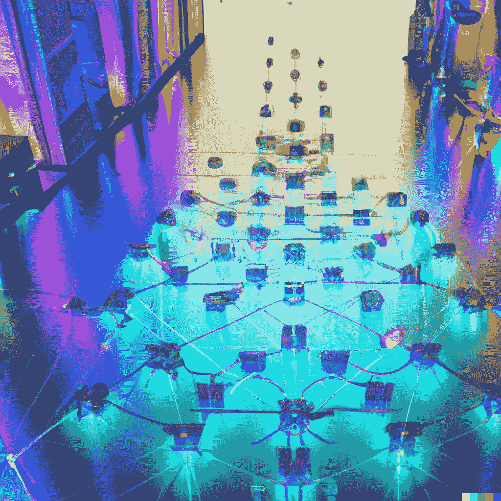

# 你上一次感受到 AI 艺术的力量是什么时候？

> 原文：<https://medium.com/mlearning-ai/when-was-the-last-time-you-felt-the-power-of-ai-art-9c3c3d990ba?source=collection_archive---------6----------------------->

## [机器学习艺术](https://mlearning.substack.com/p/train-your-ai-art-generator-from?r=z7zu8&s=w&utm_campaign=post&utm_medium=web)

## 用于[生成 AI 艺术](https://mlearning.substack.com/p/a-good-alternative-to-dalle-2-that?r=z7zu8&s=w&utm_campaign=post&utm_medium=web)的创意工具。想知道如何创造

[the power of AI artists — Can AI create real art?](https://evartology.substack.com/p/all-of-the-greatest-ai-powered-art?r=9hp4d&s=w&utm_campaign=post&utm_medium=web)

**AI 时代是一个美学时代。艺术已经变得越来越无所不在，而且常常很难与元现实的其他部分区分开来。AI 艺术是一种力量因素。这怎么解释？**