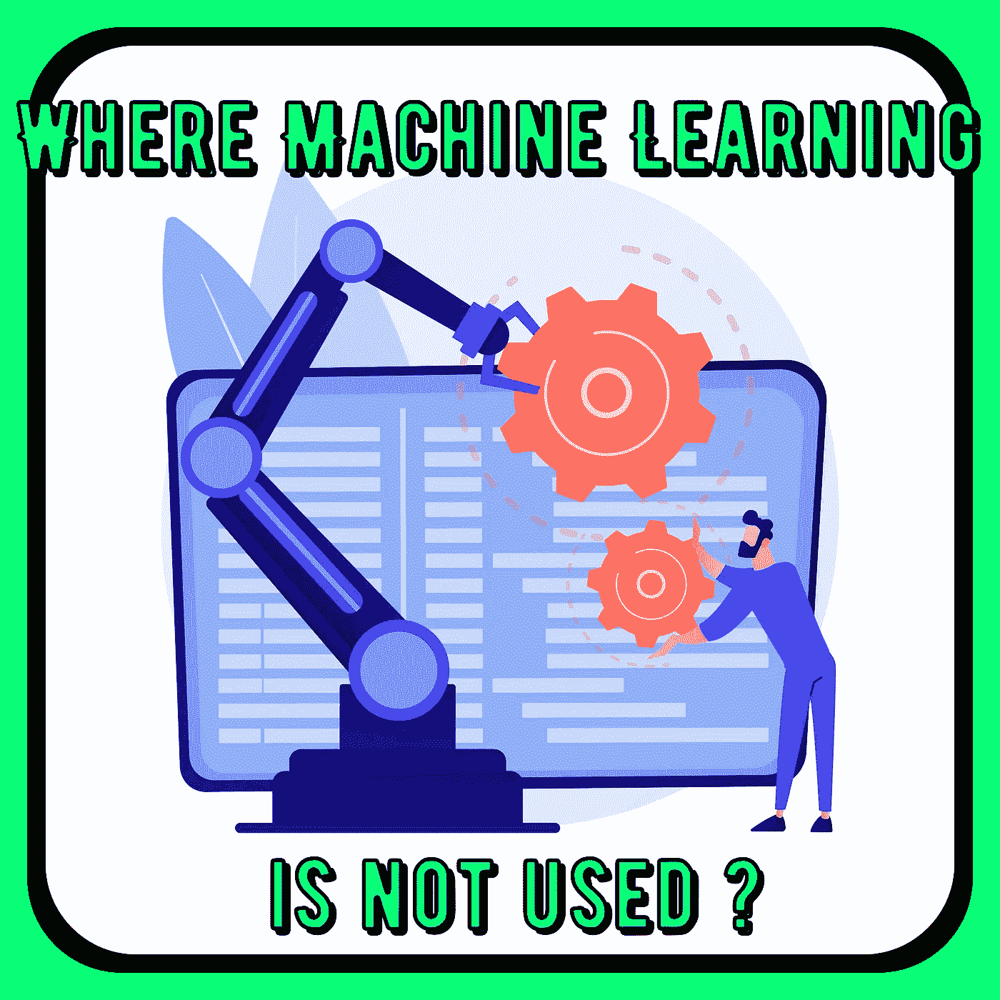
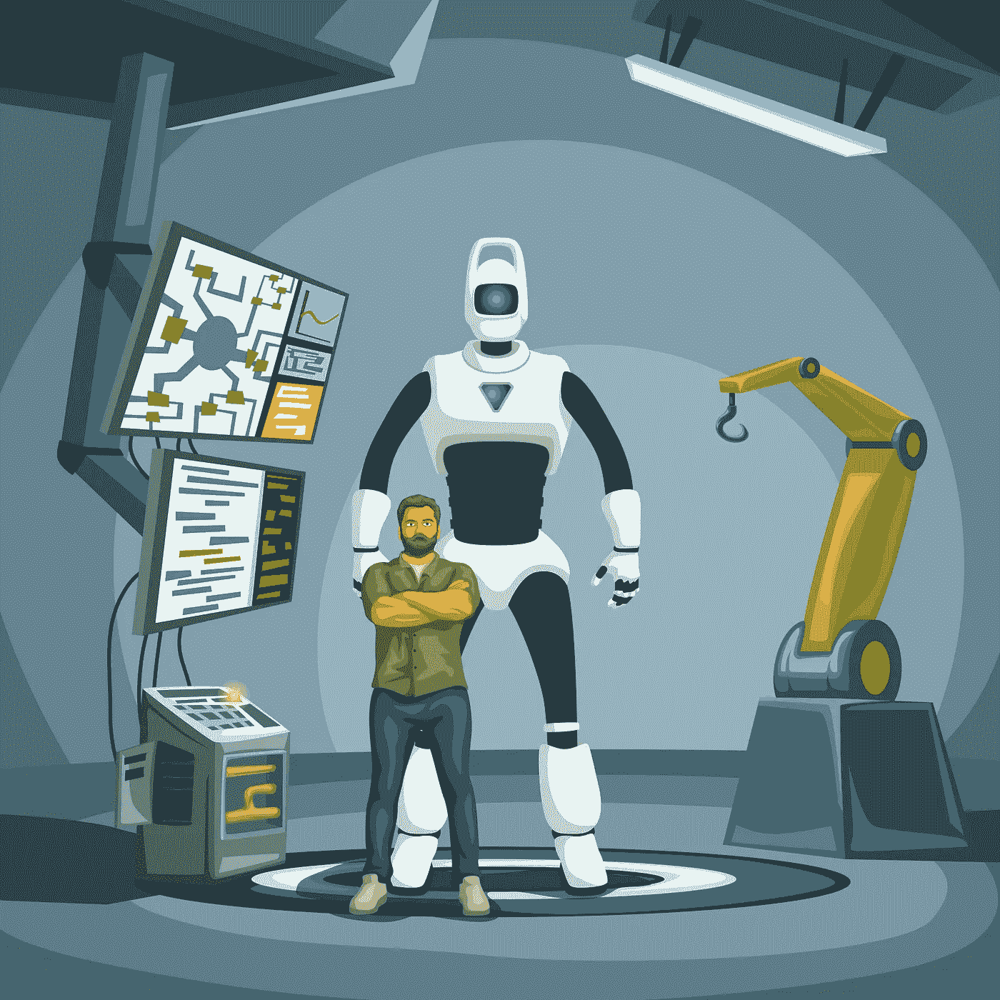

# 机器学习在哪里没有用？

> 原文：<https://medium.com/mlearning-ai/where-is-machine-learning-not-used-fde3d06879f7?source=collection_archive---------7----------------------->

**机器学习没有用在哪里？**🤖机器学习是我们日常生活中不可或缺的一部分。由于过去几年的数字化转型和计算机化，我们已经适应了这个新的数字化时代。所以，我们每天都在用机器学习；为什么？因为我们希望从数据中学习，而不是计算核心解决方案。



Where Machine Learning is not used?

> **这怎么发生得太快了？嗯，电脑变得更便宜了。忘记那些计算机是相当大的计算器的时代。是啊，处理数字的大计算器。但是数字代表数据，因此，即使在那个时候，计算机也能够处理各种数据(图 1)。**

```
"101100" Represents either the **decimal 44** and **the comma**.**Figure 1\. Binary digits**
```

## **你应该意识到机器学习吗？**

是的，你知道。我们不断从机器学习算法中获益。例如，当获得电影、要购买的物品和现代智能手机的推荐时，面部识别和图像识别在你的偏好云中。

作为一名数据科学家，我相信掌握基础知识(概念和编程)始终是最基本的。因此，让我们试着理解机器学习的概念。


Supervised Learning

# **机器学习的基本类型:**

机器学习问题主要有两类， ***监督学习&非监督学习。*** 还有一种，程度较轻的强化方法。

## 监督学习

在监督学习(机器学习的基本类型)中，算法是用正确标记的数据集来训练的。

> 是的，我知道，你总是要清理数据。

**哪种数据？**与人合影！！你看过多少次手机，给图片里的人贴标签？嗯，你的小电脑(你的手机📱)应用一种算法，使其能够在下一次捕获中识别这个被标记的人。 **- *是啊，我知道，很吓人。***

> 注意你分享的数据，甚至是名字！

## 无监督学习

在这种算法中，不需要你——是的，不需要人的参与。例如，算法如何在图像中找到确切的关系？，创造结构。这些结构是使算法通用的数据点，并且可以通过改变结构来动态适应。

> 不要担心，我们将深入研究这些机器学习算法，以便更好地理解。

## **强化学习**

我将这种类型描述为试错法。基本上，人类是如何行为和学习的。它学习并适应新的环境。强化学习预测一系列的行动。强化学习与奖励有关。

> 强化学习的一个经典例子是，如何玩电子游戏，非赢即输，**你学会了！！**



Reinforcement Learning

# 机器学习和人工智能有什么关系？

机器学习是人工智能的子集。基本上，机器学习是人工智能的一个分支，它使机器能够通过示例进行学习。

> 计算机正在学习更多的东西，因为可以获得更多的数据和更强的计算能力。

## 在深入编码之前，我们先来讲一些机器学习的例子。

> 在机场，用于面部识别。
> 
> 计算机视觉。
> 
> 生物识别。
> 
> 人脸检测。
> 
> 音频和文本识别。

> ***就这样，我们涵盖了机器学习的概念。在接下来的帖子中，我将深入研究成为数据科学家所需的代码和经典机器学习工具。*👉 ***跟着我？*****

# **你知道更多的例子吗？请为我鼓掌，关注我并评论帖子。请我喝杯咖啡！**👏

**查看我的频道看机器学习教程。**