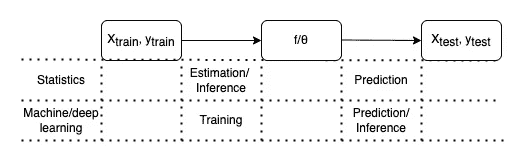

# 哪个推论？

> 原文：<https://medium.com/mlearning-ai/which-inference-997e2eeacc81?source=collection_archive---------11----------------------->

Photo by [Axel Vandenhirtz](https://www.pexels.com/@axel-vandenhirtz-332204/)

我早就对“推论”这个词感到有点不舒服。许多人——从数据科学家到机器学习从业者和统计学家——似乎很自信地使用它，并期望它指的是一个精确、定义良好的概念。虽然一个词在不同的上下文中有不同的意思并不罕见，但我花了一段时间才弄清楚在“推理”的例子中不同的意思和不同的上下文是什么。其他一些人似乎也有点困惑。

# 统计学中的推断

推断是统计学中的一个常用术语——维基百科上关于统计学的文章提到了 17 次——我在统计学的上下文中寻找这个术语的定义。

在《所有的统计》一书中，拉里·瓦色尔曼写道:

> 统计推断，或者在计算机科学中称为“学习”，是使用数据来推断产生数据的分布的过程。基本的统计推断问题是这样的:
> 我们观测 X1，…，Xn ~ F，我们要推断(或者估计或者学习)F 或者 F 的一些特征比如均值。

同样,“R 统计学习导论”的作者进一步阐述道:

> [……]我们希望估计 f，但我们的目标不一定是预测 Y。相反，我们希望了解 X 和 Y 之间的关系，或者更具体地说，了解 Y 作为 X1，…，Xn 的函数如何变化。

在一个更实用的设置中， [statsmodels 文档](https://www.statsmodels.org/stable/emplike.html?highlight=inference)也使用了与估计分布参数相关的术语推断。

# 现代机器学习/深度学习中的推理

在现代机器学习的至少相邻的、可能重叠的领域中，似乎存在对这个词的不同解释。

凯文·墨菲在《概率机器学习:导论》中写道:

> 在深度学习社区中，“推理”一词指的是我们会称之为“预测”的东西，即计算 p(y|x，theta)。

在他们关于设备上推理的[论文](https://arxiv.org/pdf/1907.01989.pdf)中，来自谷歌的 Lee 等人含蓄地对比了训练和推理:

> 我们的工作是对这些努力的补充，而是专注于优化运行神经网络的推理引擎，而不是模型或训练

在一个类似的应用环境中，[微软关于 ONNX](https://docs.microsoft.com/en-us/azure/machine-learning/concept-onnx) 的 Azure 文档陈述如下:

> 了解如何使用开放神经网络交换(ONNX)来帮助优化您的机器学习模型的推理。推断或模型评分是将部署的模型用于预测的阶段，最常见的是对生产数据进行预测。

这似乎与统计中通常使用的上述解释大相径庭。当然，这并不是说机器学习或深度学习社区的所有成员都同意这一含义——只是有些人同意。

# 摘要

退一步讲，我们可以寻找推理这个术语的更一般的定义。牛津学习词典对推理的定义如下:

> 一些你可以从你已经知道的东西中间接发现的东西

这个一般定义与前面摘录中遇到的两种含义一致。不同的是人们发现了什么——新的数据点或函数/参数——以及人们已经知道了什么——观察到的数据或函数/参数。

上述参考资料描绘了一幅更为普遍和全面的图景。然而，为了清楚地对比这些术语，人们可能会假设一个监督学习设置。在该设置中，观察到带有标签 y_train 的输入数据 X_train。该数据用于拟合参数θ_ hat 或更一般的函数 f。后者然后可用于预测其他数据 X_test 的标签。鉴于上述解释，以下是术语的可能情况:

总之，至少有*一些*人在研究明显相关的主题时，使用了往好里说不一致，往坏里说矛盾的术语。为了促进领域、社区和团队之间的知识转移，可能值得考虑使用不太模糊的术语或至少限定术语推断，例如说“参数推断”——除非其含义通过其上下文变得非常清楚，即使对于非专业读者也是如此。

# 此外

贝叶斯推理通常是指使用观察值 x，以便将先验信念 p(θ)更新为后验信念 p(θ| x)。DeepAi 提供了一个[的例子](https://deepai.org/machine-learning-glossary-and-terms/bayesian-inference)。

变分推理技术试图找到数值上具有挑战性的常规推理问题的近似解。Stefano Ermon 的课程提供了一个简短的概述。

这篇文章最初出现在我的[博客](https://kevinkle.in/)上，版本[略有不同](https://kevinkle.in/posts/2022-06-06-inference/)。

 [## Mlearning.ai 提交建议

### 如何成为 Mlearning.ai 上的作家

medium.com](/mlearning-ai/mlearning-ai-submission-suggestions-b51e2b130bfb)