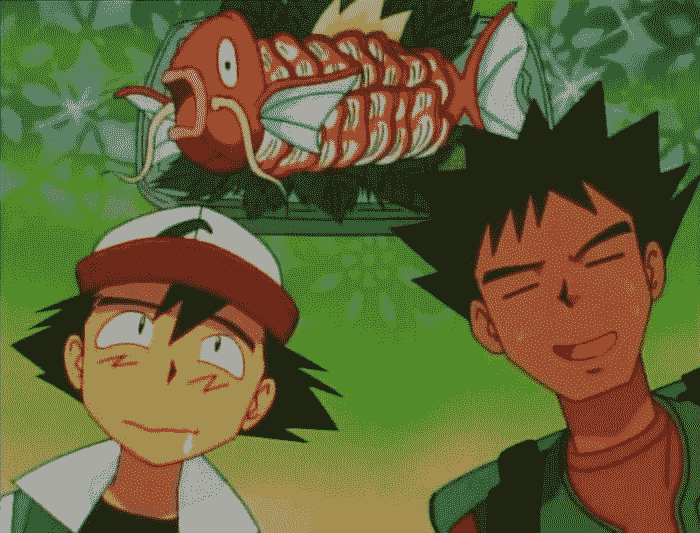
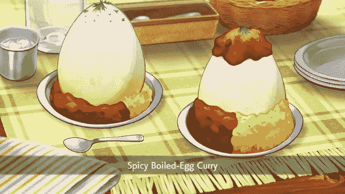
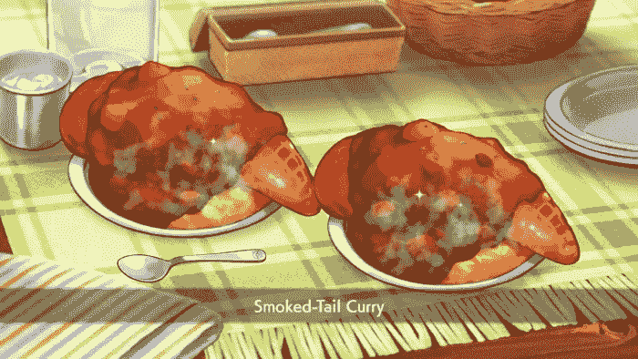
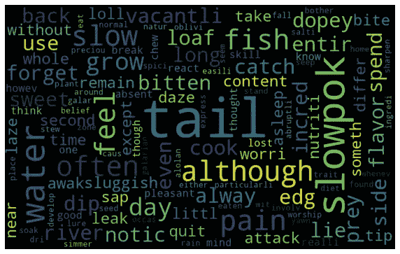
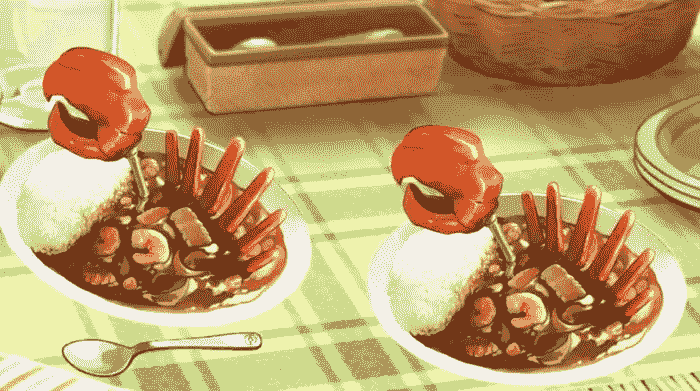

# 晚餐应该吃哪种神奇宝贝:机器学习方法

> 原文：<https://medium.com/mlearning-ai/which-pok%C3%A9mon-should-you-eat-for-dinner-a-machine-learning-approach-f870e1e2c7c7?source=collection_archive---------5----------------------->

Ash and Brock hungry

葡萄牙语。

在这个项目中，我们将发现最常见的机器学习过程和技术是否足以确定从 898 个神奇宝贝到第八代游戏都是可食用的。

在神奇宝贝的世界里，有大量的生物，当然不是所有的都被捕获并训练用于战斗。其中一些仍然是野生的，成为消防员，甚至是 10 岁主角的父亲。但这就是它在神奇宝贝世界中的全部用途吗？

Ash’s Parents

神奇宝贝本质上是由肉或植物制成的，如果不是由石头、金属、泥土或垃圾制成的话。把绵羊和山羊分开，我们可以假设，因为只有口袋妖怪和人类，而不是这个世界上所有的人都是素食主义者，所以用肉做的口袋妖怪以这样或那样的方式被用作牲畜，用植物做的口袋妖怪被用作农作物。既然在这个宇宙中有把口袋妖怪变成食物的需求，我们就可以把它们分为可食用和不可食用。

在我们确定哪些神奇宝贝在餐桌下等待食物，哪些在桌子上嘴里含着苹果之前，我们能不能避免谈论吃神奇宝贝的道德问题？如果你从 Chansey 的袋子里拿出一个鸡蛋，在她看着的时候煎鸡蛋，那有什么意义呢？这个项目当然不想接近解决这个问题，即使这些鸡蛋的味道在各种 Pokédex 条目中被广泛讨论。最多，我们将讨论神奇宝贝世界的人类是否认为吃某些神奇宝贝在当地是被接受的，就像 Farfetch'd 的情况一样，在 Galar，这种神奇宝贝不被视为美味佳肴，不像世界上其他人喜欢用他携带的韭菜制作的 Farfetch'd 胸肉。

Spicy Boiled-Egg Curry (Game Freak, The Pokémon Company/Nintendo)

为了进行深度学习分析，我们需要一个向量，其中包含主要神奇宝贝特许经营游戏各个部分的相关数据，例如该系列动漫和漫画中的 pokédex 和 lines。

说到 Pokédex，利用它的条目，我们可以分析一些神奇宝贝是否作为人类和其他神奇宝贝的食物。为了对这些条目进行调查，我们将从 Bulbapedia(一个关于口袋妖怪的强大 wiki)上收集数据。这次刮的细节是[这里](https://github.com/brunoras/pokemon-edibility/blob/main/Raspagem%20da%20Bulbapedia%20Qual%20Pok%C3%A9mon%20Voc%C3%AA%20Deve%20Comer%20no%20Seu%20Jantar.ipynb)。

在对这些数据进行适当的处理后，我们将使用自然语言处理(NLP)来进行情感分析，其中所讨论的情感不会发展到说一片鱼鳍是否可以被食用到神奇宝贝成为过度捕捞的受害者的程度。(神奇宝贝月亮中的夏普多条目)，但它足以说明神奇宝贝是否适合消费。

Smoked-Tail Curry (Game Freak, The Pokémon Company/Nintendo)

简而言之，为了使一种物质可以食用，需要考虑几个因素。首先，所述物质不能有毒或有害。另一方面，它必须满足营养需求(为身体提供能量)、社会需求(作为文化的一部分)和心理需求(其消费提供满足)，因为某些物质可能是有营养的，但在社会或心理层面上是负面的。这是矢量的前四个坐标。

通过 NLP，我们将从每组神奇宝贝条目中提取关键词，使用文档频率倒数法 TF-IDF 为每个词打分。

在为每个神奇宝贝制作单词云之后，我们将制作一个与每个因素(毒性、营养、文化和心理)相关的术语的手动列表，我们记下 TF-IDF 生成的内容，并将其添加到列表中，从而形成四个可食用性指数，这四个指数确定了神奇宝贝指数谈论可食用性因素的程度。这里的是这个处理的细节[。](https://github.com/brunoras/pokemon-edibility/blob/main/Montando_os_dados_Qual_Pok%C3%A9mon_Voc%C3%AA_Deve_Comer_no_Seu_Jantar.ipynb)

Word Cloud for Slowpoke

但仅凭这一点还不足以决定哪只口袋妖怪会离开你的 PC 去煎锅。我们需要更多的矢量坐标。这个信息的一个线索来自 Chansey 她自己产的蛋如此美味以至于它们被贪婪地吞食，甚至被那些没有食欲的人吃掉(Pokemon Emerald)。神奇宝贝都是卵生的，无一例外。他们被分为 15 个定义明确的组，这些组给出了每个组中每个神奇宝贝的外观和生物学方向。通过这种分类，我们的向量又多了两个变量，因为神奇宝贝有一两个蛋组。

kingler’s Curry (Game Freak, The Pokémon Company/Nintendo)

我们还将包括技术性的游戏数据。友谊基数，一个决定神奇宝贝对其训练者友好程度的变量，HP 基数，与神奇宝贝含有多少蛋白质及其重量相关，这表明神奇宝贝可以产生或多或少的食物，最后但并非最不重要的是，神奇宝贝类型。

因此，我们的向量将有 11 个坐标，并将形成如下:

(毒性指数、营养指数、文化指数、心理指数、蛋组 1、蛋组 2、友谊基数、HP 基数、体重、1 型、2 型)

现在我们有了让机器施展魔法的一切！我们将使用来自 Tensorflow 平台的 Keras API。

为了让机器学习，它需要知道一些我们已经知道可以食用或不可以食用的神奇宝贝。文章“神奇宝贝食物”和“15 个被证实的人类吃的神奇宝贝”提供了关于这个探索的有价值的信息。可食用的列表直接来自这些文章，加上前后的演变。为了汇编不可食用的神奇宝贝列表，我选择了明显是无机的神奇宝贝，如岩石和幽灵，超级智能的神奇宝贝和上面文章确认为不可食用的神奇宝贝。

因此，我们有以下列表:

## **可食用的:**

> 舒克尔、大钳蟹、金勒、阿罗库达、巴拉斯克夫达、尖牙陆鲨、烈咬陆鲨、阿普尔顿、弗莱普、斯洛普克、尚西、布利西、法尔费奇、切鲁比、切里姆、卡尔万哈、沙佩多、好胜蟹、克拉博纳梅、马瑞普、弗拉菲、安帕洛斯、铁臂枪虾、铁螯龙虾、巴斯库林、西德拉、米尔坦克、格罗特尔、肯泰罗、斯诺弗、托皮乌斯、帕拉斯、帕拉塞特、斯基多、科姆、维斯皮根、十提利、里博比、戈丁、海王

## 不适于食用:

> Porygon、Porygon2、Porygon-Z、凯西、Kadabra、胡地、Geodude、Graveler、假人、臭泥、Muk、鬼斯、鬼斯通、耿鬼、Mime 先生、魔尼尼、Rime 先生、Ditto、Houndour、Houndoom、Suicune、Arceus、Trubbish、Garbodor、Slugma、Magcargo、Rotom、Toxel、Toxtricity、Magikarp、Gyarados、Meowth、Persian、Perrserker、Slowking。

## 结论

有了这份名单上的 75 个口袋妖怪在手，我们可以训练和测试我们的模型，这都是详细的[这里](https://github.com/brunoras/pokemon-edibility/blob/main/Neural_Network_Qual_Pok%C3%A9mon_Voc%C3%AA_Deve_Comer_no_Seu_Jantar.ipynb)。

定义第八代之前只有 8.3%的神奇宝贝可以食用，我们能够很好地预测哪些是多汁且无毒的，可以成为一场盛宴，我们的模型准确率达到 70%。

所以瞧！跟你 898 的神奇宝贝用可食用性分开，用深度学习。

## 食物:

> Bulbasaur, Ivysaur, Venusaur, Charmander, Charmeleon, Charizard, Squirtle, Wartortle, Blastoise, Caterpie, Metapod, Butterfree, Weedle, Kakuna, Beedrill, Pidgey, Pidgeotto, Pidgeot, Rattata, Raticate, Spearow, Fearow, Ekans, Arbok, Pikachu, Raichu, Sandshrew, Nidoran♀, Nidorina, Nidoqueen, Nidoran♂, Nidorino, Nidoking, Clefairy, Clefable, Vulpix, Ninetales, Jigglypuff, Wigglytuff, Zubat, Golbat, Oddish, Gloom, Vileplume, Paras, Parasect, Venonat, Venomoth, Psyduck, Golduck, Growlithe, Arcanine, Poliwag, Poliwhirl, Poliwrath, Machoke, Machamp, Bellsprout, Weepinbell, Victreebel, Tentacruel, Ponyta, Rapidash, Slowpoke, Slowbro, Magnemite, Farfetch’d, Doduo, Dodrio, Seel, Dewgong, Shellder, Hypno, Krabby, Kingler, Electrode, Exeggcute, Exeggutor, Cubone, Marowak, Lickitung, Koffing, Rhyhorn, Rhydon, Chansey, Tangela, Kangaskhan, Horsea, Seadra, Goldeen, Seaking, Starmie, Scyther, Magmar, Pinsir, Tauros, Lapras, Eevee, Vaporeon, Jolteon, Flareon, Omastar, Aerodactyl, Zapdos, Moltres, Mew, Chikorita, Bayleef, Meganium, Cyndaquil, Quilava, Typhlosion, Totodile, Croconaw, Feraligatr, Sentret, Furret, Hoothoot, Noctowl, Ledyba, Ledian, Spinarak, Ariados, Crobat, Chinchou, Lanturn, Igglybuff, Togetic, Natu, Xatu, Mareep, Flaaffy, Ampharos, Bellossom, Marill, Azumarill, Politoed, Hoppip, Skiploom, Jumpluff, Aipom, Sunkern, Sunflora, Yanma, Wooper, Quagsire, Wobbuffet, Girafarig, Pineco, Forretress, Dunsparce, Gligar, Snubbull, Granbull, Qwilfish, Scizor, Shuckle, Heracross, Teddiursa, Ursaring, Corsola, Remoraid, Octillery, Delibird, Kingdra, Donphan, Stantler, Smeargle, Magby, Miltank, Blissey, Entei, Larvitar, Celebi, Treecko, Grovyle, Sceptile, Torchic, Combusken, Blaziken, Mudkip, Marshtomp, Swampert, Zigzagoon, Linoone, Wurmple, Silcoon, Beautifly, Cascoon, Dustox, Lotad, Lombre, Ludicolo, Seedot, Nuzleaf, Shiftry, Taillow, Swellow, Wingull, Pelipper, Surskit, Masquerain, Shroomish, Breloom, Slakoth, Vigoroth, Slaking, Nincada, Ninjask, Whismur, Loudred, Exploud, Makuhita, Hariyama, Azurill, Skitty, Delcatty, Electrike, Plusle, Minun, Volbeat, Illumise, Roselia, Gulpin, Swalot, Carvanha, Sharpedo, Wailmer, Numel, Torkoal, Grumpig, Spinda, Trapinch, Vibrava, Flygon, Cacnea, Cacturne, Swablu, Altaria, Zangoose, Seviper, Lunatone, Solrock, Barboach, Whiscash, Corphish, Crawdaunt, Claydol, Milotic, Castform, Kecleon, Tropius, Snorunt, Sealeo, Walrein, Huntail, Gorebyss, Relicanth, Luvdisc, Shelgon, Salamence, Latias, Jirachi, Turtwig, Grotle, Chimchar, Monferno, Infernape, Piplup, Prinplup, Empoleon, Starly, Staravia, Staraptor, Bidoof, Bibarel, Kricketot, Kricketune, Shinx, Luxio, Luxray, Budew, Roserade, Rampardos, Burmy, Wormadam, Mothim, Combee, Vespiquen, Pachirisu, Buizel, Floatzel, Cherubi, Cherrim, Shellos, Gastrodon, Ambipom, Drifloon, Drifblim, Buneary, Lopunny, Glameow, Purugly, Stunky, Skuntank, Happiny, Chatot, Gabite, Garchomp, Munchlax, Lucario, Hippopotas, Skorupi, Drapion, Croagunk, Toxicroak, Carnivine, Finneon, Lumineon, Mantyke, Snover, Abomasnow, Lickilicky, Tangrowth, Electivire, Magmortar, Togekiss, Yanmega, Leafeon, Gliscor, Gallade, Froslass, Uxie, Mesprit, Azelf, Cresselia, Phione, Manaphy, Shaymin, Victini, Snivy, Servine, Serperior, Tepig, Pignite, Emboar, Oshawott, Dewott, Samurott, Patrat, Watchog, Lillipup, Herdier, Stoutland, Pansage, Simisage, Pansear, Simisear, Panpour, Simipour, Pidove, Tranquill, Unfezant, Blitzle, Zebstrika, Boldore, Woobat, Swoobat, Drilbur, Excadrill, Audino, Timburr, Conkeldurr, Tympole, Palpitoad, Seismitoad, Sewaddle, Swadloon, Leavanny, Venipede, Whirlipede, Cottonee, Whimsicott, Petilil, Lilligant, Basculin, Sandile, Krokorok, Krookodile, Darumaka, Darmanitan, Maractus, Dwebble, Sigilyph, Tirtouga, Carracosta, Archen, Archeops, Minccino, Cinccino, Ducklett, Swanna, Deerling, Sawsbuck, Emolga, Karrablast, Escavalier, Foongus, Amoonguss, Frillish, Jellicent, Alomomola, Joltik, Galvantula, Ferroseed, Ferrothorn, Eelektross, Haxorus, Shelmet, Accelgor, Stunfisk, Mienfoo, Mienshao, Druddigon, Golett, Bouffalant, Rufflet, Braviary, Heatmor, Durant, Hydreigon, Larvesta, Volcarona, Thundurus, Landorus, Keldeo, Meloetta, Genesect, Chespin, Quilladin, Chesnaught, Fennekin, Braixen, Delphox, Froakie, Frogadier, Greninja, Bunnelby, Diggersby, Fletchling, Fletchinder, Talonflame, Scatterbug, Spewpa, Vivillon, Litleo, Pyroar, Flabébé, Floette, Florges, Skiddo, Gogoat, Pancham, Pangoro, Furfrou, Espurr, Meowstic, Spritzee, Aromatisse, Swirlix, Slurpuff, Inkay, Malamar, Barbaracle, Skrelp, Dragalge, Clauncher, Clawitzer, Helioptile, Heliolisk, Tyrunt, Amaura, Aurorus, Sylveon, Hawlucha, Dedenne, Carbink, Goodra, Noivern, Hoopa, Volcanion, Rowlet, Dartrix, Decidueye, Litten, Torracat, Incineroar, Popplio, Brionne, Primarina, Pikipek, Trumbeak, Toucannon, Yungoos, Gumshoos, Grubbin, Charjabug, Vikavolt, Crabrawler, Crabominable, Oricorio, Cutiefly, Ribombee, Wishiwashi, Mareanie, Toxapex, Mudbray, Dewpider, Araquanid, Fomantis, Lurantis, Morelull, Shiinotic, Salandit, Salazzle, Stufful, Bewear, Bounsweet, Steenee, Tsareena, Comfey, Oranguru, Passimian, Wimpod, Golisopod, Pyukumuku, Silvally, Komala, Togedemaru, Bruxish, Kommo-o, Tapu Koko, Tapu Bulu, Tapu Fini, Lunala, Pheromosa, Kartana, Blacephalon, Grookey, Thwackey, Rillaboom, Scorbunny, Raboot, Cinderace, Sobble, Drizzile, Inteleon, Skwovet, Greedent, Blipbug, Dottler, Orbeetle, Gossifleur, Eldegoss, Wooloo, Dubwool, Chewtle, Drednaw, Yamper, Carkol, Applin, Flapple, Appletun, Silicobra, Sandaconda, Arrokuda, Barraskewda, Sizzlipede, Centiskorch, Clobbopus, Grapploct, Polteageist, Morgrem, Grimmsnarl, Cursola, Sirfetch’d, Runerigus, Milcery, Alcremie, Falinks, Pincurchin, Eiscue, Indeedee, Morpeko, Cufant, Dracozolt, Arctozolt, Arctovish, Duraludon, Urshifu, Regieleki, Regidrago, Calyrex.

## 不可否认:

> Sandslash,Diglett,Dugtrio,Meowth,Persian,Mankey,Primeape,Abra,Kadabra,Aladakam,Machop,Tentacool,Geodude,Graveler,Golem,Magneton,Grimer,Muk,Cloyster,Gastly,Haunter,Gengar,Onix,Drowzee,Voltorb,Hitmonlee,Hitmonchan,Weezing,Staryu,Mr. Mime,Jynx,Electabuzz,Magikarp,Gyarados,Dittto,Porygon,Omanyte,Kabuto,Kabutops,Snorlax,Articleuno,Dratini,Dragonair,Dragonite,Mewtwo,Pichu,Cleffa,Togepovo,Sud Kirlia, 守护者, Shedinja, Nosepass, Sableye, Mawile, Aron, Lairon, Aggron, Meditite, Medicham, Manectric, Wailord, Camerupt, Spoink, Baltoy, Lileep, Cradily, Anorith, Armaldo, Feebas, Shuppet, Banette, Duskull, Dusklops, Chimecho, Absol, Wynaut, Glalie, Spheal, Clamperl, Bagon, Beldum, Metang, Metagross, Regirock, Register, Latios, Kyogreon, Groudon, Rayquaza, Deoxys, Torterra, Cranidos, Shieldon, Mismus, Honchrow, Ching, Bronzor, Bronzong, Bonsly, M Gurdurr, Throh, Sawk, Scolipede, Crustle, Scraggy, Scrafty, Yamask, Cofagrigus, Trubbish, Garbodor, Zorua, Zoroark, Gothita, Gothorita, Gothitelle, Solosis, Duosion, Reuniclus, Vanillite, Vanillish, Vanilluxe, Klang, Klang, Klinklang, Tynamo, Elektronik, Elgyem, Beheeyem, Litwick, Lampent, Chandelure, Axew, Fraxure, Cubchoo, Beartic, Cryogonal, Golurk, Pawniard, Bishard, Vullaby, Mandibuzz, Deino, Zweilous, Cobal, Terrakion, Virition, Tornadus, Reshiram, Zekrom, Kyurem, Honedge Dhelmis,Jangmo-o,Hakamo-o,Tapu Lele,Cosmog,Cosmoem,Solgaleo,NihİR,Buzzwole,Xurkitree,Celesteela,Guzzlord,Necrozma,Magearna,Marshadow,Poipole,Naganadel,Stakataka,Zeraora,Meltan,Melmetal,Rookidee,Corvisquire,Corviknight,Nickit,Thievul,Boltund,Rolycoly,Coalossal,Cramorant,Toxel,Toxtricity,Sinistea,Hatenna,Hattrem,Hatterene,Impidimp,Obstaergoon,Perrker,Mr. Rime,Snom,Frosmoth,Stonjourner,C

## 参考资料

1.  [https://m.bulbapedia.bulbagarden.net](https://m.bulbapedia.bulbagarden.net)
2.  [https://bulbapedia.bulbagarden.net/wiki/Pok%C3%A9mon_food](https://bulbapedia.bulbagarden.net/wiki/Pok%C3%A9mon_food)
3.  https://conceito.de/comestivel
4.  【https://www.thegamer.com/pokemon-humans-eat-confirmed/ 
5.  [https://www . polygon . com/videos/2020/12/28/22195388/pokemon-edibility-unrabled](https://www.polygon.com/videos/2020/12/28/22195388/pokemon-edibility-unraveled)
6.  [https://modernfarmer.com/2014/05/food-politics-pokemon/](https://modernfarmer.com/2014/05/food-politics-pokemon/)
7.  [https://www . ka ggle . com/mariotormo/complete-pokemon-dataset-updated-090420/discussion/195347](https://www.kaggle.com/mariotormo/complete-pokemon-dataset-updated-090420/discussion/195347)
8.  [https://www . gamespot . com/gallery/do-people-eat-pokemon-13-examples-from-the-anime-o/2900-2769/# 1](https://www.gamespot.com/gallery/do-people-eat-pokemon-13-examples-from-the-anime-o/2900-2769/#1)

在更多的地方找到我！[我的链接树](https://linktr.ee/brunoras)。

 [## Mlearning.ai 提交建议

### 如何成为 Mlearning.ai 上的作家

medium.com](/mlearning-ai/mlearning-ai-submission-suggestions-b51e2b130bfb)