# 2022 年，德国的开发人员使用哪些技术和工具？

> 原文：<https://medium.com/mlearning-ai/which-technologies-and-tools-are-developers-in-germany-using-in-2022-8131209c7163?source=collection_archive---------5----------------------->

在本文中，我们通过查看开发者在 [2021 StackOverflow 调查](https://insights.stackoverflow.com/survey)中回答的两个问题，使用简单的分析来确定德国开发者的技术和工具环境的可能趋势。德国是世界上最大的经济体之一。如果我们只关注欧洲，那么德国是该地区最大的经济体。

问题如下:

> **1)开发人员被要求从他们在过去几年里做了大量工作的技术或工具中进行选择。**
> 
> **2)然后他们被要求选择他们更希望在即将到来的 2022 年使用的技术或工具。**

通过这个简单的分析，我们寻求探索和分享我们对开发人员的技术和工具环境的可能趋势的发现。决策者可能会发现这些信息很有用，他们可能会考虑将这些信息纳入他们的决策中。

我们计划进行分析的领域分为以下几类:

## **1。云平台**

## **2 .数据库**

## **3 .错切工具**

## **4 .新的协作工具**

## **5。编程、脚本和标记语言**

## **6。工具技术**

## **7。Web 框架和库**

## **分析方法论**

我们使用一种简单的方法，通过首先查看开发人员提供的关于他们在 2021 年使用的技术和工具的信息，来确定他们对技术和工具使用偏好的可能趋势。然后我们看看他们提供的关于他们希望在未来一年(2022 年)使用的技术和工具的信息。对于当前(2021 年)和未来一年(2022 年)，我们计算了 7 个类别中每一个类别的开发人员总数，并输出了他们在给定年份中占每一组的百分比。

为了澄清上面的解释，请看下面的图表。

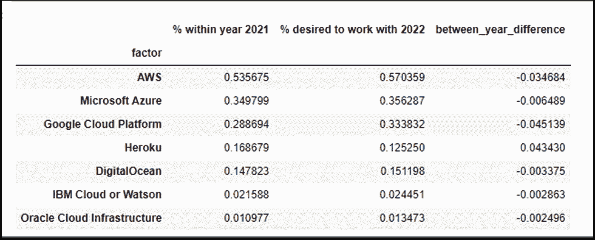

**Table 1\. Cloud Platform Environment**

这里我们有类别**云平台**的因素。这一类别中有 7 种不同的云平台。**% 2021 年内**告知 2021 年使用相应平台的开发者百分比。2022 年希望使用的 **%表示 2022 年希望使用给定平台的开发人员的百分比。最后一栏**_ year _ difference**是 2021 年使用该平台的开发者与 2022 年希望使用相应平台的开发者之间的百分比差异。**

我们通过使用每个因素的年度间差异来确定差异的**方向。如果 2021 年**使用给定云平台的开发者的百分比差异超过了 2022 年**开发者使用该平台的愿望，那么我们将此解释为 2022 年与 2021 年**相应因素的**使用趋势将相同。我们对此解释的理由是，他们不希望使用他们在 2021 年使用的另一种工具或技术。**

然而，如果他们在 2022 年的**预期使用量的差异超过了 2021 年的**，那么我们将此解释为相应云平台的**使用量可能会增加**。

考虑一下云平台 AWS。2021 年，54%的开发者在使用它。2022 年开发者使用 AWS 的意愿在 57%左右。这大约增加了 3%。我们将这种增长解释为 AWS 用户可能会越来越受欢迎。

另一方面，考虑云平台 Heroku。2021 年，大约 17%的开发者在使用它。开发者对 2022 年使用它的欲望约为 13%。所以我们有 4%的差距支持 2021 年。我们将此解释为云平台 Heroku **在 2022 年将拥有与 2021 年类似的**用途。

**我们的上述分析方法基于从百分比差异(正或负)的方向传递的直觉。我们没有通过必要的分析方法(如假设检验)来证明统计显著性。**

作为总结，我们使用 2021 堆栈溢出开发者调查。该数据集由 5625 名受访者组成。在我们开始之前，让我们看看受访者所在行业的规模。

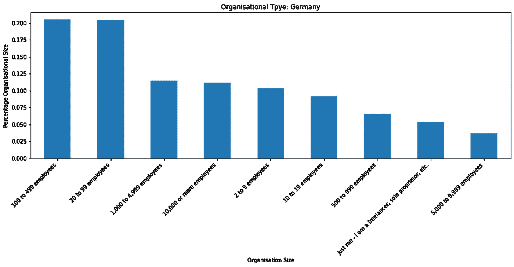

**Figure 2 Organisational Types**

当我们看这个图表时，我们可以根据开发人员的数量将公司大致分为三组。大多数开发人员来自拥有 100 到 449 名员工的公司(**中小型企业**)和 20 到 99 名员工的公司(**小型企业**)。此外，排名第三的受访者来自员工人数在 **1000 到 4999 人和 10000 人及以上的公司**。来自拥有 2 到 9 名员工的公司的开发人员似乎也占有很高的比例。也有受访者是**自由职业者**。较少的开发者来自拥有 5000 到 9999 名员工的公司。

现在我们已经对开发人员来自的公司有了一个大致的了解，让我们来探究一下数据集中出现的开发人员的类型。

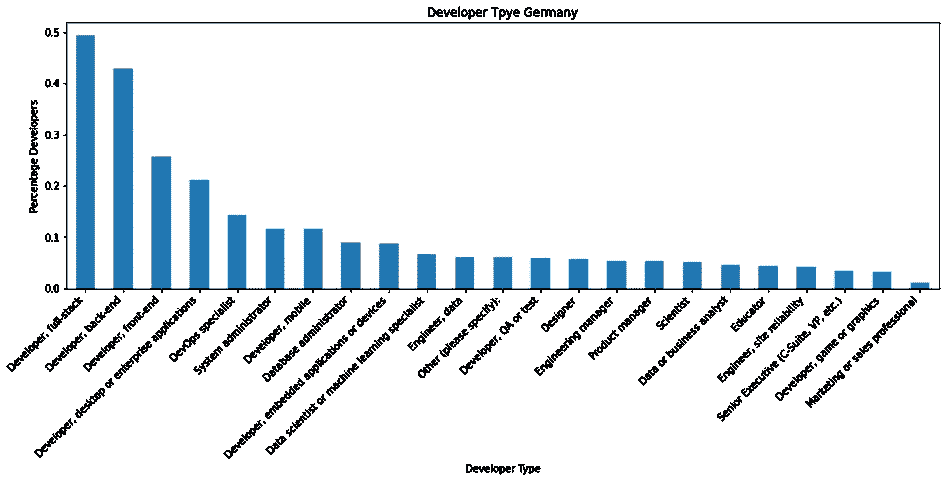

**Figure 3 Developer Tpye**

开发者类型大概有 23 种，受访者最多的是**开发者，全栈**，其次是**开发者，后端**。此后，我们有**开发人员，前端**，开发人员，桌面或企业应用，**开发人员专家**，**系统管理员**，**开发人员，移动设备**，**数据库管理员，**和开发人员，嵌入式应用设备。除了已经提到的开发人员，其他开发人员类型的分布似乎是平均分布的，市场营销或销售代表是最低的。

让我们从云平台的使用开始。

## **1。云平台**

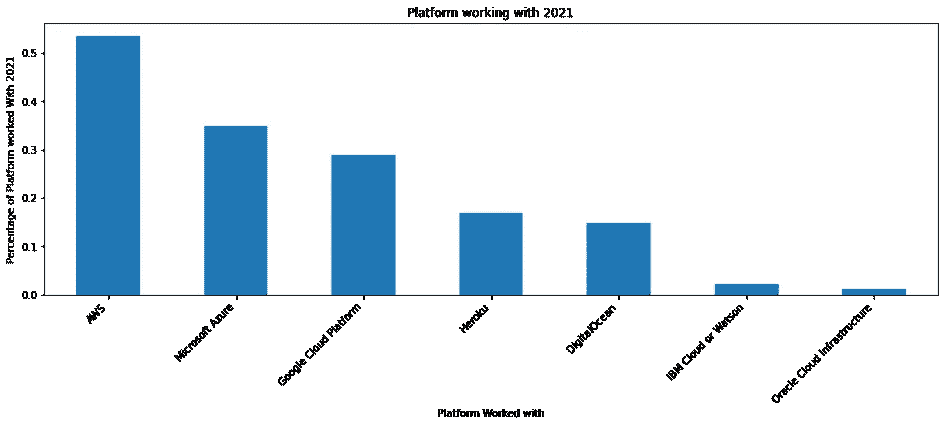

**Cloud Platform 2021**

从图表中，我们观察到大多数开发人员使用 **AWS** 。其次是**微软 Azure、谷歌云、Heroku、**和**数字海洋**。使用最少的是 **IBM Cloud** 或 **Watson** 和 **Oracle Cloud Infrastructure。**

让我们来看看 2022 年开发人员希望与哪些云平台合作的分布情况。

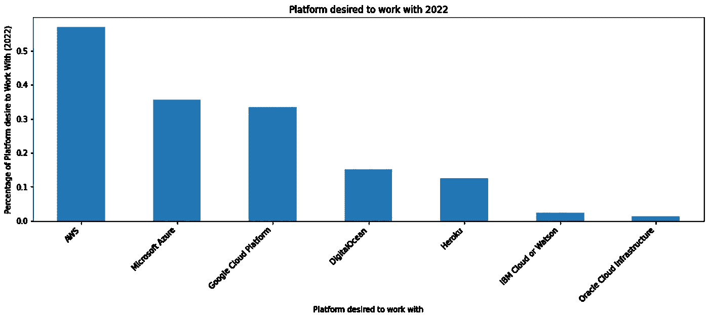

**Desired Cloud Platform 2022**

在这里，我们看到胎面仍然与 2021 年相同。唯一不同的是 DigitalOcean 和 Heroku 换了位置。

接下来，我们将两个图表放在一起(**2021 年的使用分布**(绿色)和 d**2022 年的期望使用分布**(紫色))

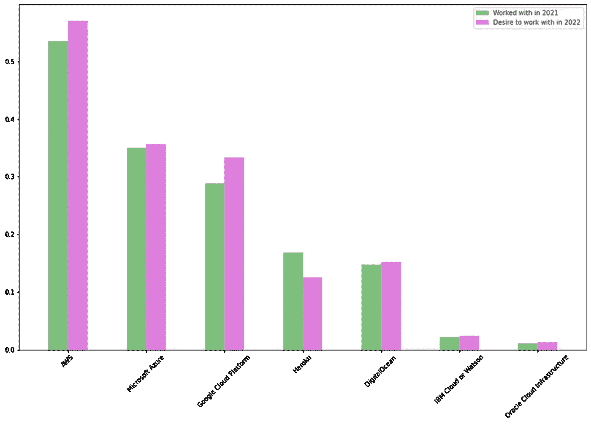

**Cloud Platform usage and desired**

我们看到，就百分比而言，2022 年更多的开发者更喜欢使用 **AWS** 。这一观察同样适用于**微软 Azure** 。我们对其他平台的需求也略有增加。然而，我们观察到 2022 年更少的开发者喜欢使用 Heroku。

现在让我们来看看百分比差异。

## 百分比差异

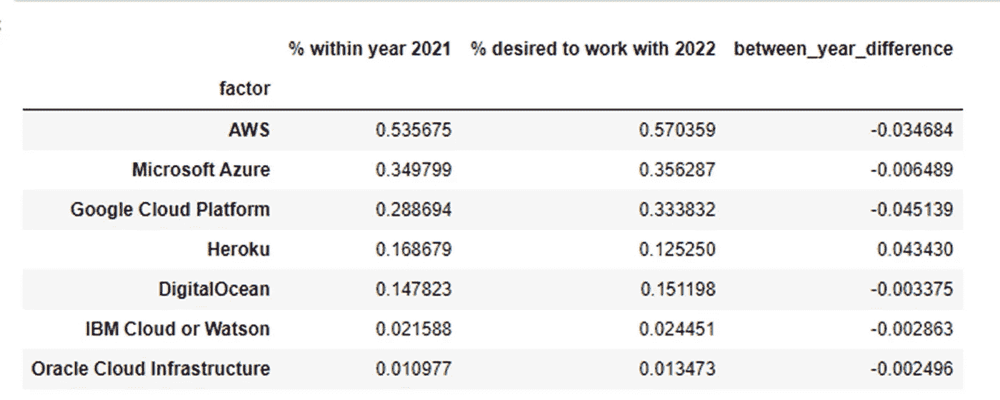

**percentage differences of usage in 2021 and desired in 2022**

观察各列及其对应的行值。仔细查看数值和百分比差异(年间差异)

下图是开发者使用云平台的百分比差异图。

**percentage differences of usage in 2021 and desired in 2022**

总的来说，我们观察到 2022 年大多数云平台的使用有显著增加的趋势。最值得注意的偏好是**谷歌云平台**和 **AWS** 。Heroku 的用法将继续遵循 2021 年的趋势。

接下来，我们将介绍数据库环境方面的信息。

**2。数据库环境**

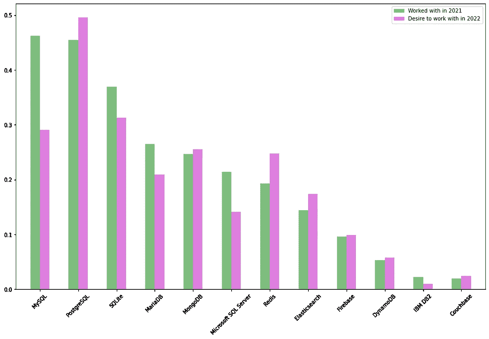

Database Enviornment

现在考虑下图中的百分比差异。

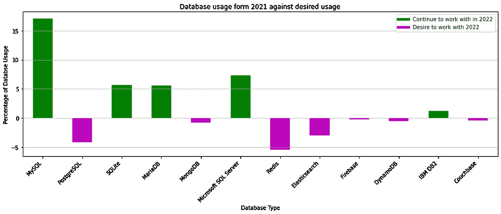

使用量显著增加的有 **PostgreSQL、Redis 和 Elasticsearch。**此外，我们还观察到对 **MongoDB** 、 **Firebase** 、 **DynamoDB** 和 **Couchbase** 的需求略有增加。对于 **MySQL** ， **SQLite** ， **MariaDB** ，**微软 SQL Server** ， **IBM DB** 的趋势需求很可能保持到 2021 年。

接下来，我们介绍 Misch_Tech 工具的百分比差异。

3 个混合技术工具

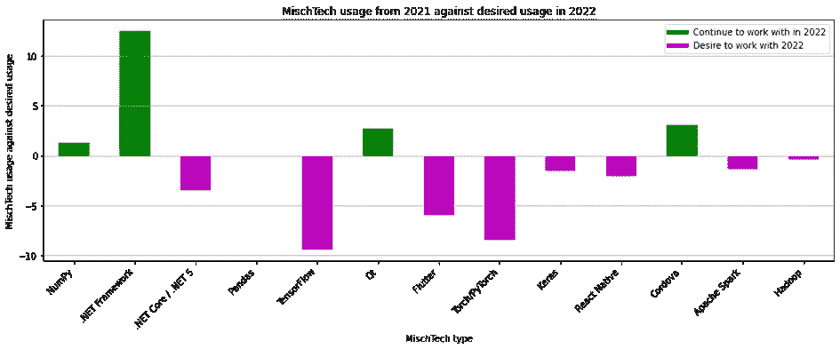

对**的欲望增加了。Net Core/。Net 5** 、 **TensorFlow、**、 **TorchPyTouch** 、 **Keras** 、 **React Native** 、 **Apache Spark** 、 **Hadoop** 。另一方面， **NumPy** 、 **NET Framework** 、 **Ot** 和 **Cardova** 的使用趋势遵循 2021 年的趋势。

下一张图描绘了新协作工具的百分比差异。

**4。新的协作工具**

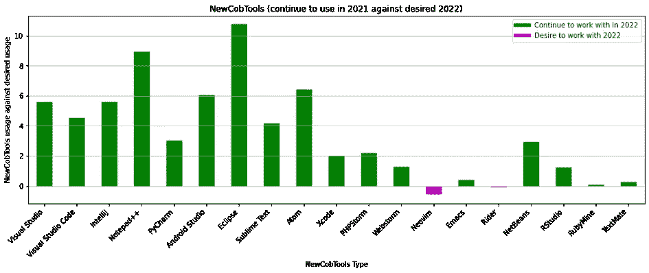

除了 **Neovim** 和 **Rider** 之外，新协作工具的使用趋势似乎在 2021 年保持不变。 **Visual Studio** ， **Visual Studio Cod** e， **IntelliJ** ， **Notepad+** ， **PyCharm** ， **Android Studio** ， **Eclipse** ， **Sublime Text** ， **Axiom** 好像是跟着 2021 年。

我们的下一个分析是关于编程、脚本和标记语言。

**5。编程、脚本和标记语言**

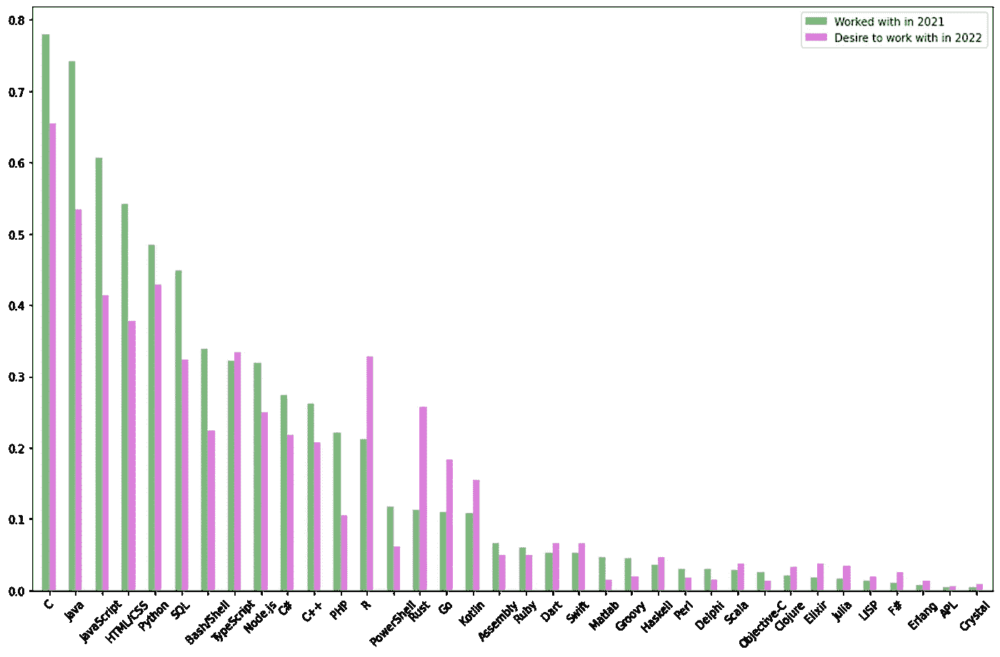

**Programming, Scripting, and markup languages**

上图描绘了 2021 年(绿色)和 2022 年(紫色)开发商之间的使用百分比差异

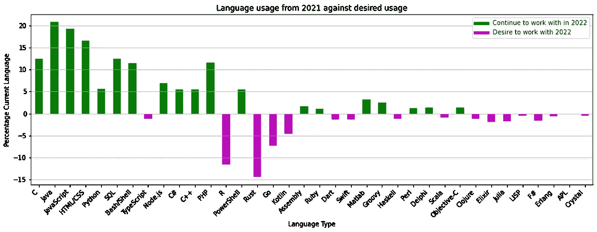

对于这一类别，我们观察到对 2022 年 **R、Rust、Go** 和 **Kotlin** 的需求增加。**打字稿**、**飞镖、斯威夫特**、**斯卡拉**、**哈斯克尔**、**仙丹**、**科朱雷**和**茱莉亚**的记录略有上升。 **c** ， **Java** ， **JavaScript** ， **HTML/CSS** ， **PHP** ， **SQL** ， **Bush/Shell** ， **C#** 和 **C++** 的使用情况将与 2021 年的趋势相似。

**6。工具技术**

现在我们考虑工具技术

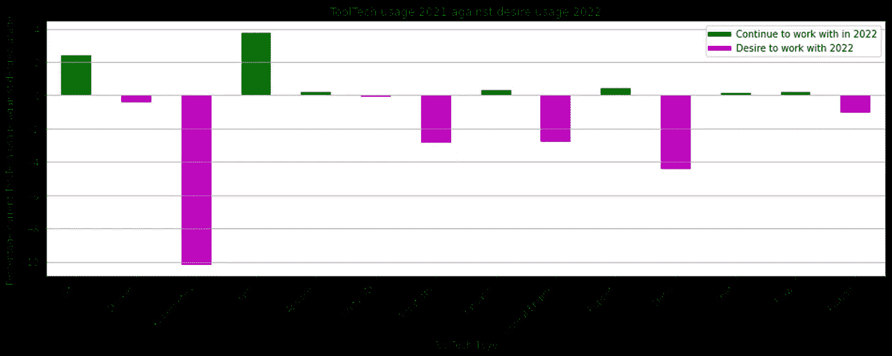

我们观察到对 **Kubernetes** 、 **Terraform** 、**虚幻引擎、Deno** 和 **Pulumi** 的需求增加。另一方面，对 **Git** 、 **Yam** 、 **Xamarin** 、**木偶**、**厨师**和**流**的需求将呈现与 2021 年类似的趋势。

**7。网络框架**

最后，让我们看看 web 框架。

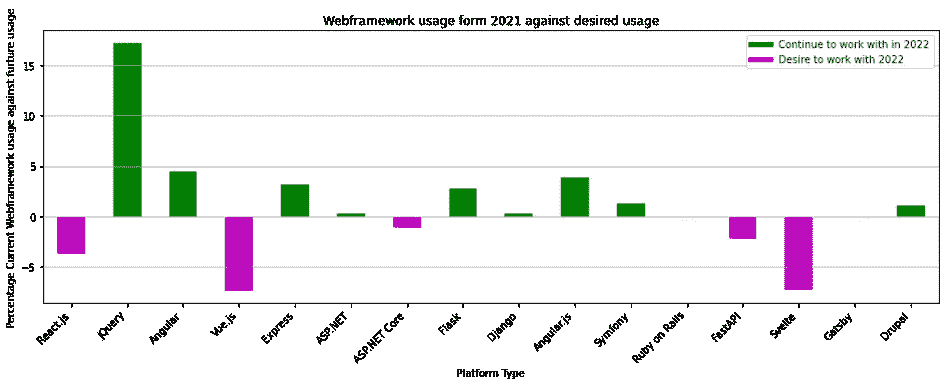

对 **React.js** 、 **Vue.js** 、**Asp.NET 核心**、 **FasAPI、**和**苗条**的欲望增加。另一方面， **JQuery** ， **Angular** ， **Angular JS** ， **Flask** ， **Symfony** 和 **Drupal** 似乎遵循着与 2021 年类似的趋势。

# **总之**

在本文中，我们揭示了 2022 年德国开发人员在使用技术和工具方面的偏好趋势。我们使用 2021 年 StackOverflow 调查数据集的 5625 个数据集，开发人员来自不同的行业机构。我们使用开发人员在调查中回答的两个问题来确定他们在 2022 年对技术和工具的使用趋势。

这些类别是:

1.  **，2。* ***数据库*** *，3。* ***误切工具*** *，4。* ***新的协作工具*** *、5。* ***编程、脚本和标记语言*** *，6。* ***工具技术*** *和 7。* ***Web 框架和库****

# ***2022 年的可能趋势***

1.  ***云平台***

***使用量增加**:谷歌云、AWS、微软 Azure、DigitalOcean、IBM Cloud 或 Watson、甲骨文云*

***常量用法:**Heroku*

## ***2。数据库***

***增加使用** : *PostgreSQL、Redis、Elasticsearch、MongoDB、Firebase、DynamoDB、Couchbase**

***常量用法:** *MySQL、SQLite、MariaDB、微软 SQL Server、IBM DB**

## ***3。错误技术工具***

***增加用法:** *。Net Core/。Net 5、TensorFlow、Flutter、TorchPyTouch、Keras、React Native、Apache Spark 和 Hadoop**

***常量用法:** *NumPy、NET Framework、Ot、Cardova**

## ***4。新的协作工具***

***增加用法:** *Neovim 和 Rider**

***常量用法:** *Visual Studio、Visual Studio 代码、IntelliJ、Notepad+、PyCharm、Android Studio、Eclipse、Sublime Text、Axiom**

## ***5。编程、脚本和标记语言***

***增加用法:** *R、Rust、Go、Kotlin、TypeScript、Dart、Swift、Scala、Haskell、Elixir、Clojure、Julia**

***常量用法:** *C、Java、JavaScript、HTML/CSS、PHP、SQL、Bush/Shell、C#和 C++**

## ***6。工具技术***

***增加用法:** *Kubernetes、Terraform、Unreal Engine、Deno、Pulumi**

***常量用法:** *Git、Yam、Xamarin、Puppet、Chef、Flow**

## ***7。Web 框架***

***增加用法:** *React.js、Vue.js、Asp.NET 核心、FasAPI、Svelte**

***常量用法:** *JQuery、Angular、Angular JS、Flask、Symfony、Drupal**

*最后，我们观察到 ***【新协作工具】*** 类别中的趋势似乎是不变的。在其他类别中，趋势似乎遵循一种混合的动态形式。*

***非常感谢您的阅读。如果你觉得这篇文章有趣或不有趣，请留下你的评论和建议。***

* [## Mlearning.ai 提交建议

### 如何成为移动人工智能的作者

medium.com](/mlearning-ai/mlearning-ai-submission-suggestions-b51e2b130bfb)*