# 哪些技术、语言和学习机会对开发人员来说最有价值——2022 年 StackOverflow 调查的结果

> 原文：<https://medium.com/mlearning-ai/which-technologies-languages-and-learning-opportunities-are-the-most-valuable-among-developers-99ebbf5df280?source=collection_archive---------5----------------------->

在决定开发人员报酬的因素中，技术、编程语言和学习机会是最重要的。该分析旨在根据从 2022 年 5 月开始的[堆栈溢出调查的公开数据量化相关性，数据集已经在](https://insights.stackoverflow.com/survey)[的 Kaggle](https://www.kaggle.com/datasets/dheemanthbhat/stack-overflow-annual-developer-survey-2022) 公开。与之前的故事类似，该分析基于 [SHapley 附加解释(SHAP)](https://shap.readthedocs.io/en/latest/index.html) 值。分析的全部细节也可以在 Kaggle 上的[公共笔记本中获得。](https://www.kaggle.com/code/dima806/techstackstudy-stackoverflowdevelopersurvey2)

Photo by [Alex Kotliarskyi](https://unsplash.com/@frantic?utm_source=unsplash&utm_medium=referral&utm_content=creditCopyText) on [Unsplash](https://unsplash.com/s/photos/learning-and-development?utm_source=unsplash&utm_medium=referral&utm_content=creditCopyText)

# 步骤 1 —数据预处理

这里，数据预处理包括以下步骤:

*   选择具有代表性的大量响应者的国家和开发商类型；
*   将标签列重新调整为 kUSD/year；
*   从调查结果中提取技术、语言和学习机会；
*   移除具有最大(最小)补偿的 5% (5%)响应者；
*   删除对此分析不感兴趣的列；
*   替换空值。

# 步骤 2-设置机器学习模型来预测年度薪酬

上一步准备的数据在训练样本和测试样本之间随机分割，并使用明确考虑分类特征的 [CatBoostRegressor](https://catboost.ai/en/docs/concepts/python-reference_catboostregressor) 模型建模。所得模型的[均方根误差](https://scikit-learn.org/stable/modules/generated/sklearn.metrics.mean_squared_error.html) (RMSE)为**约 54 kUSD/年**，与基准模型 RMSE 的约 74 kUSD/年相比有所提高**(假设对于每个**响应者**同样的**年补偿约 100 kUSD/年**)。**

# 步骤 3——对获得的机器学习模型的解释。

在这里，我使用[SHapley(SHAP)](https://shap-lrjball.readthedocs.io/en/latest/index.html)的附加解释方法，一种最常见的探索机器学习模型的可解释性的方法。因此，SHAP 价值的单位是 kUSD/年。

首先，查看代码学习方法的 SHAP 值范围( **LearnCode** 变量):

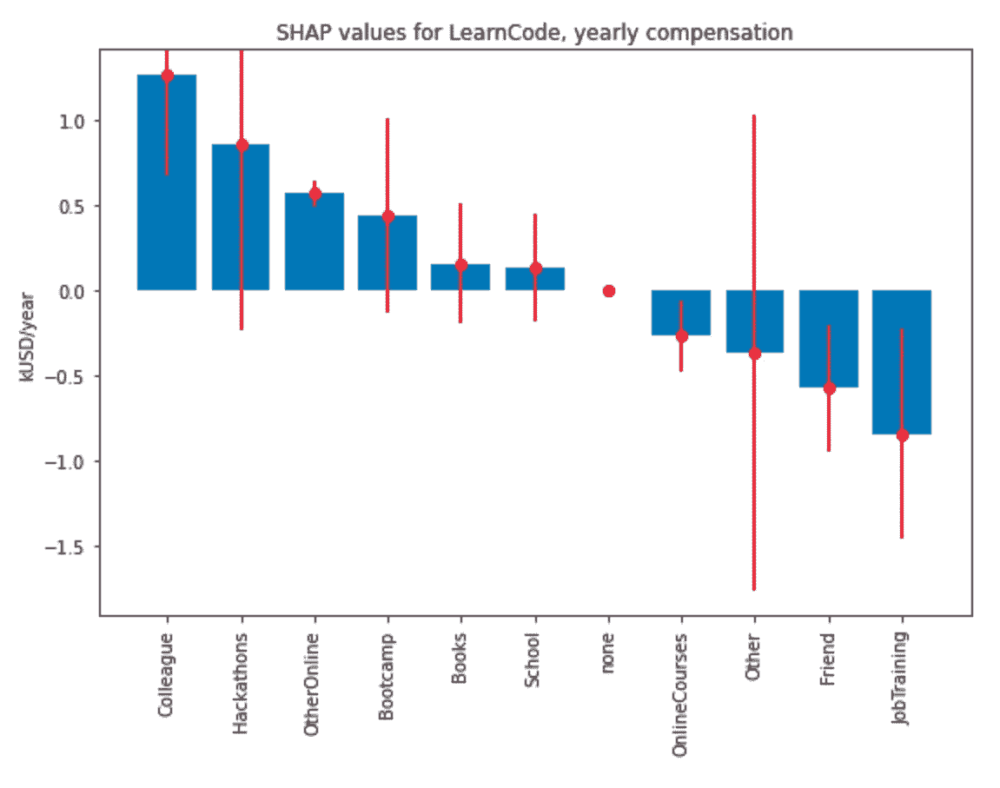

Image source: author, [TechStackStudy_StackOverflowDeveloperSurvey2 | Kaggle](https://www.kaggle.com/code/dima806/techstackstudy-stackoverflowdevelopersurvey2)

正如我们所看到的，**最有价值的是从同事那里学习代码**，而**从在线课程、朋友和工作培训中学习代码在回应者中似乎没有价值**(平均而言**对基本年薪有负面影响**)。

尽管如此，**从博客和播客中在线学习代码还是有积极的影响**:

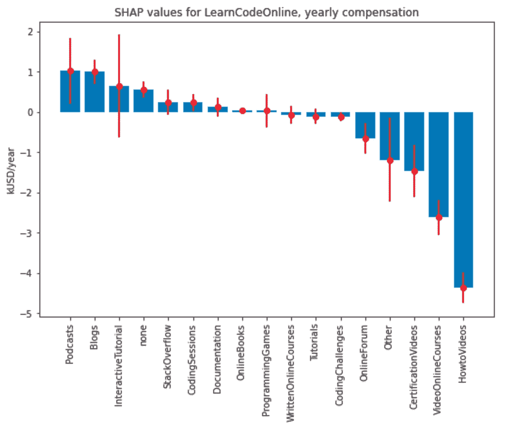

Image source: author, [TechStackStudy_StackOverflowDeveloperSurvey2 | Kaggle](https://www.kaggle.com/code/dima806/techstackstudy-stackoverflowdevelopersurvey2)

最有价值的认证**来自**[**Coursera**](https://www.coursera.org/)**平台**:****

**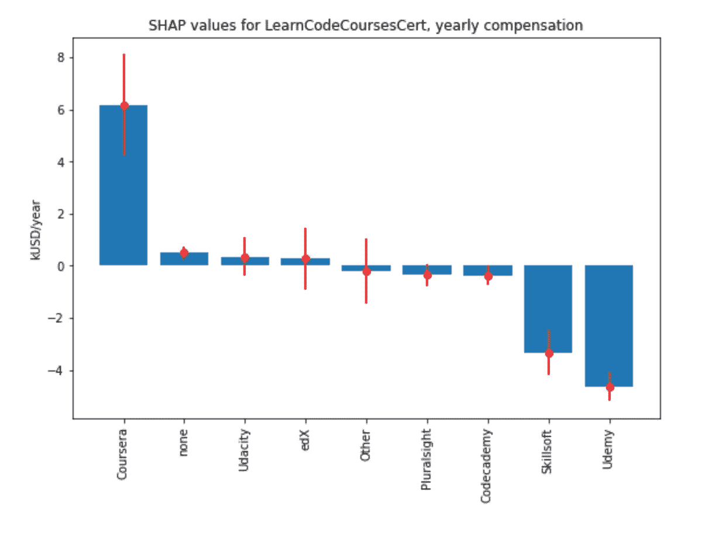**

**Image source: author, [TechStackStudy_StackOverflowDeveloperSurvey2 | Kaggle](https://www.kaggle.com/code/dima806/techstackstudy-stackoverflowdevelopersurvey2)**

**在响应者已经合作过的平台中( **PlatformHaveWorkedWith** 变量)，最大的**净效应**来自**主机托管服务(注意可变性很大)，其次是** [**亚马逊网络服务(AWS)**](https://aws.amazon.com/) **和** [**谷歌云平台(GCP)**](http://cloud.google.com/) **:****

**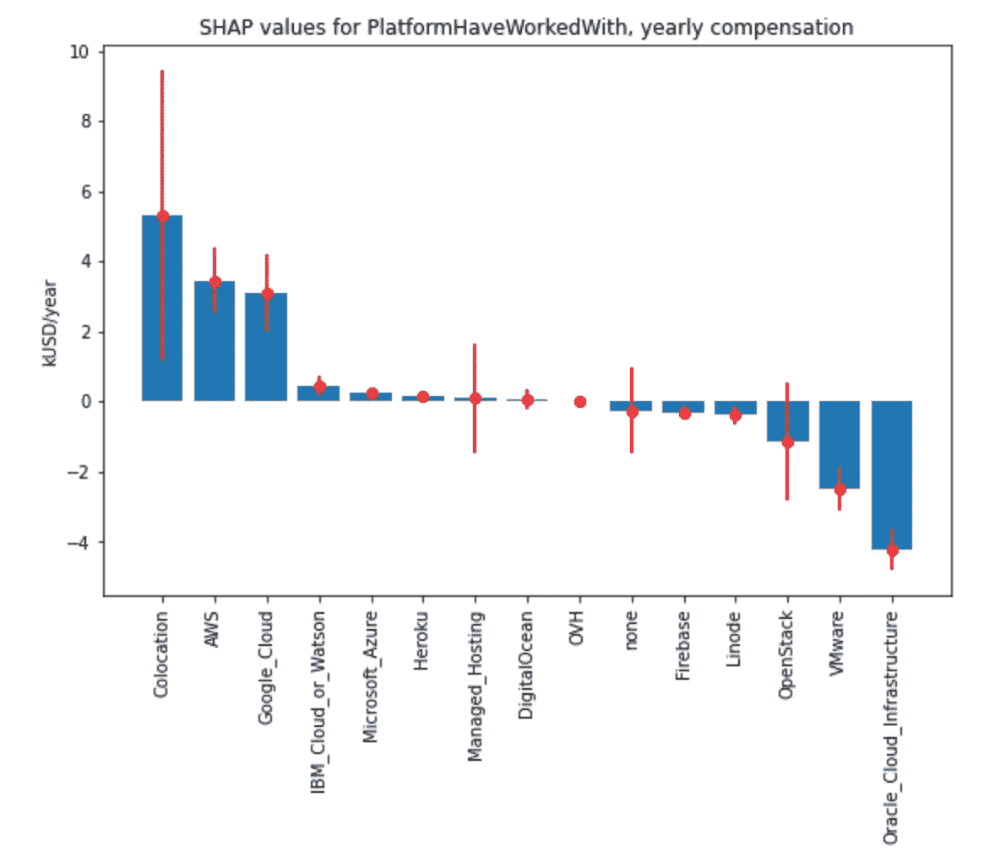**

**Image source: author, [TechStackStudy_StackOverflowDeveloperSurvey2 | Kaggle](https://www.kaggle.com/code/dima806/techstackstudy-stackoverflowdevelopersurvey2)**

**响应者中最有价值的编码语言(**language have worked with**variable)**的**领袖是 [**OCaml**](https://ocaml.org/) **，**[**Scala**](https://scala-lang.org/)**，Typescript** ，其次是 [COBOL](https://en.wikipedia.org/wiki/COBOL) ， [C++](https://en.wikipedia.org/wiki/C%2B%2B) ，******

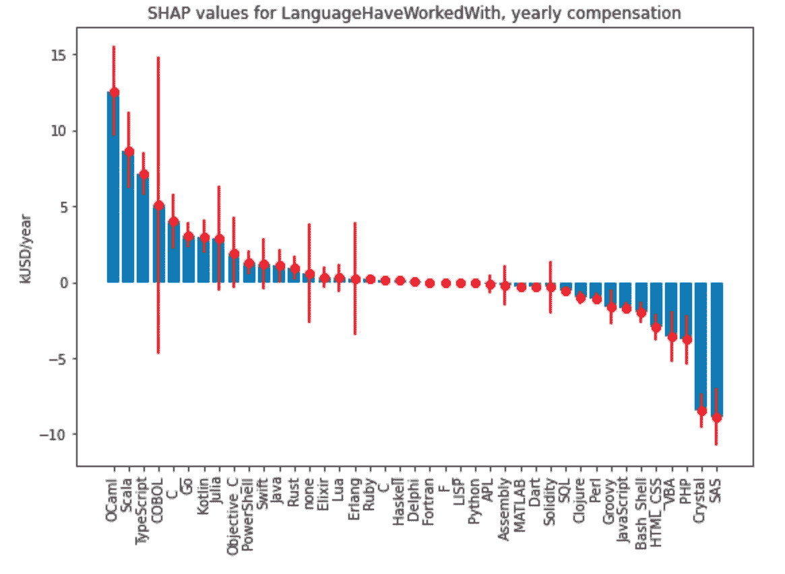

Image source: author, [TechStackStudy_StackOverflowDeveloperSurvey2 | Kaggle](https://www.kaggle.com/code/dima806/techstackstudy-stackoverflowdevelopersurvey2)

在响应者使用过的数据库中(**databaseaveworkedwith**变量)，最有价值的**是**[**MongoDB**](https://www.mongodb.com/)**和** [**Redis**](https://redis.io/) :

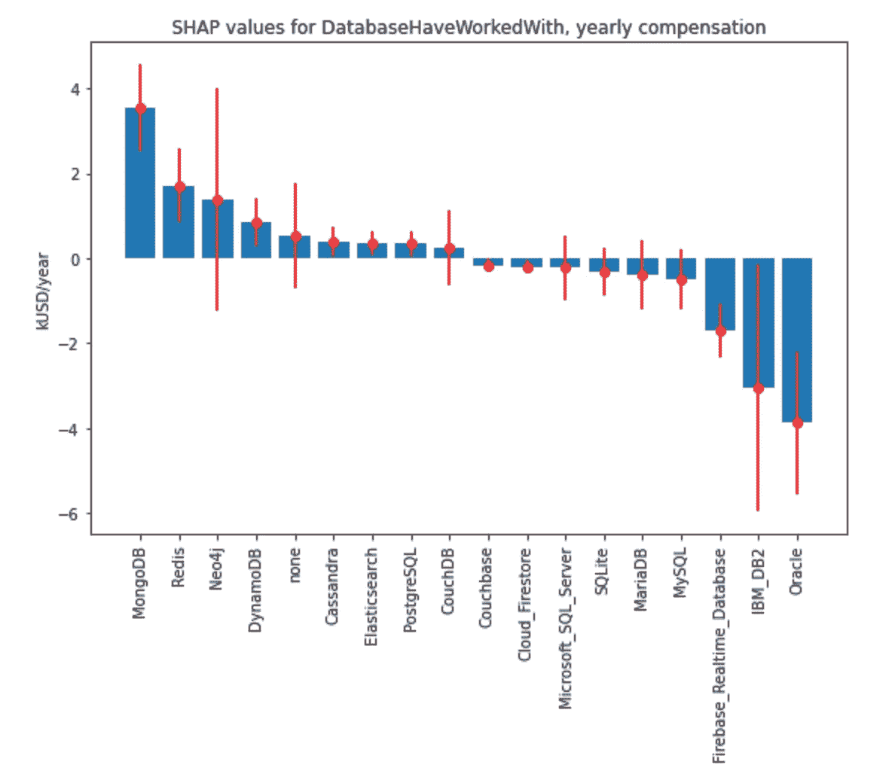

Image source: author, [TechStackStudy_StackOverflowDeveloperSurvey2 | Kaggle](https://www.kaggle.com/code/dima806/techstackstudy-stackoverflowdevelopersurvey2)

响应者中最有价值的 web frames 是 [Deno](https://deno.com/) 和 [Fastify](https://www.fastify.io/) :

Image source: author, [TechStackStudy_StackOverflowDeveloperSurvey2 | Kaggle](https://www.kaggle.com/code/dima806/techstackstudy-stackoverflowdevelopersurvey2)

响应者**中最受重视的杂牌 tech 有** [**阿帕奇 Spark**](https://spark.apache.org/)**[**Uno Platform**](https://platform.uno/)**[**tensor flow**](https://www.tensorflow.org/):****

****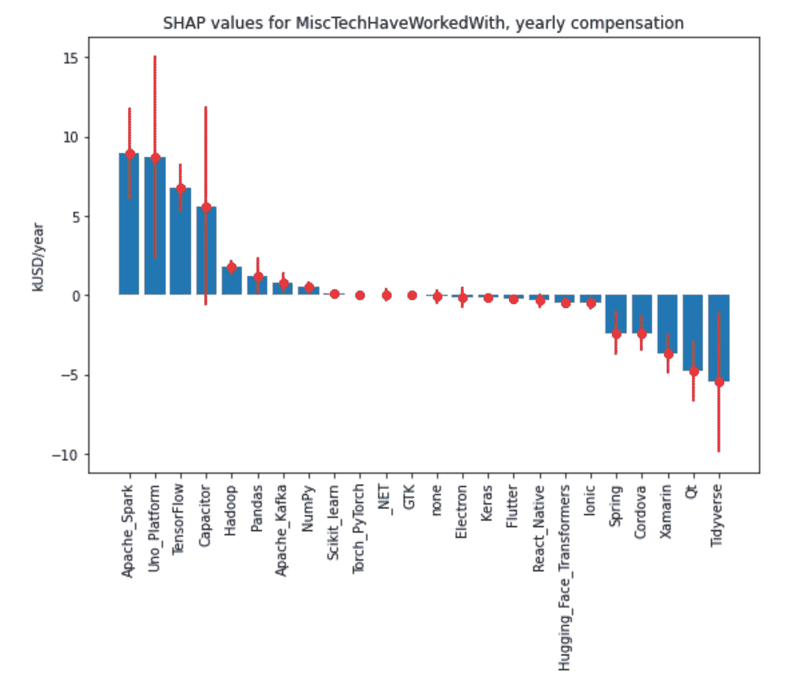****

****Image source: author, [TechStackStudy_StackOverflowDeveloperSurvey2 | Kaggle](https://www.kaggle.com/code/dima806/techstackstudy-stackoverflowdevelopersurvey2)****

****在响应者合作过的 t **ech 工具中，最有价值的是******，其次是**[**【Kubernetes】**](https://kubernetes.io/)**[**家酿**](https://brew.sh/) **，以及****:**********

******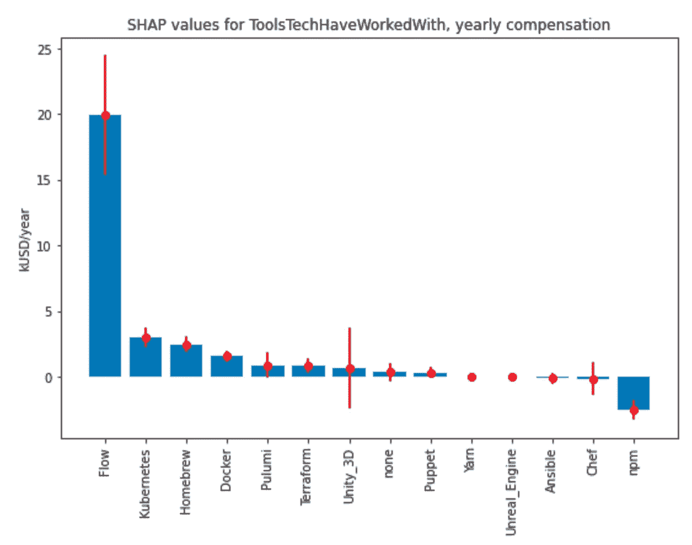******

******Image source: author, [TechStackStudy_StackOverflowDeveloperSurvey2 | Kaggle](https://www.kaggle.com/code/dima806/techstackstudy-stackoverflowdevelopersurvey2)******

******有趣的是，响应者使用过的**最有价值的协作工具是**[**GoLand**](https://www.jetbrains.com/go/)**，**[**CLion**](https://www.jetbrains.com/clion/)**和****【py charm**，这三个工具都来自 [JetBrains](https://www.jetbrains.com/) :******

****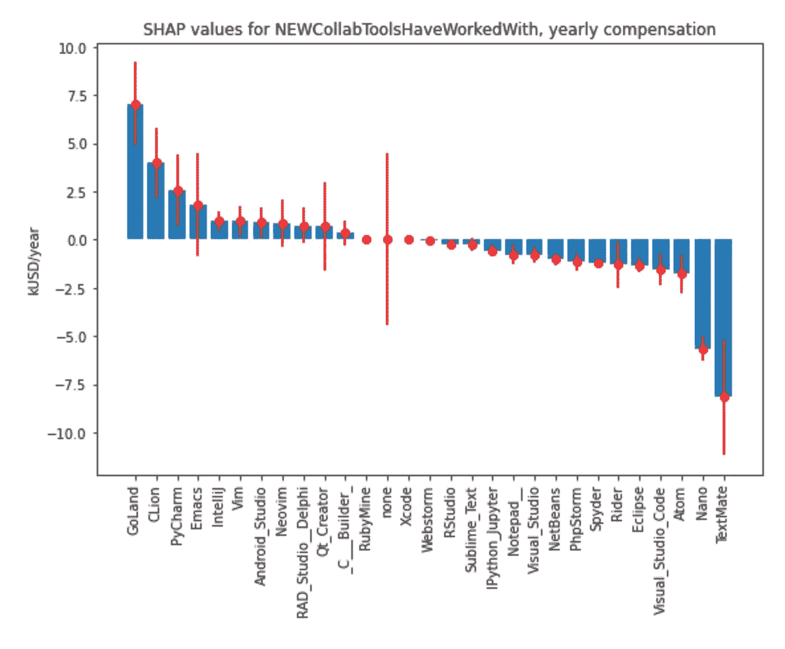****

****Image source: author, [TechStackStudy_StackOverflowDeveloperSurvey2 | Kaggle](https://www.kaggle.com/code/dima806/techstackstudy-stackoverflowdevelopersurvey2)****

****响应者使用过的**最有价值的异步办公堆栈**是团队的[堆栈溢出](https://stackoverflow.co/teams/)，其次是 [Smartsheet](https://www.smartsheet.com/) 和[概念](https://www.notion.so/):****

****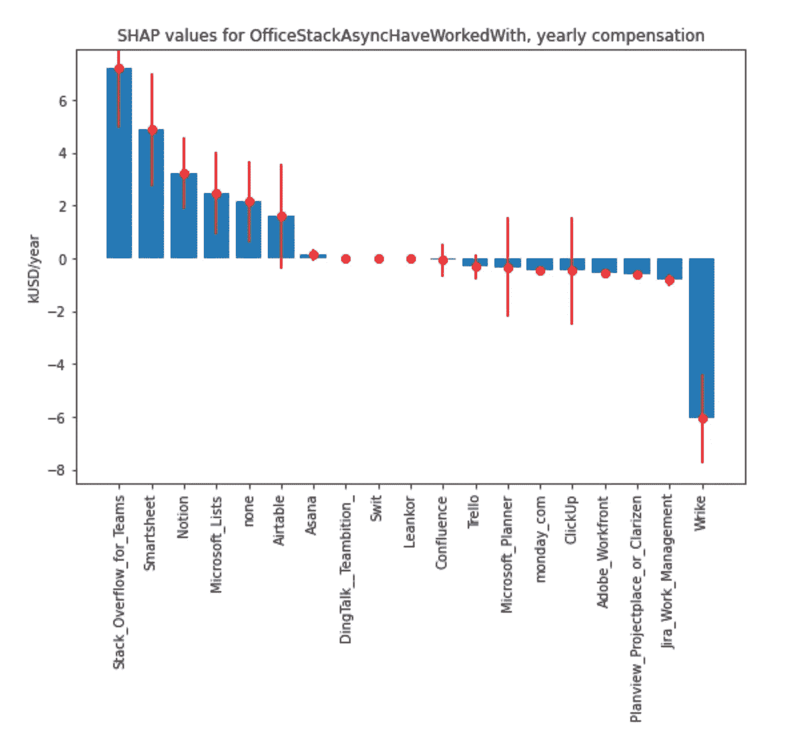****

****Image source: author, [TechStackStudy_StackOverflowDeveloperSurvey2 | Kaggle](https://www.kaggle.com/code/dima806/techstackstudy-stackoverflowdevelopersurvey2)****

****两个最有价值的**同步办公栈**先遣队与**合作过的是** [**交响乐**](https://symphony.com/) **和** [**Wickr**](https://wickr.com/) :****

****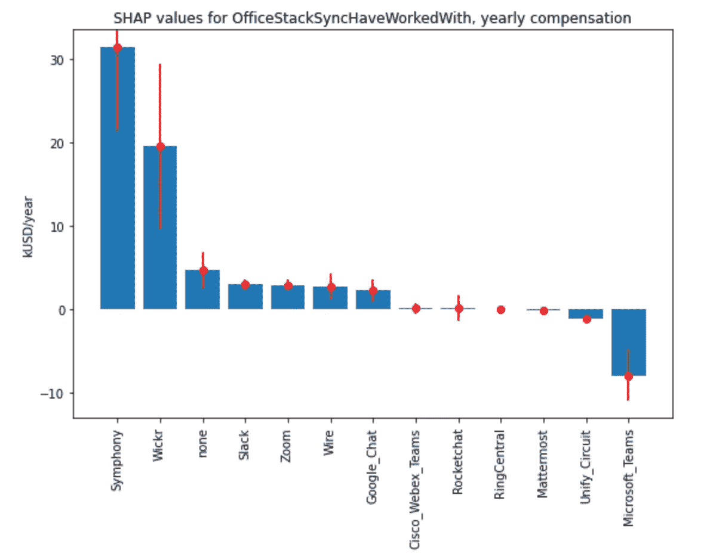****

****Image source: author, [TechStackStudy_StackOverflowDeveloperSurvey2 | Kaggle](https://www.kaggle.com/code/dima806/techstackstudy-stackoverflowdevelopersurvey2)****

****最后，应急人员专业使用的**最有价值的操作系统是** [**macOS**](https://support.apple.com/macos) :****

****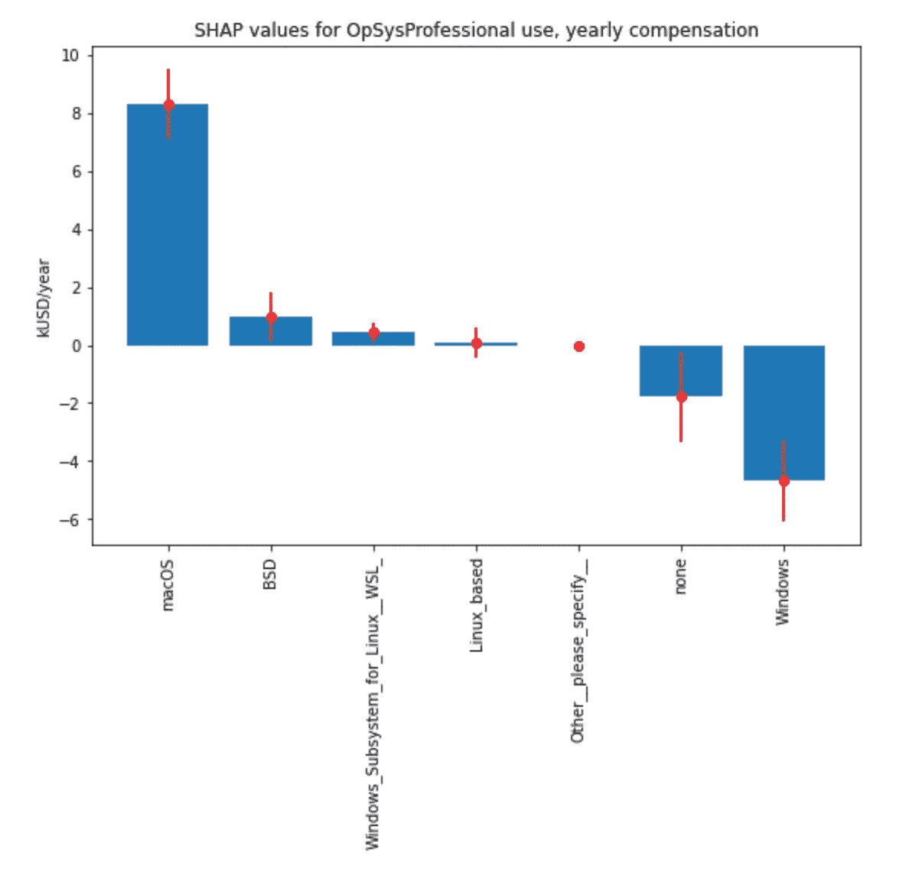****

****Image source: author, [TechStackStudy_StackOverflowDeveloperSurvey2 | Kaggle](https://www.kaggle.com/code/dima806/techstackstudy-stackoverflowdevelopersurvey2)****

****希望这些结果能对你有用。如果有问题/意见，不要犹豫，在下面的评论中写下或**通过 [LinkedIn](https://www.linkedin.com/in/dima806/) 或 [Twitter](https://twitter.com/dima806_dima) 直接联系我**。****

****你也可以 [**订阅我的新文章**](/subscribe/@dima806) ，或者 [**成为推荐媒介会员**](/@dima806/membership) 。****

**** [## Mlearning.ai 提交建议

### 如何成为 Mlearning.ai 上的作家

medium.com](/mlearning-ai/mlearning-ai-submission-suggestions-b51e2b130bfb)****