# 我们在这个世界上是谁(在哪里)？

> 原文：<https://medium.com/mlearning-ai/who-and-where-are-we-in-this-world-d5636f58455c?source=collection_archive---------3----------------------->

我们，人类，往往有相当的记忆力。尤其是开车的时候。我们知道什么是红灯，并意识到我们需要让我们的汽车减速，记住道路名称，甚至用谷歌地图进行路径规划，甚至理解如何驾驶汽车！

假设我给你这张世界地图，让你指出我在哪里(最近的城市)。你可能不知道。我可以从旧金山一直到悉尼，甚至布宜诺斯艾利斯。

但是假设我给你下面这张图片。

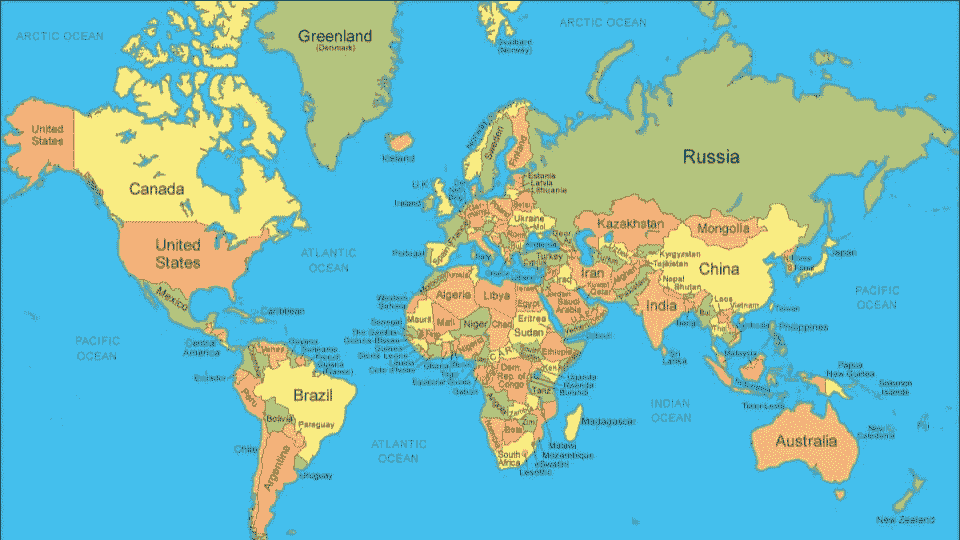

从数学上来说，我让你做的初始预测(当我让你通过简单给出世界地图来告诉我我在哪里)的高斯分布是完全均匀的。

让我再给你一张图片，现在让我们看看你是否能找出我在哪里:

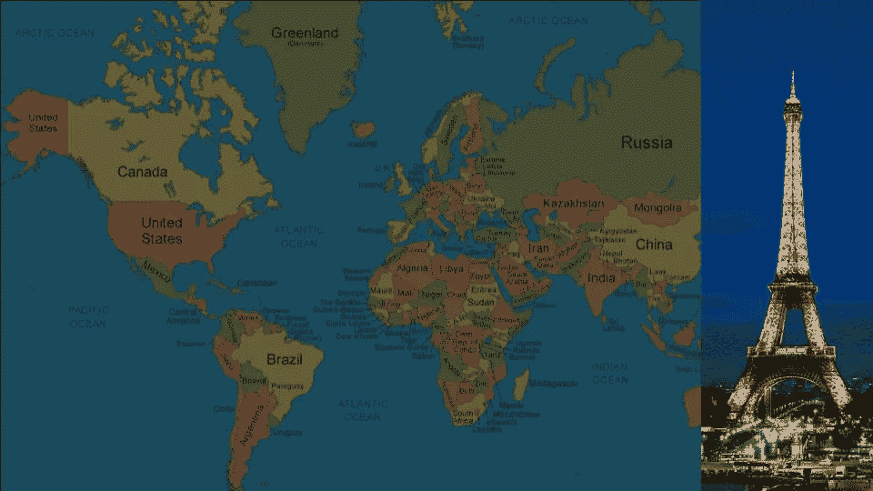

当我给你一个具体的图像，艾菲尔铁塔，你能够精确地指出我所说的城市给定的数据点。您已经算出了具有非常低的方差(σ)的高斯均值(μ)。

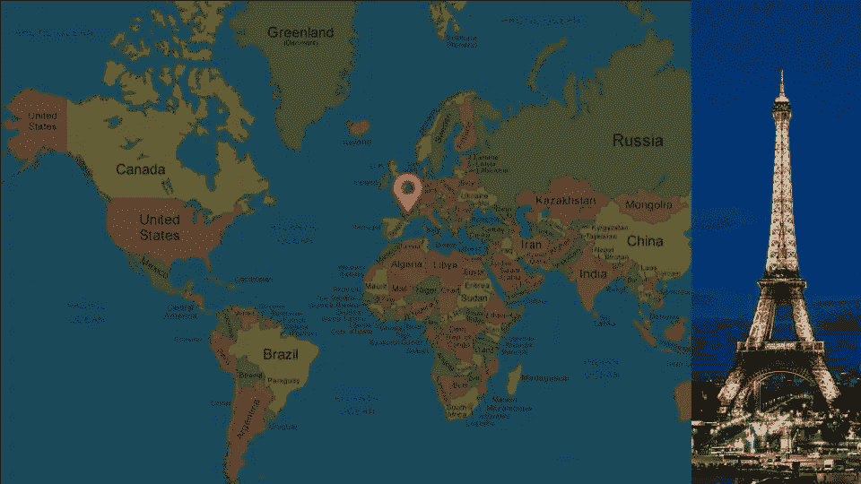

这实质上是自动驾驶汽车本地化的核心。给定我们位置的初始 GPS 估计，我们可以使用地标作为来源来帮助定位并计算出我们(自动驾驶汽车)在世界上的位置。

# GPS 烂透了

很多人在高速公路上开车时通常使用 GPS，这没问题。但在自动驾驶汽车的情况下，GPS 信号的方差(σ)往往在 3 到 10 米之间，这是非常不准确的。GPS 可能会告诉我，我正在正确的车道上行驶，但实际上，我完全偏离了轨道，可能会撞到一些行人。

就自动驾驶汽车的定位而言，GPS 是一个很好的起点。问题是，相信 GPS 是定位的解决方案是一个不准确的猜测。

GPS 帮助自动驾驶汽车粗略估计汽车的位置(在数学术语中，这是一个均值为 0 的高斯函数)。最初，这款车可以在世界上的任何地方。但是 GPS 可以让汽车得到更好的，更新的位置估计。平均值将会比以前高(因为我们已经精确定位了位置),同时变化(从世界上的任何坐标点到 3-10 米之间的坐标点)急剧减少。

为了建立一个更好的评估系统，我们将不得不从我们漂亮的卡尔曼滤波器开始。

# 使用传感器融合数据

自主车辆定位的第一步是从传感器融合中收集数据。我写了一篇更深入的文章，你可以在这里阅读。(*注:本节假设你已经阅读了我链接的关于传感器融合的文章，或者你知道卡尔曼滤波器+传感器融合是如何工作的)。*

当我们接受传感器融合数据时，我们基本上获得了通过汽车的激光雷达和雷达传感器检测到的所有对象的列表。我们还可以获得地标的坐标(例如建筑物)不随时间“移动”来帮助计算我们可能在哪里。

真正有趣的是，我们可以使用最近邻算法来帮助我们找出汽车可能在哪里。对于传感器融合数据中的每一个点，最近邻算法将把最近的点与每个标志相关联。在此基础上，我们能够找出我们潜在的位置。

问题很简单，这不是一个非常精确的方法，我们需要更精确的方法来进行预测。但是，让我们用这个作为一个初步的估计，在我们的 GPS 估计之上，我们可能在哪里。

# 粒子过滤器

粒子滤波器的要点是它们执行贝叶斯规则的实现。我们分散了一堆我们可能存在的所有可能性的点(高斯分布，平均值为 0 ),并将每个点与三维权重[x，y，θ]相关联，其中 x 和 y 是我们的坐标点，θ是我们的方向。

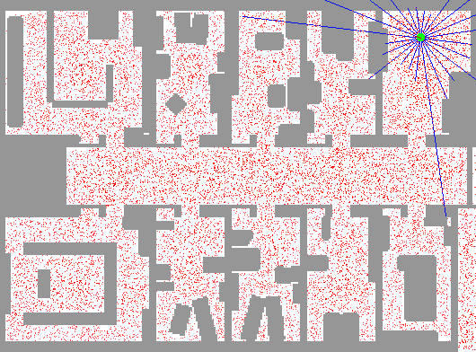

[Source](http://udacity.com)

你在这张图片中注意到的是，整张地图周围的所有红点都是汽车可能出现的位置。蓝线是传感器融合数据中的地标位置(精确定位每个地标离我们有多远),为了更好地了解我们离地标的距离，实现了最近邻。每个粒子都有一个与之相关的重量，我们可以把它看作是重要的重量。权重越重要，它存活的概率就越高(权重大小与估计持续的时间成正比)。

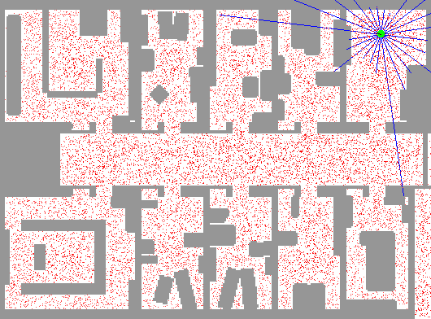

[Source](http://udacity.com)

这一点在下面的 GIF 中得到了很好的体现。权重在每个时间步长被重新采样，权重越大，它实际存活的概率就越高。

这可以分为 4 个主要步骤:

1.  初始化
2.  预测步骤
3.  更新步骤(权重)
4.  重采样

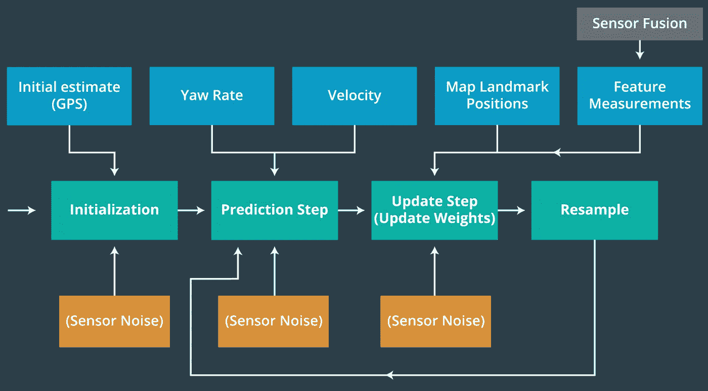

[Source](http://udacity.com)

# 初始化

初始化的第一步是计算出我们想要使用多少粒子(“红点”)来进行估计(是的，这是一个我们要调整的超参数)。你需要在准确性和成本之间找出一个最佳值来使用(计算成本→会使汽车太慢)。

初始化汽车的最简单方法是简单地将地图/初始 GPS 估计分成均匀间隔的网格部分，同时考虑高斯传感器噪声分布。

# 预言；预测；预告

既然我们已经初始化了我们的地图空间，并且初始化了所有可以传递到预测步骤的传感器数据，那么是时候这样做了；对每一个粒子做一个预测，我们可能在哪里。我们将使用基本的运动模型，利用带有高斯传感器噪声的速度和偏航测量来更新每个粒子。

下面的公式可以帮助我们做到这一点:

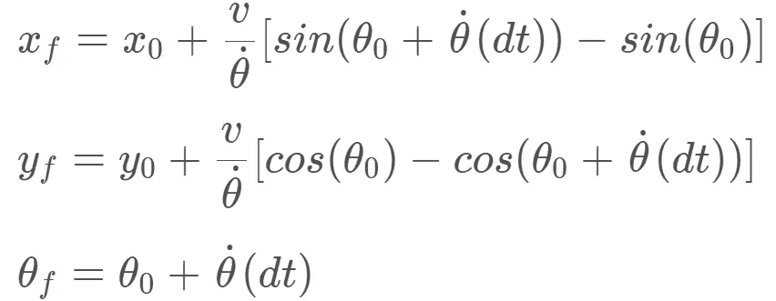

在本文前面，我提到每个粒子都有一个相关的 x、y 和θ，同时考虑到高斯传感器噪声。我们使用这个简单的运动模型(根据速度更新)来帮助估计汽车可能在哪里。

# 更新步骤(权重)

数据关联是我们在更新权重之前必须解决的问题，以帮助用地图地标映射我们的激光雷达测量。这正是最近邻算法发挥作用的地方。我们比较所有点的大小，并使用该数据来帮助找出哪个激光雷达点最接近实际的地标本身。这个最近邻假设模型将在更新粒子的权重方面发挥作用。

在更新步骤中，我们可以使用测量值来更新粒子的权重，而不是使用我们的特征测量值(激光雷达+雷达)来影响关于汽车位置的预测。

我们可以更新粒子权重的方法是通过对每个测量使用多元高斯概率密度函数，并通过取它们的乘积来组合所有测量的可能性。请记住，我们假设每个地标观测都是独立的，因此我们将简单地取所有测量的所有可能性的乘积。

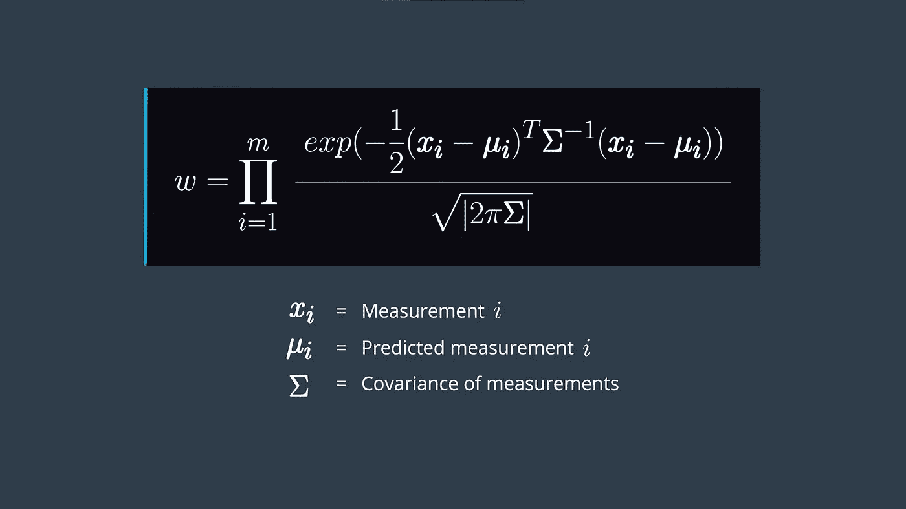

[Source](http://udacity.com)

xᵢ是我们在时间 I 的 x 测量值，yᵢ是我们在时间 I 的 x 测量值，σ是我们的协方差矩阵，由 x 和 y 的高斯噪声组成

1 需要注意的一点是，我们需要将汽车的尺寸从其本地坐标系转换到地图坐标系(xy 坐标系→地图)。

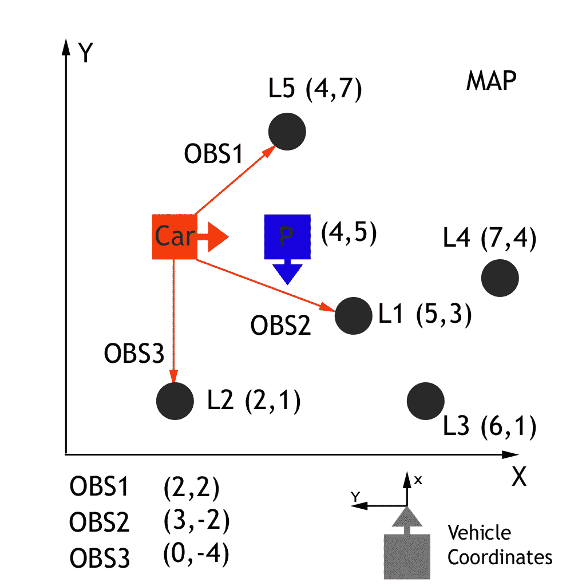

Example of the car on the vehicle's coordinates. This needs to be transformed into the map’s coordinates. [Source](http://udacity.com)

上图是汽车坐标的一个例子。我们现在想把它放进地图的坐标里。这可以通过使用以下等式的齐次变换来完成([这里有一个很棒的视频来了解关于这个变换问题的更多信息](https://www.youtube.com/watch?v=h11ljFJeaLo)):

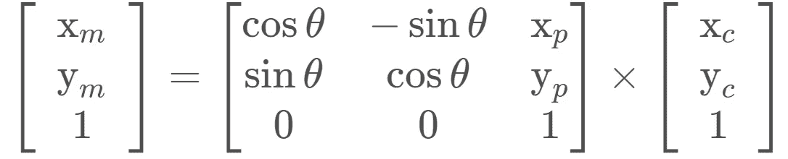

总而言之，更新步骤包括 3 个部分:

1.  从车辆坐标到地图坐标的转换
2.  数据关联→使用最近邻算法计算出最接近地标的权重
3.  更新步骤→使用多元高斯概率密度函数更新每个粒子的权重

# 重采样

这才是本土化的真正肉；我们如何在保留帮助我们定位汽车的估计值的同时，去掉对我们无关紧要的估计值和权重？

假设我们有一个饼图，在那里我们放置了所有的加权粒子(每个粒子占一个切片，切片越大=重要性权重%越大)。我们会定义一个变量，β (beta ),从 0 开始。然后，通过均匀采样 0 到 2 *最大重量(例如如果最大权重是 0.3，那么最大权重将是 0.6)。

我们也可以选择一个随机指数，I 代表我们的权重。因此，如果我们选择指数 6 作为例子(饼图上的权重#6)，那么我们将比较它和β的权重。如果这个权重小于β，那么我们将丢弃权重#6。现在，β干扰了 7 号砝码(β和 6 号砝码之间的差异是什么会移动到 7 号砝码上)。

如果β现在的更新值小于权重#7，那么我们保留权重#7，不丢弃它(它保留下来)。因为现在权重#7 大于β，所以我们现在将为β重新采样一个新值，并从那里继续。

巴斯蒂安·特龙在他的机器人人工智能课上对此进行了深入的解释。欢迎观看视频了解更多信息。他提供的视觉效果对开发重采样算法背后的逻辑直觉非常有帮助。

# 计算误差

在找出一种方法来衡量我们的模型的整体性能方面，我们可以使用所有粒子的加权平均误差。这可以通过简单地取每个粒子和它的基本事实之间的均方根误差，并乘以粒子的重量来完成。

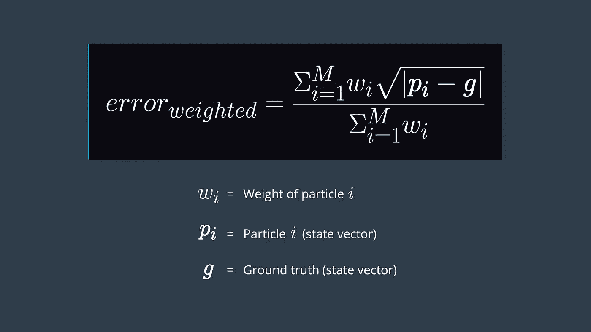

# 本土化在行动！

作为我一直在做的成为自动驾驶汽车工程师 nanodegree 的一部分，我被赋予了以下这个确切挑战的任务。请随意看看下面的 Github 代码和视频演示！

 [## srianumakonda/成为自动驾驶汽车工程师-Term-2

### 这个库包含了完成 Udacity 的本地化课程的最终项目所需的所有代码

github.com](https://github.com/srianumakonda/Become-a-Self-Driving-Car-Engineer-Term-2/tree/master/CarND-Kidnapped-Vehicle-Project-master) 

注意，视频中的蓝圈实际上是汽车本地化预测的估计值。

# 与我联系

跟上我的进度和旅程，在下面打造一辆完全自动驾驶的汽车！

[电子邮件](mailto:sri.anumakonda06@gmail.com)

[领英](https://www.linkedin.com/in/srianumakonda/)

[推特](https://twitter.com/srianumakonda)

[网站](http://srianumakonda.com/)