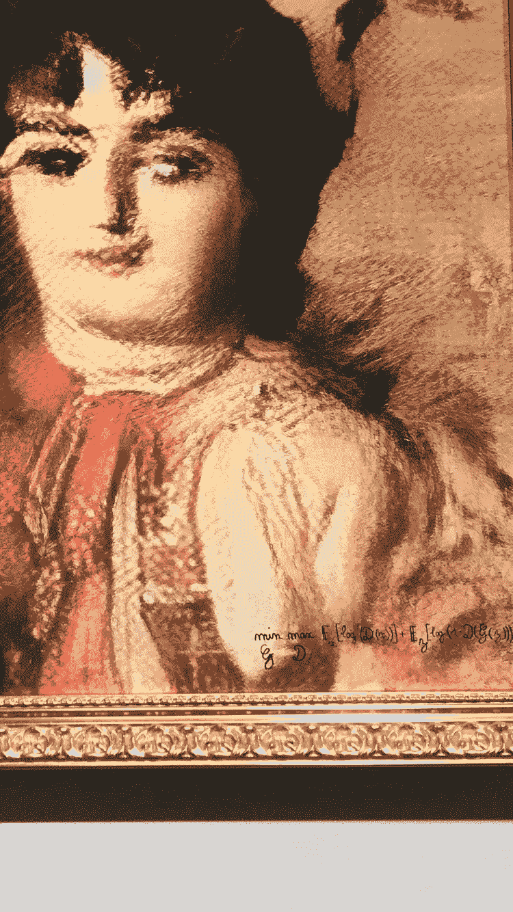
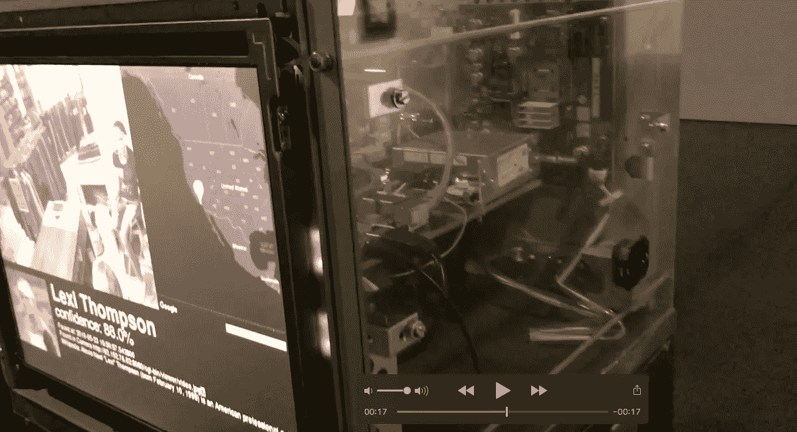
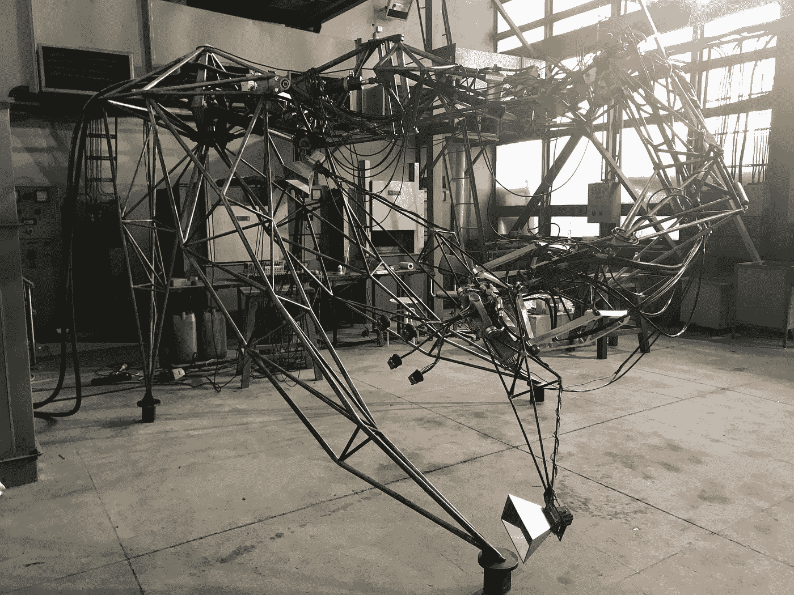
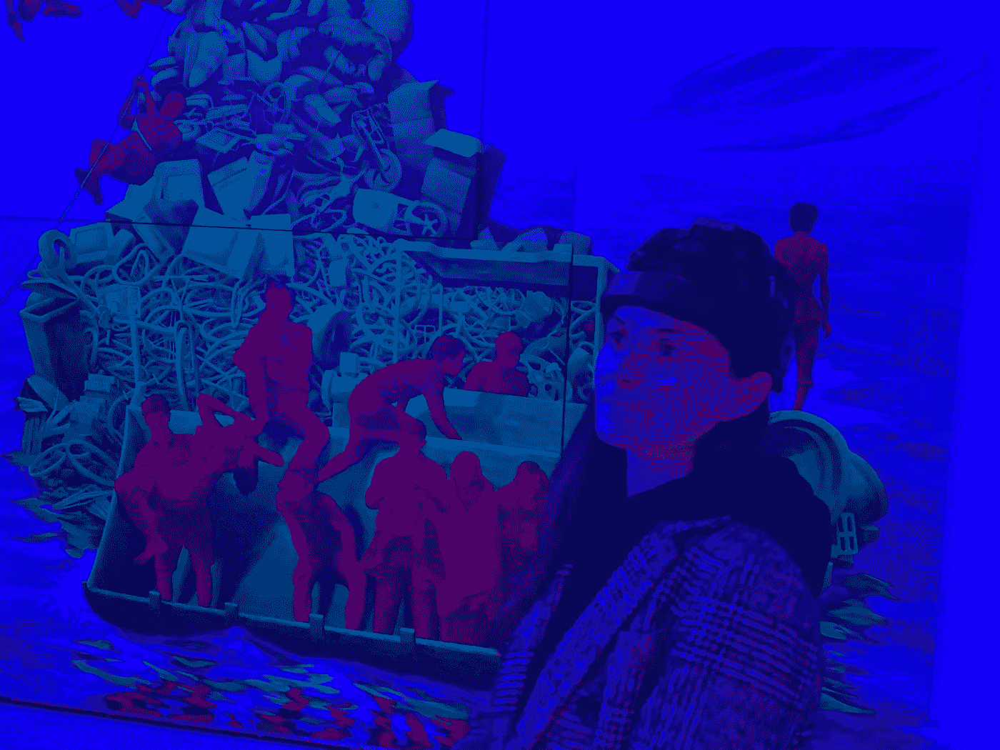

# 谁是现代的达芬奇？

> 原文：<https://medium.com/mlearning-ai/who-is-a-modern-leonardo-da-vinci-6533a6f71633?source=collection_archive---------7----------------------->

*# art tech # AI # VR # AR #区块链#digitalart #* [***人工智能***](https://www.google.com/search?client=safari&rls=en&q=artificial+intelligence&spell=1&sa=X&ved=2ahUKEwj3rojs1tbmAhUCJlAKHRMuCDAQkeECKAB6BAgSECk)

几个月前，由沃尔特·伊萨克森撰写的列奥纳多·达·芬奇的最新传记出版了。买的时候过了一会儿，读的时候又过了一个“瞬间”，虽然听说过那些一个周末就“吞掉”这 700 多页肉肉的人。我花了更长的时间，不仅因为时间不够，还因为我渴望更深入地了解达芬奇如何将科学和艺术结合起来。他如何利用他的数学、解剖学或地理学知识来描绘美丽、比例恰当和感人的场景和人物。

这种对不同世界的迷恋也可以从阿达·洛芙莱斯的历史中找到，他作为第一个程序员和计算机科学的先驱创造了历史。作为天才诗人拜伦的女儿，同时也是天才数学家，她相信直觉和想象力是有效使用数学和科学概念的关键。她认为自己同时是一个分析家和玄学家，她通过在作品中结合诗歌和数学来实现这一点。显然，她认为机器不仅可以用于计算，还可以用于创作音乐和艺术作品，只要它们获得适当的数据和算法。

**Photo:** La Duchesse De Belamy (Men are weak. An opportunity to bring order and harmony cannot be thrown away under the pretext of few fools advocating for scattered agitation), OBVIOUS

近 200 年前听起来像科幻小说的东西今天是事实，Ada 不仅可以被认为是编程的先驱，而且可以被理解为艺术和新技术的结合。到目前为止，媒体最大的关注点是关于法国集体明显以 432，500 美元的感官价格出售埃德蒙·德·贝拉米肖像的信息。在艺术家的签名中，有一个算法显示该图像不是人类的作品，而是一个 AI。它看起来很奇怪，这是我今年 10 月在巴黎艺术博览会上看到的“Belamy 家族”系列 11 幅肖像中的另一幅。从美学的角度来看，这件作品并不令人印象深刻。然而，画廊给出的数量，虽然肯定低于纽约的一个，令人印象深刻。

# **值得在维基百科描述吗？**

在欧洲，包括波兰，广泛理解的数字艺术类别的展览和装置的数量正在增长。它们有两个维度。一方面，展品或装置使用现代技术呈现，特别是:人工智能(AI)、虚拟(VR)或增强(ar)现实。另一方面，艺术视觉试图让我们意识到现代技术的发展会把我们引向何方。这两个类别的有趣组合是比利时艺术家 Dries Depoorter 的作品，今年在巴塞尔电子博物馆展出。

Photo: Dries Depoorter, Surveillance Paparazzi, installation presented at HeK during the exhibition AI: Entangled realities — living with Artificial Intelligence

在他的*监控狗仔队*装置中，这位艺术家黑掉了世界各地 1000 多个不安全的监控摄像头。在安装屏幕上，人们被“系统”实时识别。这个系统是基于将被监控者的脸与他在网络上的照片和维基百科上的描述进行匹配...我们从网飞*黑镜*系列或者来自中国的报道中了解到类似的情况，在中国，面部扫描早已脱离实验阶段。然而，在艺术展上看到这样的装置，除此之外，被其他二十件类似的“艺术品”所包围，并不能让你不带情绪地路过…

# ***恐怖谷*或者当一个你可以害怕的机器人**

连接各种展览的一个反复出现的主题是“恐怖谷”的概念，这是指日本工程师和机器人设计师森昌弘在 1970 年进行的一项研究，内容是人们对机器人外观的情绪反应。机器人越像人类，它似乎越有同情心。然而，在某种程度上，这种倾向发生了变化，原来与人类最相似的机器人引起了他的不适甚至恐惧。最近，我“高兴地”在克拉科夫的 AGH 体验了森先生所描述的替代物，与森斯特直接接触。这个 5 米长的四条腿的生物是由波兰艺术家兼工程师爱德华·伊纳托维奇在 20 世纪 60 年代设计的。在 70 年代，它出现在飞利浦的 Evoluon 展厅，这是对作品创作的支持。后来的几十年里，他一直被认为失踪了，直到被 AGH 的员工找到。然后他被带到克拉科夫，目前正在那里重建。

Photo: RE: SENSTER, AGH — University of Science and Technology in Krakow (October 2019)

RE-SENSTER 项目仍在进行中，尽管这座雕塑已经在 2019 年的弗罗茨瓦夫 WRO 艺术节上展出过，它的下一场展览计划于 2020 年年中在华沙的 Zachę ta 举行。不可否认，这是一件机器人艺术的非凡范例，尤其是因为它是世界上第一件对接受者的声音和动作做出反应的电脑控制雕塑。70 年代的录像保存至今，从中可以看到它的辉煌([https://www.youtube.com/watch?v=hoZb5MTKzQc](https://www.youtube.com/watch?v=hoZb5MTKzQc))。

# **全球雷达上的人工智能**

今年围绕人工智能发生了很多事情。就我个人而言，我有机会在巴塞尔和维也纳参加了两个非常有趣的围绕人工智能的展览。另一个同样有趣的地方是在伦敦。此外，今年由世界上最大的拍卖行之一[佳士得](https://www.christies.com)举办的艺术+技术峰会致力于人工智能。因为组织者有分享知识的使命，所以在 Youtube 上可以看到这次会议的完整记录。虽然整个过程持续了 5 个多小时，但还是值得花时间来听听这个领域已经发生的事情，以及它对文化机构和艺术市场的发展前景是什么。而且事实证明，AI 应用有很多明显和不明显的领域。

有趣的是，首届 Art + Tech 峰会专门针对区块链，而迄今为止的最后一届——2019 年 11 月在香港——则是针对混合现实的。除了其他人之外， [DSL Collection](http://www.g1expo.com/v3/dslcollection/contact/) 的联合创始人 Sylvain Levy 也是其中一员，在今年的 ASIA NOW Paris 现代艺术博览会上，我有幸聆听了他关于技术是否会改变我们对艺术的体验的讨论

> 人们越来越多地寻找经历而不是对象。因此，例如**增强和虚拟现实在艺术中作为一种交流方式和扩展体验领域的重要性日益增加。**

在展示的虚拟现实的例子中，有尼基塔·沙伦尼(Nikita Shalenny)的《桥》(Bridge)，这是我在今年华沙非常有趣的[数字文化](http://digitalcultures.pl/pl)期间在 TR Warszawa 的虚拟现实中体验的。在讨论之际，我遇到了当代艺术界另一个有趣的人物——中国艺术家[刘娃](https://www.liuwastudio.com)。在她的艺术中，她运用了神经科学的成就，在观众的情感和物理环境之间创造了视觉路径。这种装置的一个例子出现在“现在亚洲”上——头上戴着测试脑电波装置的观众会影响他正在观看的图像的颜色。

Photo: Art experience presented at the fair ASIA NOW 2019 in Paris: LIU WA, Glimpse: a Passing Look, 2018.

# **此外，列奥纳多和阿达有什么共同之处吗？**

围绕阿达·洛芙莱斯出现了许多争议，削弱了她在编程领域的先锋作用。同样，就达芬奇而言，有许多作品艺术史学家无法确定，它们在多大程度上是达芬奇创作的，以及在多大程度上是他与其他艺术家合作的。但这里的关键词是“合作”。阿达和莱昂纳多都不是在舒适的工作室里发展他们的天赋，而是在与他人的大量互动中发展他们自己和他们的想法。**所以重点不是自己去发现一切，而是“把点点滴滴连接起来”，这样新的发现才是开创性的。**

**额外链接:**

 [## 森斯特- rzeźba，斯图卡，罗博特卡，森斯特:实验室

### 关于:rzeźby 先生。życia·杰德诺

senster . ag . edu . pl](http://senster.agh.edu.pl)  [## 多莉娜·涅萨莫维奇

### 多莉娜·涅萨莫维奇-特明·斯托索万·希波泰兹·瑙科韦杰，兹戈德尼·którą机器人，雷苏内克·卢·阿尼玛贾·孔普特罗瓦…

pl.wikipedia.org](https://pl.wikipedia.org/wiki/Dolina_niesamowitości)  [## WRO 双年展 2019 CZYNNIK LUDZKI /人文方面

### Tematem 双年展 Sztuki Mediów WRO 2019，świętującego·斯沃杰 30-莱西，jest CZYNNIK LUDZKI /人文方面。30-莱切…

wrocenter.pl](https://wrocenter.pl/pl/wro2019/)  [## 画廊-明显的艺术

### 画廊-明显的艺术

画廊-明显的 Artobvious-art.com](https://obvious-art.com/gallery.html)  [## 阿达·洛芙莱斯

### 阿达·洛芙莱斯(1838 年)1815 年 10 月 10 日至伦敦，1852 年 10 月 27 日至伦敦…

pl.wikipedia.org](https://pl.wikipedia.org/wiki/Ada_Lovelace)  [## 监视狗仔队

### '监视狗仔队'试图采取狗仔队的照片与使用人工智能和不安全的监控摄像头从所有…

driesdepoorter.be](https://driesdepoorter.be/surveillance-paparazzi/)  [## 聊天室- Sylvain Levy & Faurschou 基金会和刘娃& benot Baume-ASIA NOW

### Charleen Leo 是新加坡滨海湾金沙艺术科学博物馆的展览项目经理，该博物馆是一座标志性建筑

www.asianowparis.com](https://www.asianowparis.com/en/2019/chatroom/sylvain-levy-faurschou-foundation-liu-wa-benot-baume)  [## 数字文化会议 a

### 数字文化-Konferencja-26-27 . 09 . 2019-Warszawa

数字文化](http://digitalcultures.pl/pl/wydarzenia-towarzyszace/vr-showcase)