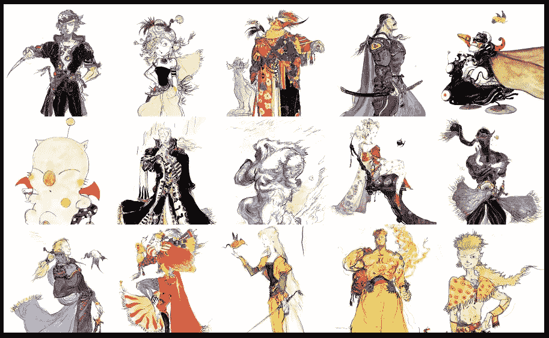
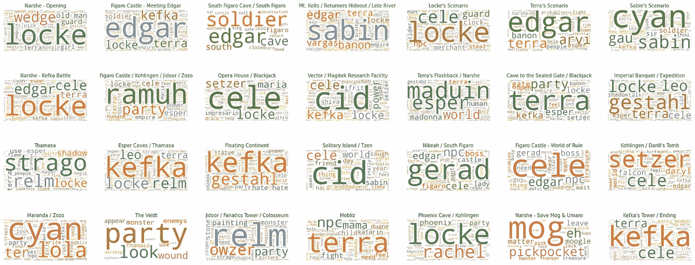

# 最终幻想 6 的主人公是谁？用自然语言处理来回答这个经常争论的问题

> 原文：<https://medium.com/mlearning-ai/who-is-the-hero-of-final-fantasy-vi-be5d07e07ad9?source=collection_archive---------0----------------------->

Final Fantasy VI Character Concept Art, by Yoshitaka Amano. From left to right; Top: Locke, Relm, Gogo, Cyan, Strago; Middle: Mog, Setzer, Umaro, Terra, Shadow; Bottom: Edgar, Kefka, Celes, Sabin, Gau

F *最终幻想 VI* 是电子游戏让我爱上了电子游戏。由 Squaresoft 开发并出版的 1994 年《超级任天堂经典》拥有一个初出茅庐的游戏玩家可能想要的一切:一个很好实现的角色的大型演员阵容，背景故事和动作的引人注目的融合，以及令人兴奋的叙事，感觉如此广阔，以至于直到今天我仍然对一个完整主义者的游戏感到震惊，尽管“只有”40 小时。

我不是我朋友中唯一一个玩完游戏的人。而且，就像 10 岁的孩子容易做的那样，我们经常为游戏的愚蠢细节而争吵，几年后互联网的出现会具体地回答这个问题。(Sa-bin vs . Suh-be 相当于 1994 年的 Her-my o-nee vs . Her-me-own。结果证明我错了。抱歉杰森。)

有一个问题从来没有明确的答案:

> 主角是谁？

明确地说，这个问题让我如此困惑是有原因的。首先，绝大多数的*最终幻想*游戏都有一个明显的英雄。菲里昂、塞西尔、巴茨、克劳德、史克尔、齐达内、提多斯、闪电、诺克蒂斯无疑是各自节目的明星。然而，*最终幻想 VI* 是仅有的两款没有明确主角的主线游戏之一——另一款是*最终幻想 XII* 。

最终，你会看到人们被分成四个不同的阵营:

*   **Terra 是英雄。**你在平衡世界的旅程从她开始。她从一个被洗脑的奴隶变成了一个有爱的女人。她失去了父亲的形象。她是你在大结局中看到的最后一个角色。她是发行商选择的角色，在系列中代表她的游戏。然而，这都忽略了一个事实，你可以在技术上击败最终的 boss，而无需重新招募 Terra。
*   塞蕾斯是英雄。你在毁灭世界的旅程从她开始。她从一个被洗脑的奴隶变成了一个有爱的女人。她失去了父亲的形象。她是打败游戏的四个角色之一。然而，塞蕾斯绝对没有得到出版商的爱。
*   两个女人都是英雄。他们的日记相互呼应，这一事实对于理解这一点至关重要。两者都是由对爱的追求和更好地了解自己的愿望所驱动的。这个论点是女权主义的一种松散形式，从一开始就没有通过贝克德尔检验，这使我想到…
*   **洛克是英雄。在帮助特拉和塞蕾斯逃离帝国的过程中，他扮演了一个关键的角色。他帮助他们两人追求更好的自我。此外，他是一个男人\_(ツ)_/(对不起，我只是不同意他应该被考虑，但他值得注意，所以……)**

我不会因为在*最终幻想*游戏中写了 20 页关于种族、性别、性取向的短文就给你上历史课。我分享它是为了让你和我一样被炒作，因为，在漫长的 27 年后，我终于要回答关于这个游戏我不知道的最后一件事:谁是主角？

# 方法学

我从 Fandom.com 最终幻想维基的[中提取游戏脚本开始。他们已经将游戏分成了逻辑故事片段，所以我使用他们的框架来创建我的数据集的行。然后我加了一章(平衡的世界/毁灭的世界)，](https://finalfantasy.fandom.com/wiki/Final_Fantasy_VI_SNES_script)

然后，我使用了 NLTK 库中的 TokTokTokenizer()，SpaCy 中的停用词列表，以及一个自定义函数来扩展缩写、清除标点符号、对文本进行词条排序并删除停用词。如果你不知道什么是词汇化或停用词，你并不孤单。

如果你学过一门外语，你会直觉地理解很多词汇化。例如， *bailar* 在西班牙语中是“跳舞”的意思我仍然可以在我的脑海中吟唱"*拜洛，拜拉斯，白腊，拜拉摩斯，拜莱斯，白兰，*"这些都是"跳舞"的现在时态我可以重复这个过程来表达过去时、未完成时、条件时、将来时……现在虚拟语气、未完成虚拟语气……你明白了。*百乐*的形式有很多，但说到底都还是*百乐*。变元化试图将这些不同的形式变回它们的根形式。了解了这一点，就很容易理解为什么变元化是至关重要的。毕竟，在一个探索“存在”和“爱”的含义的故事中，这些动词形式需要结合起来以确保准确的结果。

停用词稍微简单一点。语言中有大量的词汇作为思想的连接器或桥梁。在你刚刚读的句子中，你能去掉多少单词而不漏掉一个细微差别？如果我让你只去掉没有附加值的词呢？你可能会想到类似这样的话，“语言有单词，有连接器，有桥梁，有思想。”然而，你没有办法知道你是否修剪了适当的单词。停用词基本上是统计上不太可能影响语言实验结果的词。

虽然这两种解释都不完美，但我希望，如果你以前不明白，至少，这幅图像会更有意义一点:

虽然脚本看起来像单词沙拉，但这些语言的组成部分将允许我们进行更有意义的分析。

# 结果

## 探索性数据分析

我想知道的第一件事是，在*最终幻想 6*的剧本中，每个角色被明确提及的频率是多少。结果……不太像我预料的那样:

*   洛克:223
*   Terra: 187
*   塞蕾斯:156 人
*   埃德加:128
*   萨宾:120
*   青色:119
*   塞泽尔:74
*   斯特拉戈:70
*   Relm: 58
*   高:41
*   阴影:34
*   Mog[半隐藏角色]: 8
*   umaro[隐藏角色]: 2
*   gogo[隐藏角色]:1

洛克被提及的次数远远多于泰拉(+19.2%)或塞蕾斯(+42.9%)。洛克被提到的次数比 Strago、Relm、Gau、Shadow、Mog、Umaro 和 Gogo *加起来*还多。他只差 25 次出场就能与费加罗双胞胎埃德加&萨宾的组合实力相匹敌。

当你把这个视图变成一个单词云，并分解出每个场景时，事情变得更有趣了。

一些值得注意的标注:

*   在 Terra 的场景中，埃德加比 Terra 更经常被提及。她甚至没有自己的剧本！
*   骆家辉是纳尔希之战的明星，尽管这是第一次整个政党同时出现在同一个地方。
*   在特拉变成斯珀人后试图拯救她的整个过程中，她很少被提及。
*   在游戏中点的帝国宴会上，洛克比泰拉和塞蕾斯更受欢迎，考虑到他们与帝国的过去，他们表面上应该是这个场景的焦点。
*   在游戏的后半段，Terra 和 Locke 都不是必须的队伍成员，他们都需要一个更忠诚的队伍，这意味着他们不会经常出现在毁灭世界
*   泰拉和塞蕾斯是大结局的明星。

## 情感分析

我决定做一些有趣的事情来看看情感分析。我决定采取和单词云一样的方法，把它们按场景分解。我决定将每个场景分成 10 个部分，然后用图表表示它们随时间的变化，并给出一个平均指标。

在这里，我们看到，总的来说，游戏倾向于相当积极地倾斜。也就是说，值得注意的是那些明显偏向负面的场景:

*   Magitek 研究机构:了解 Terra 和塞蕾斯的过去
*   通往封闭之门的洞穴:Terra 第一次向她的人民伸出援手
*   漂浮大陆:世界的尽头
*   费加罗城堡(废墟世界):这有点反常；这是一个简短的场景，主要集中在让埃德加回到聚会上。

## 主题建模

我最不想做的事情就是对脚本进行主题建模。我想看看主要的主题是否能提供任何关于这个史诗故事的英雄可能是谁的见解。

我利用 LDA 模型确定了在*最终幻想 VI* 中出现的四个主要集群。占主导地位的一组是由战争与和平的上升词组成的。第三组代表希望的话语。最小的集群是由卡夫卡的恶行(毒药、雕像、战争)组成的。但是第二组和第三组显示了一些非常有趣的东西:

在这里，像 esper，want，human，magic/magic，friend 这些词都立刻跳到了最前面。这些文字都讲述了 Terra 理解自己人类的旅程。当深入研究数据时，我注意到使用这种语言的场景支持这一点:

*   Narshe —开场:99.68%匹配
*   Terra 的方案:98.49%匹配
*   纳尔什—卡夫卡战役:99.43%匹配
*   Maranda/Zozo: 99.05%匹配
*   Narshe — Save Mog & Umaro: 99.71%匹配

世界的毁灭结果是最令人惊讶的；Mobliz 确实显示为集群 2 主题，但置信度较低。Maranda 和 Saving Mog & Umaro 很有意义，因为它们充满了爱情和魔法的主题。鉴于 Terra 在游戏的这一部分并不是一个必需的角色，她没有出现在这个组中并不完全令人惊讶。

# 调查的结果

这一分析的结果是喜忧参半的，至少——在等待了这么多年之后，这几乎不是我所希望的结论性发现！也就是说，有一些关键的要点:

*   洛克是被提及最多的，但是特拉和塞蕾斯累计被提及的次数更多。
*   洛克是游戏早期某些高风险场景中最常见的角色，但泰拉和塞蕾斯是大结局中的焦点。
*   了解了特拉的背景故事(以及在较小程度上，塞蕾斯的背景故事)后，剧本的情绪明显下降，暗示了困难或斗争。同时，洛克的背景故事没有同样的影响。
*   关于 Terra 的几个场景使用一个共同的语音模式(集群 2)。

如果根据这些发现，你强迫我选择一个主角，我会得出结论，这是泰拉和塞蕾斯分享角色。女权主义暂且不谈，洛克在早期游戏中做了很多工作，让特拉和塞蕾斯逃离帝国，并更多地了解自己作为女性的身份(发现自我价值、爱和人性，这是日本角色扮演游戏中女性角色经常出现的比喻)。这也可以解释为什么他们的背景故事会导致情绪下降(增长很难)，也可以解释为什么洛克在游戏早期更流行，而在游戏后期有点消退。

你认为*最终幻想 VI* 的主角是谁？这些数据改变了你的想法吗？在评论中留下你的观点，以及你想知道数据科学能否回答的任何其他问题。