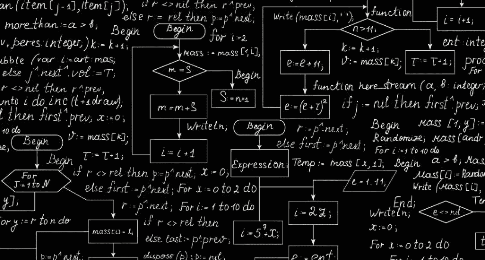

# 算法出了问题，谁该承担责任？

> 原文：<https://medium.com/mlearning-ai/who-should-take-the-responsibility-when-algorithms-go-wrong-82aab0ab617f?source=collection_archive---------4----------------------->

我们从很小的时候就开始使用算法，但却不知道它是什么。算法只是在计算或其他解决问题的操作中要遵循的一个过程或一组规则。一个简单的例子是我们除数的步骤，或者我们可以把一个食物食谱作为一个算法。

算法通常是完成任务的漂亮而有效的工具。它们通常是不知不觉的辅助手段，以越来越多的方式改善着人类的生活。然而，即使算法是怀着高尚的目的构建的，它们也可能会产生不可预见的后果。

美国数学家兼作家凯茜·奥尼尔(Cathy O'Neil)在一次题为“数学毁灭武器”的关于算法危险的演讲中说，“算法不是事实。它们是观点。”再看“意见”这个词，著名的《牛津词典》对它的定义是，“(可数)你对某人或某事的感受或想法，而不是一个事实”。凯茜·奥尼尔的这句话让我从不同的角度看待算法。在这篇博客中，我不会谈论我们放在网上的每一个数据是如何被利用的。我将集中讨论用于这些活动的算法的概念。要深入了解这一点，我们必须看看算法的技术定义。

> 作为一种有效的方法，算法可以在有限的**空间**和**时间**内，用定义明确的形式语言来表达，用于计算一个函数。从初始状态和初始输入(可能为空)开始，指令描述了一种计算，当被执行时，该计算通过有限数量的明确定义的连续状态进行，最终产生“输出”并终止于最终结束状态。

算法用于指定计算和数据处理应该如何进行。算法可以执行自动推理(也称为自动推理)，并采用数学和逻辑测试来沿着多条路径重定向代码。

# 算法或算法专家会出错吗？

当你在纸上或听讲座时，算法是美丽的。是实际应用(或者背后的人)出了问题。我知道这个问题值得商榷。有人可能会概括说，“是幕后的人让事情变得更糟”。嗯，这是看待这个问题的一种方式，我并不否认人们应该为自己的行为负责。但是，人不能因为有脑子就去做一件事。数代人以来，数学一直是我们将想法变成现实的武器。我认为算法的无限可能性和学生的持续创造力，尤其是研究生，可能会导致灾难性的破坏。你可以看到我现在要去的地方。

# 那么，如果是这样的话，有什么可能的措施来控制算法落入错误的路径/手中？

你怎么想呢?

1.  为了避免那些可能的损害，是否应该有一个任何算法专家都不能越过的界限？
2.  **从大型科技公司到大学研究实验室的学生，是否应该有规章制度让每个人都遵守？**
3.  **是否应该为算法从业者和算法学家开设一门算法伦理课程，或者在大学里开设一个专业？**
4.  不应该做任何事情，我们不会达到你所说的水平，那将是灾难性的。

一定要让我知道你从中选择了什么或者新的想法。

为了未来的读者，我在 2022 年 7 月左右写了这篇博客，以防你想知道。

最后，我写这个没有事实数据或任何现实的方法。我要学的东西太多了，我绝不是在表达我的观点或权利，我只是在分享我对这个话题的想法。

 [## Mlearning.ai 提交建议

### 如何成为 Mlearning.ai 上的作家

medium.com](/mlearning-ai/mlearning-ai-submission-suggestions-b51e2b130bfb)