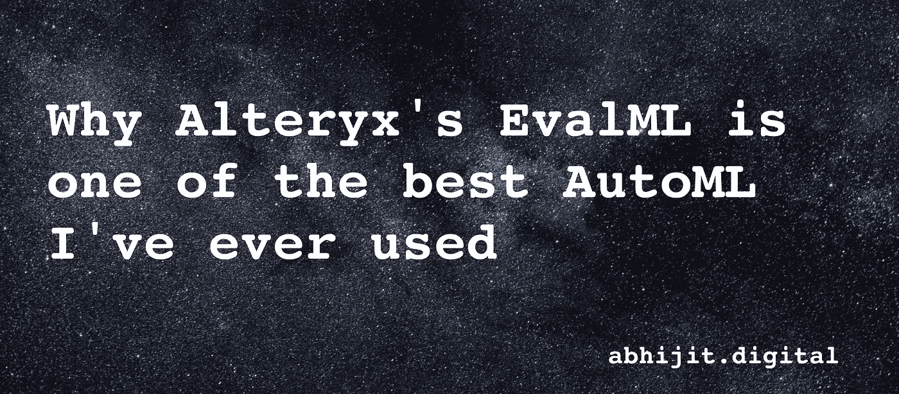

# 为什么 Alteryx 的 EvalML 是我用过的最好的 AutoML 之一

> 原文：<https://medium.com/mlearning-ai/why-alteryxs-evalml-is-one-of-the-best-automl-i-ve-ever-used-78f9ddfd2ea4?source=collection_archive---------1----------------------->

# 什么是 AutoML？

根据维基百科-

自动化机器学习( *AutoML* )是将机器学习应用于现实世界问题的任务自动化的过程。AutoML 涵盖了从原始数据集到可部署的机器学习模型的完整管道。AutoML 是作为一种基于人工智能的模型提出的