# 为什么事件驱动架构应该以数据为中心

> 原文：<https://medium.com/mlearning-ai/why-an-event-driven-architecture-should-be-data-centric-2e2922e0eed4?source=collection_archive---------1----------------------->

也是为了让人工智能在生产中更具可操作性！

# 为什么事件制作应该以数据为中心

假设服务可以通过三种方式相互交互:命令、事件和查询。

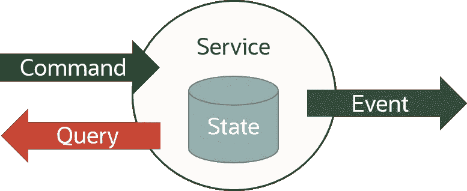

事件产生可以是以**代码为中心的**或以**数据为中心的**。

**以代码为中心的**事件生成依赖于为创建一系列捕获服务状态变化的事件而开发的代码。

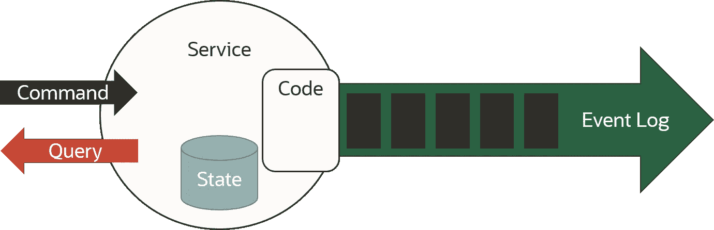

事件生产的以代码为中心的实现非常复杂，必须捕获服务的一致状态之间的变化，从而确保服务状态的演变被完全和一致地捕获。

除了实现的复杂性之外，这种以代码为中心的实现的维护也非常复杂，因为每次服务发展时，捕获服务状态变化以产生事件的代码也必须相应地发展。

**以数据为中心的**事件生成依赖于事务一致性数据库，将所有事务提交的更改自动存储到一系列事件中，通常称为事件日志。

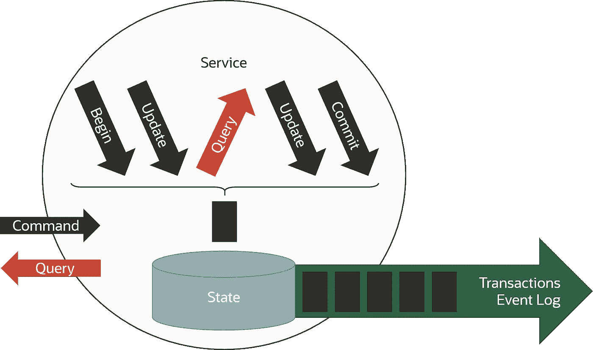

事件产生的以数据为中心的实现非常简单，因为所有提交的更改都由数据库自动捕获，同时确保服务状态的演变在事务上是一致的。

这种以数据为中心的实现的维护也非常简单，因为如果服务的代码发生变化，就没有代码来捕获相应变化所需的状态变化，这只是因为数据库自动完成了这项工作。

利用数据库来实现事件生产并不意味着开发人员仍然不能构建代码来处理事件，尤其是为了提高解耦性和可伸缩性。这仅仅意味着开发人员可以专注于服务领域逻辑，而不必关心相关的事件产生逻辑。

由事件源提供的典型功能，如从初始状态删除和重建服务状态、在多个时间点对状态运行时态查询或重放事件的功能，可以通过利用数据库的功能来回滚动到特定时间戳或查询事务日志上的事件序列来提供。

# 为什么事件消费应该以数据为中心

数据中心性是事件生产的关键，但对事件消费更为重要，它允许在数据平台提供的更丰富的语义上下文中利用事件流提供的信息。

就像下棋一样，你可以考虑棋步列表或者棋盘的当前状态。走法列表可以为你提供很多有用的信息，但你也可以根据棋盘的当前状态来决定下一步的走法。

事件流可以用许多不同的方式消费。让我们考虑一些最常见的事件消费模式，从消费来自**以数据为中心的事件生产**的事件流开始。

在这种模式中，事件流只是将所有提交的事务从单写入主机传播到数据的只读副本。

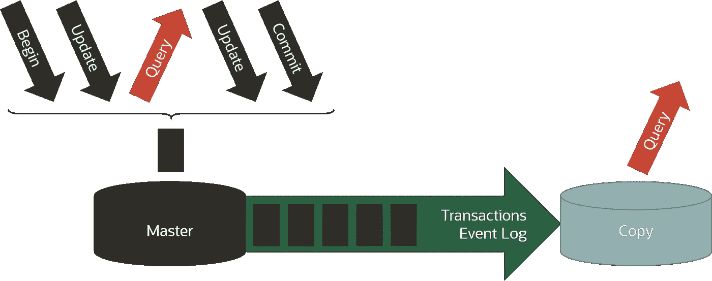

在这种情况下，利用数据的只读副本，接近实时地应用事务，通常比仅仅考虑事件的顺序在语义上更有效，尽管在某些情况下，分析和关联事件的顺序也可以提供额外的价值。

事实上，假设事件仍然可以用作事件驱动编程的触发器，对数据的只读副本的查找查询可以提供关于当前状态的所有信息和语义(如产品的当前库存)，而先前事件的相关性可以提供额外的洞察(如产品的过去销售趋势)。

有人可能会说，一个好的程序员可以编写代码来消耗事件流并保持当前状态最新，但是为什么要花费时间和精力来开发随时可用、经过测试和事务一致的东西呢？

正如我已经多次说过的，数据库和事件日志并不相互排斥，而是一枚硬币的两面。它们是伙伴，对于构建以数据为中心和事件驱动的架构都是必要的。

让我们转到事件消费模式，即消费来自以**代码为中心的事件生产**的事件流。在这种情况下，数据驱动类型的事件消费的好处似乎不太明显，但它们仍然很重要，尤其是对于并行消费和关联多个事件流。

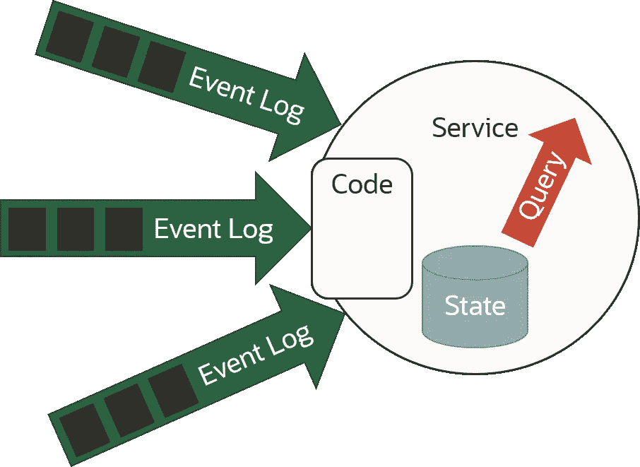

我们可以讨论很多关于实现这种模式的最佳方式，是否在选择逻辑和域逻辑之间分离，或者是否将选择逻辑放入每个事件流的独立事件处理器中。

当然，如果域逻辑需要基于服务的当前状态做出决策，而服务的当前状态是根据许多不同事件的流以异步和独立的时间并行变化的，那么利用数据库来保持和事务性地更新服务的当前状态可以极大地简化实现，允许在当前事务性一致的状态上运行查找查询。

显然，如果事件流来自以数据为中心的事件生产，那么好处甚至更大。在这种情况下，在数据的主副本上提交的事务可以自动传播，并以事务方式应用于数据的只读副本，从而轻松地允许对事务一致的数据运行查找查询。

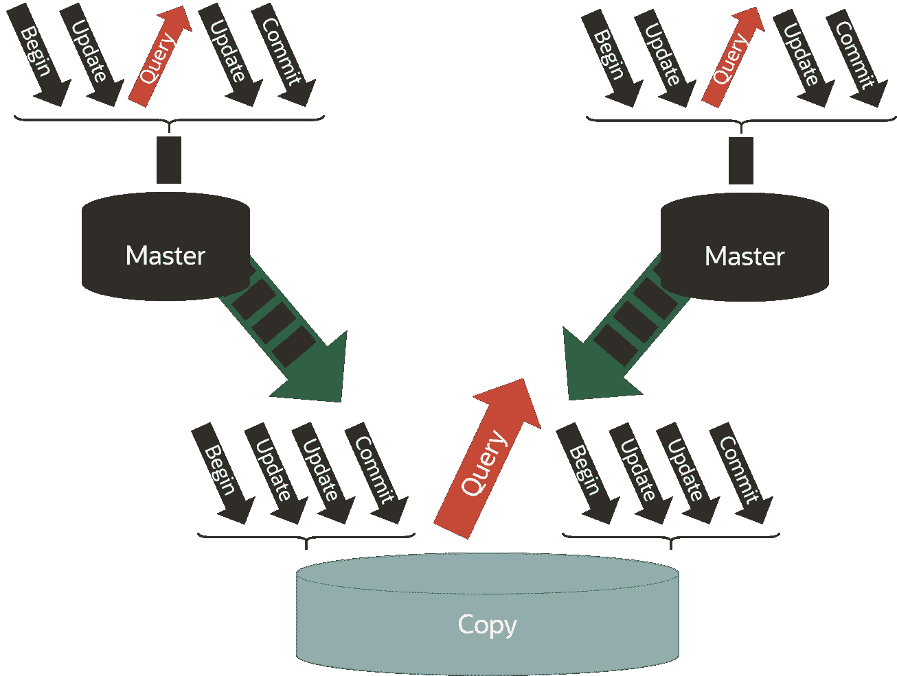

# 理论上的 AI

如果你阅读一篇关于人工智能的论文，你可能会发现一个很好的例子，它展示了一个通过机器学习训练的人工智能模型，利用了通常来自存储在数据湖中的事件流的历史数据序列。

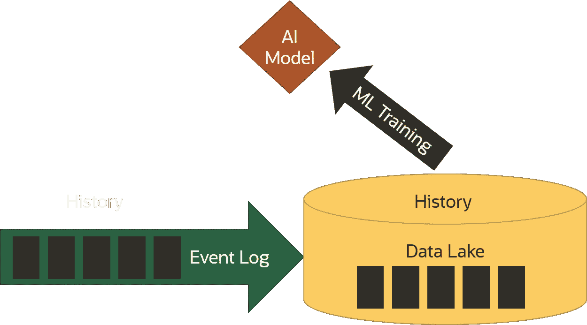

一旦使用存储在数据湖中的历史数据训练了 AI 模型，就可以将其投入到无状态功能的生产中，该无状态功能仅将实时到来的事件流作为输入，并对每个事件做出反应。

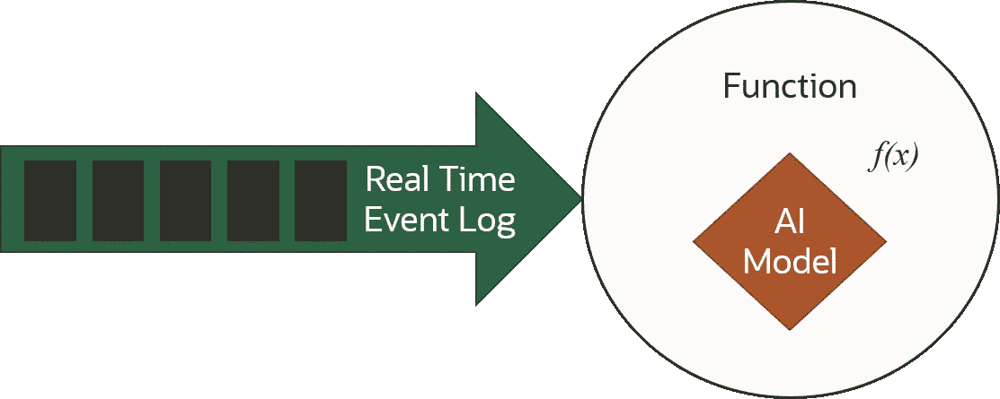

虽然这种简单的模式实际上非常适合人工智能，特别是对于利用原子数据流进行预测性维护的物联网来说，但实际上大多数利用人工智能的现实模式要复杂得多。

# 现实中的人工智能

在现实世界中，训练 AI 模型所需的历史数据通常不仅仅来自一个单一的数据源，在生产中执行 AI 模型所需的实时数据也不仅仅来自一个单一的事件流。

现实是，人工智能模型通常是利用和关联来自许多不同数据源的数十个(如果不是数百个)数据流来训练的。

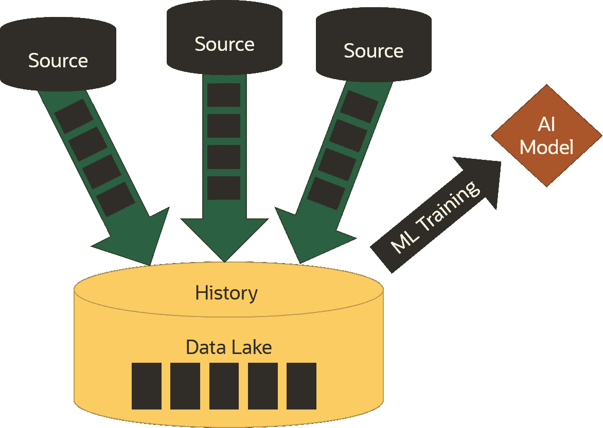

让我们以零售银行的信用评分模型为例。该模型可以利用机器学习算法对来自几十个数据源的数百个不同变量的历史值进行训练。但是一旦模型被训练，为了在生产中运行它，必须实时地向它提供用于训练它的所有变量。

不幸的是，当客户在 POS 设备上刷信用卡时，支付事件的唯一变量通常是客户代码和客户要求的信用额度。那么，我们如何为信用评分模型提供决定是否向客户提供信用所需的所有变量呢？此外，如何实时完成，既向模型提供变量的最后值，又在几秒钟内为客户提供答案？

我们可以就开发代码的最佳方式争论几个小时，该代码用于并行接收数十个实时变化的事件流，数百个具有异步和独立计时的变量，同时确保一些变量以一致的方式变化。

然而，通过使用所有流来实时更新存储在一致的数据平台中的所有变量，可以以简单、有效和以数据为中心的方式实现这种模式。

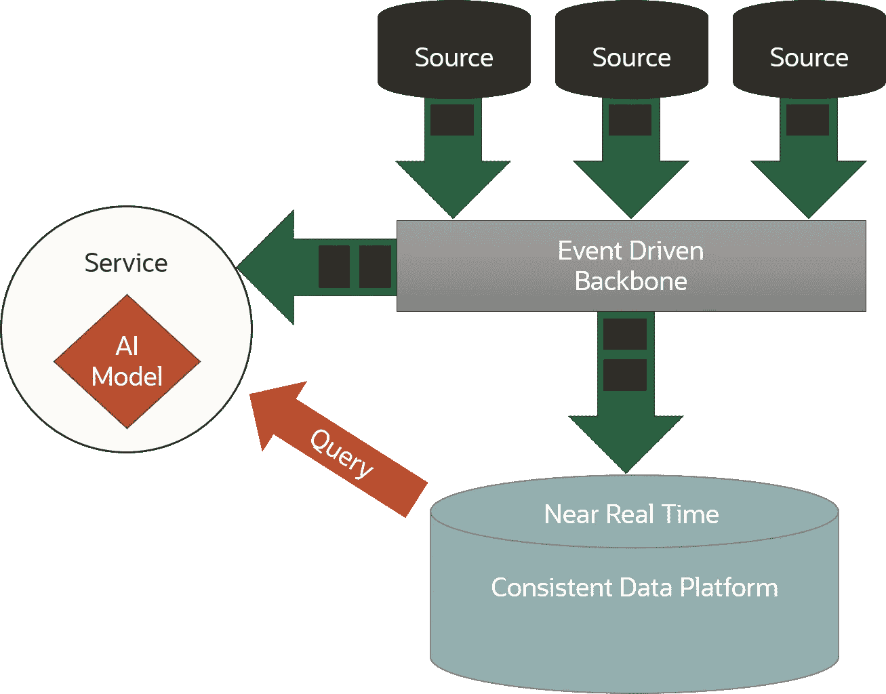

通过这种方式，实现 AI 模型的服务可以消耗一些事件流，以便被触发(例如来自 POS 设备的事件)，但也可以在数据平台上运行查找查询，以便为 AI 模型实时提供所有所需变量的最新一致更新。

如果我们不仅在数据平台中存储所有变量的最后一致更新，而且还保存所有变量的值的历史，那么我们不仅可以使用相同的数据平台来运行模型，还可以使用相同的数据平台来训练模型，而不是在数据湖中进行。

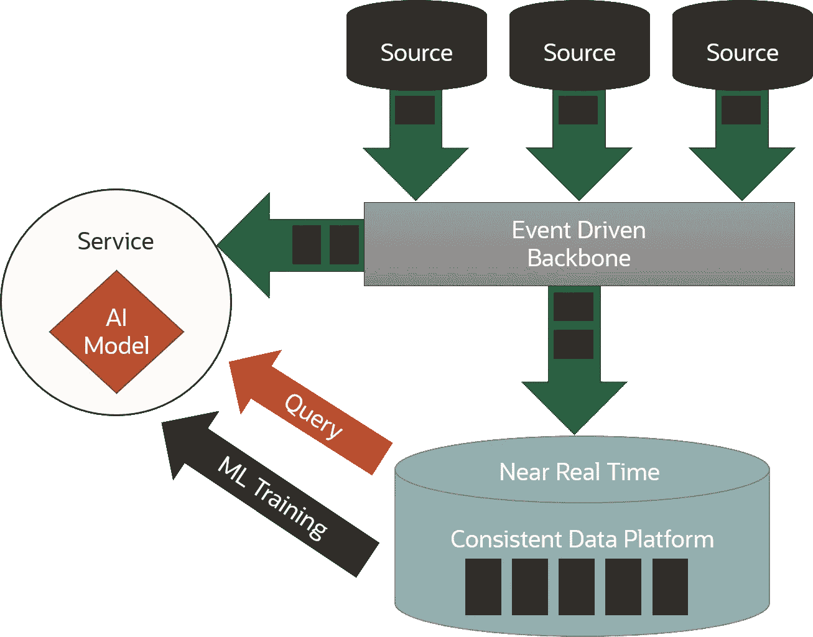

这种方法可以提供额外的好处。例如，人工智能模型可以用实时更新的新数据不断地重新训练。此外，它可以更容易地投入生产，因为它被训练的数据模型与它将运行的数据模型是相同的。

最后，通过最大限度地减少代码，这种以数据为中心的方法不仅会减少在生产中开发和部署的时间和精力，还会减少维护和发展复杂的人工智能模型的时间和精力。事实上，人工智能模型经常更新和扩展。例如，信用评分模型可以考虑新的变量，以便添加新的欺诈检测模型。

顺便说一下，有时不同的数据源具有不同的数据语义，因此数据平台还应该能够实时地“处理每种类型的数据类型和语义”，这是一种典型的以代码为中心的能力，而公共数据湖并不提供这种能力，它通常只是通过存储原始数据来处理不同类型的数据，以便稍后提供作为“读取模式”的语义。这种方法仅适用于训练 AI 模型时的批处理执行期间，但不适用于在将 AI 模型投入生产时处理实时数据。

# 总结

事件产生和事件消费都可以以代码和数据为中心，但以数据为中心的实现更简单、更快且防错，需要更少的代码来开发、测试、维护和发展。

因此，事件驱动的架构应该尽可能以数据为中心，特别是如果你必须实现一个复杂的架构来处理和关联许多不同的和独立的事件流，比如在生产中实际训练和实现一个重要的人工智能模型。

# 参考

 [## 活动采购

### 事件源的基本思想是确保应用程序状态的每一个变化都被捕获到…

martinfowler.com](https://martinfowler.com/eaaDev/EventSourcing.html)  [## 从以代码为中心到以数据为中心

### 您的数据是您最宝贵的资产；你会把他们的知识留在开发人员的代码中吗

luigi-scappin.medium.com](https://luigi-scappin.medium.com/from-code-centric-to-data-centric-8e730c45b48e)  [## 分布式数据网格如何既以数据为中心又受事件驱动

### “到 2025 年，超过四分之一的新云应用将使用以数据为中心的事件驱动架构，而不是……

luigi-scappin.medium.com](https://luigi-scappin.medium.com/how-a-distributed-data-mesh-can-be-both-data-centric-and-event-driven-14cd383ab6ea)