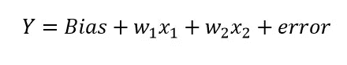
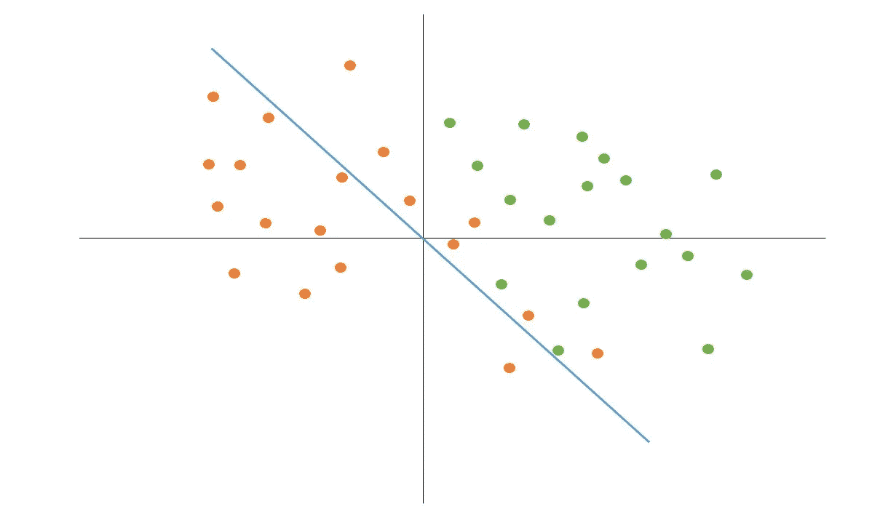
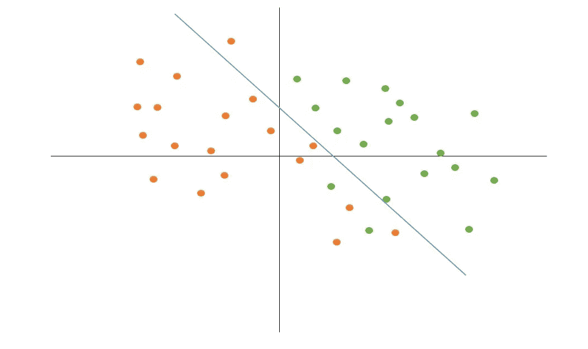

# 为什么以及如何在机器学习模型中使用偏差？

> 原文：<https://medium.com/mlearning-ai/why-and-how-bias-is-used-in-data-mining-models-8895e31f8c37?source=collection_archive---------4----------------------->

在线性回归和逻辑回归等模型中，我们有一个术语叫做偏差。要了解为什么使用偏见这个词，请和我们一起阅读这篇文章。

A scene of desert that the shadow separated it into two parts (src: [unsplash.com](http://unsplash.com))

# 偏见的定义是什么？

首先，我们先从偏见的定义说起。偏见意味着不公正的状态，或者换句话说，它解释了选择一个群体而不是另一个群体的机会更高。如果我们想举一个现实世界中的例子，我们可以说种族主义是偏见的定义，它使一个群体更受欢迎，或者他们比另一个群体更优越。

想象一个有两个组的数据集。为两个组训练模型和进行预测的机会是一半，但是如果我们给一个组一半以上的权重，并在训练过程中给它更多的被选中的机会，那么得到的模型将会有偏差，并且在预测中，它更有可能预测权重较高的类的数据。在这个场景中，我们偏向其中一个类。

# 偏差如何在数学上区分数据？

线性回归和逻辑回归的公式包含一个名为偏差的术语。它用于更改公式的基线，以便更好地分离数据。这里可以看到线性回归公式。

image1\. Linear Regression Formula

正如我们在图 1 中看到的，这个公式中的术语很少。*偏差*是控制图表基线的数字。对每行进行加权的术语称为 *w* ，error 是一个随机错误数。如果我们的数据在图表中平均分开，那么*偏差=0* 的公式可以很好地区分数据。但是，如果我们的数据没有正常分离，模型需要有一个正或负的偏差数，以便更好地学习数据。让我们用图 2 中的图表更好地看这个问题。

image2\. blue angle is the diagram for Linear Regression with *Bias=0*

在图 2 中，橙色和绿色点代表图中两组的数据，蓝色线是线性回归模型的线，偏差=0 。如果我们看得足够近，就有可能看到七个橙色点在绿色点的区域内。我们可以将蓝线向右上方移动一点，以便让模型更好地学习数据。为了实现这一点，我们可以添加一个数字来偏置和移动蓝线。在图 3 中，偏置数为正，蓝线移动。

image3\. the blue line is the diagram for Linear Regression with *Bias > 0*

很明显，随着图 3 中的*偏差> 0* ，线性回归线移动，我们可以看到模型中错位的数据减少了。这里我们可以说线性回归模型对数据的学习更好。

我们说明了线性回归中偏差的必要性。对于逻辑回归，除了公式之外，*偏差*的所有定义都是相同的，因为我们预测的是类(离散数据),所以需要另一个包装线性回归公式的函数。对于二元分类(预测 2 个值)，我们需要 sigmoid 函数。我们不会深入讨论 sigmoid 函数的细节，因为互联网上有大量关于它的信息，但只要知道 sigmoid 函数的输出在 0 和 1 之间，那么对于二进制分类问题，我们可以将数据分配给输出为 0 到一半的第一个类和输出超过一半的另一个类。

感谢阅读这篇文章。如果你有任何问题要问，请随便问。请为这篇文章鼓掌支持我。