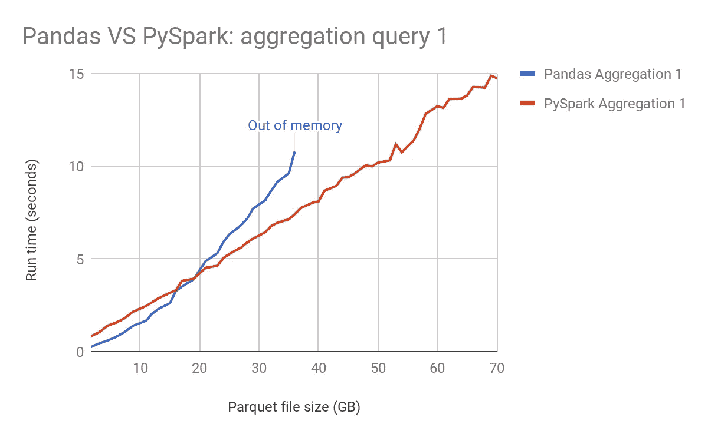

# 为什么数据科学家痴迷 PySpark 而不是熊猫——数据科学行业的一个真相

> 原文：<https://medium.com/mlearning-ai/why-are-data-scientists-obsessed-with-pyspark-over-pandas-a-truth-of-data-science-industry-87c708307c62?source=collection_archive---------0----------------------->

Life of Data Scientist — CSV

近年来，我们已经看到了数据的增长，因此，它也增加了计算时间和内存。在大型数据集的情况下，像 Pandas 这样按顺序工作的工具无法在所需的时间内获得结果。

有一些软件包可以并行处理 pandas 操作，如 Dask、Swift、Ray 等。对 pandas 进程进行并行处理可以大大提高速度，但是当 Pandas 将数据帧加载到内存中时，系统会对内存造成一定的限制，即使在特定情况下并不需要这样做。对于桌面系统来说，这可能是一个大问题，因为我们需要保持 UI 活动。

我们需要一个框架来解决上述问题，并在给定的内存限制下实现并行化。在一些给定的阈值下，Spark 解决了其中的一些问题。它能够实现更快的处理速度，并使用一种称为惰性评估的概念(顾名思义，它在需要时评估数据)，这解决了由内存引起的一些限制。

# PySpark 相对于熊猫的优势

1.  Pandas 在一台机器上执行操作，而 PySpark 在多台机器上执行操作，这使得它在大数据集上比 Pandas 快**100 倍**** 。
2.  熊猫坚持渴望执行，这意味着任务尽快完成，而 Pyspark 遵循**懒惰执行**，这意味着任务直到一个动作被执行才被执行。
3.  Pandas 数据框架无法构建可伸缩的应用程序，但是 PySpark 数据框架是开发可伸缩应用程序的理想选择。
4.  Pandas 数据帧不保证容错，但 PySpark **数据帧保证容错。**

# 什么时候用 PySpark 或者熊猫？

正如我前面提到的，PySpark 比熊猫快 100 倍，这只是半个事实。Pandas 和 Pyspark 对于最初的 GB 数据有相同的运行时间，如下面的基准测试所示。

对于最初的 20 GB，它们具有相同的斜率，但是随着文件大小的增加，Pandas 耗尽了内存，PySpark 能够成功地完成这项工作。

Benchmark Pandas and PySpark ([Source](https://hirazone.medium.com/benchmarking-pandas-vs-spark-7f7166984de2))

因此，对于 10–12gb 的小数据集，由于相同的运行时间和较低的复杂性，您可能更喜欢 Pandas 而不是 PySpark，此外，您必须使用 PySpark。

# PySpark 的局限性

凡是擅长某一方面的东西，在其他方面都落后了。PySpark 也是如此。Pyspark 的一些限制是:

1.  PySpark 延迟较高，导致吞吐量较低。
2.  对内存的消耗非常大。
3.  为 PySpark 开发的算法和库更少。

从上面的讨论中，我们可以得出结论，随着数据的增加，对更多像 PySpark 这样的框架的需求也在增加，这些框架可以轻松处理这样的过程，如果你是一名有抱负的数据科学家，你应该开始了解 PySpark。

## [**成为 MLearning.ai** 的作家 ](https://mlearning.substack.com/about)

 [## Mlearning.ai 提交建议

### 如何成为 Mlearning.ai 上的作家

medium.com](/mlearning-ai/mlearning-ai-submission-suggestions-b51e2b130bfb)