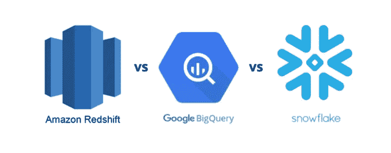

# 为什么 Google Bigquery、Snowflake、Redshift 等云数据仓库比大多数人预期的要慢？—第 0 部分

> 原文：<https://medium.com/mlearning-ai/why-are-google-bigquery-snowflake-redshift-and-other-cloud-data-warehouses-slower-than-most-fb4517aa7dff?source=collection_archive---------0----------------------->

## *主要云数据仓库的真实性能*

> **热血**、**汗水**和**泪水** : **关于 Google Bigquery、雪花、AWS Redshift、Athena 和 Azure Analytics 服务的前线故事**

