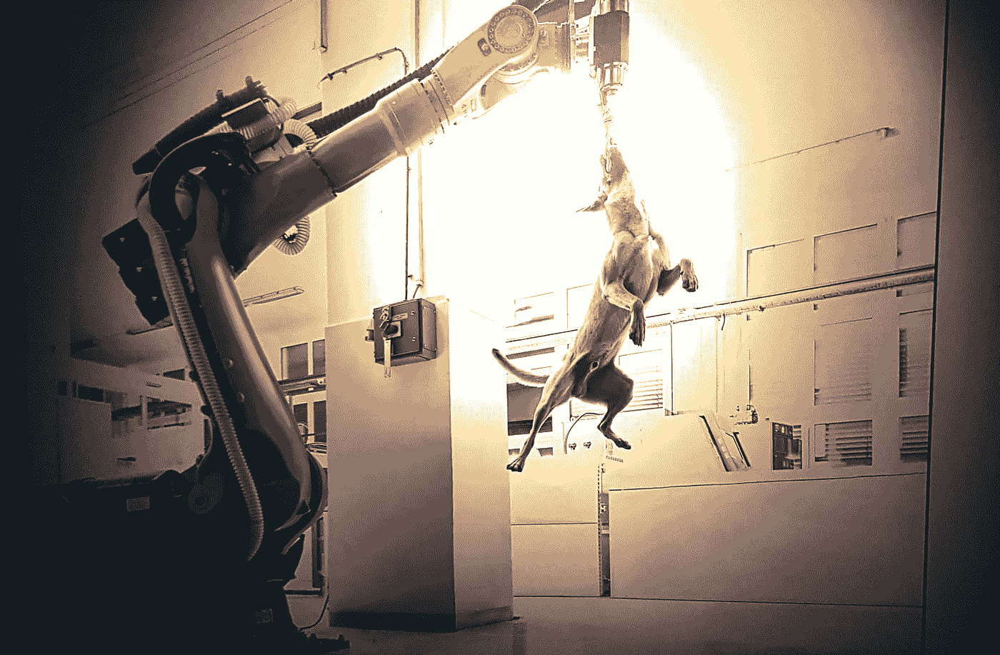

# 为什么数据需要您的关注

> 原文：<https://medium.com/mlearning-ai/why-data-requires-your-care-3f633f64e966?source=collection_archive---------9----------------------->

## [艾艺术](https://towardsdatascience.com/how-to-start-your-adventure-with-ai-art-fd74afaf30c1)

## 不要害怕机器学习！

[Everyone Can Create](/data-driven-fiction/biennales-are-ending-410def29b47b) 2022

> “这个任务对我来说太重要了，我不允许你破坏它”
> 哈尔 9000

[机器学习](/mlearning-ai/what-is-machine-learning-2ec9cacb986c)被人类视为一种工具，用来进一步发展我们的物种，并更接近柏拉图式的理想。我们依靠已知的学习方法来创造思维工具。