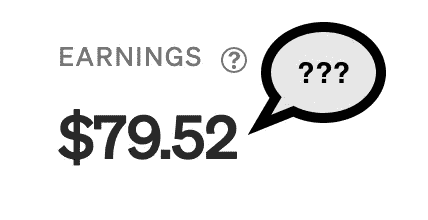

# 为什么我在 Python 工具列表上赚了 80 美元

> 原文：<https://medium.com/mlearning-ai/why-did-i-make-80-00-on-a-list-of-python-tools-849cfed9dc9e?source=collection_archive---------0----------------------->

分析

我在 5 月份写了一篇文章，这篇文章莫名其妙地飙升，在我写这篇文章的时候已经有超过 4000 的浏览量。它让我赚了 80 美元，我希望我能完全明白是怎么回事。也许你能解开灵媒之谜。文章如下图。