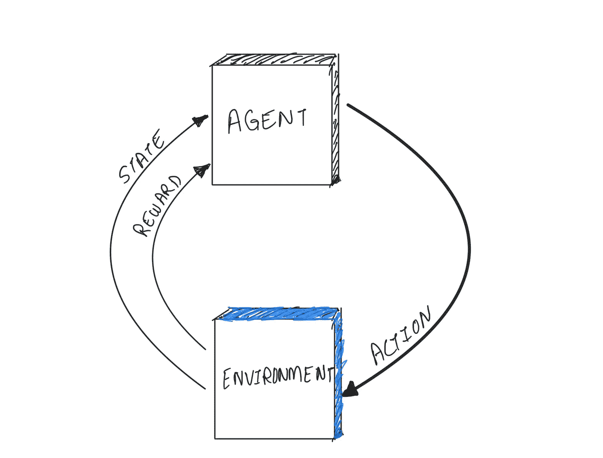
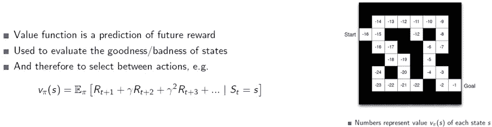
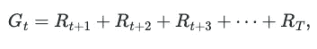
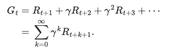

# 我为什么热爱强化学习？

> 原文：<https://medium.com/mlearning-ai/why-do-i-love-reinforcement-learning-5c0de2abf7e4?source=collection_archive---------5----------------------->

据说，许多数据科学概念的灵感来自人类生活、心理、我们的环境以及我们如何与之互动。例如，在强化学习(RL)中，代理通过在环境中交互并在从一个状态移动到另一个状态时采取行动后最大化其收到的回报来学习。

Reinforcement Learning

这不是很明显吗？然而，在这篇博客中，我打算分享一个完全不同的观点和我自己喜欢强化学习的原因。

当我开始更多地了解 RL 作为一个概念时，对我来说，它只是另一个充满复杂算法、数学支持的直觉和研究工件的学科。但是，渐渐地，我开始把我的现实生活经验和我所学到的联系起来。最终，我意识到我实际上是在用 RL 的概念解决我生活中的很多问题。

让我分享我在生活中经常应用的三个主要经验。

1

Value function in RL

我们经常发现自己处于没有价值但却能给我们即时满足感的“状态”。例如，我们只是看电视，花时间在社交媒体上，或者无所事事。如果，我们可以将一个价值函数与每个状态和动作关联起来，从而在这些状态之间移动。我们可以训练我们的潜意识来制定一个政策，使我们长期处于更有价值的状态。通过这种方式，我们可以确定哪些状态对我们是“好的”,因此可以反复地住在这样的状态中。

这难道不是另一个保持纪律并时刻注意我们行为的好方法吗？

2 **折现率:**一个代理人被训练使*期望收益最大化，*这里的收益通常是代理人在每个状态下通过采取某种行动从环境中获得的回报的总和。数学上，在时间 *t* 的返回 *G* 定义如下:

其中 *T* 是最终时间步长。上面的等式只适用于在时间 T 有终止状态的情况，例如在游戏中。对于实际上没有终止状态的连续任务，代理试图选择动作，使得它在未来收到的*折扣奖励*的总和最大化。因此，它在选择*，以最大化预期贴现收益:*

其中𝛾是一个参数，0 ⩽ 𝜸 ⩽ 1，称为*贴现率*，它决定了未来报酬的现值。

我认为*贴现率*类似于现实生活中的*毅力*。考虑一下，如果𝛾为 0，那么代理人被称为*短视*，因为它只会将收到的最后一个奖励视为回报，并试图最大化它，然而，如果它接近 1，那么代理人变得有远见，因为它试图最大化长期收到的奖励。

在现实中，对于需要持续努力的目标，我们经常无法坚持，然而却被那些能让我们立即实现的状态分散了注意力。例如，为了达到良好的热量状态，一个人需要遵循每天锻炼、均衡饮食和优质睡眠的制度，但在大多数情况下，我们会分心，并最终收敛到一种懒惰的生活方式，这种生活方式给了我们即时的回报。因此，有必要选择一个𝜸，以便我们在任何时候都表现出毅力来最大化我们的长期回报。

3 **最优和近似:**在 RL 中训练的代理的关键目标是学习最优策略，使用该策略它可以遍历各种状态，同时使回报最大化。为了做到这一点，代理采用探索和利用的方法，即它在一个状态中尝试新的动作，或者可以在给定的状态中采取已经被利用的动作。因此，最优策略是这样一种策略，使用这种策略，代理人可以说获得了最大回报，因此任何这样的代理人如果知道最优策略，就会做得非常好。然而，实际上这很少发生，因为它需要大量的计算能力，尤其是内存。

我认为*优化*类似于现实中的*平衡*，就像由于计算的需要，一个智能体很难在复杂和连续环境的最优策略方面做得很好一样，对于我们人类来说也很难，因为我们在时间、精力和记忆方面都有限制。因此，近似和平衡是成功的关键。例如，保持工作和生活之间的平衡对于保持快乐、健康和平静的生活是非常重要的。

总之，强化学习是一个伟大的主题，不仅仅是为了学习，也是一个在生活中应用的伟大资源。此外，一个接受过 RL 训练的智能体，如果有“推理”能力，肯定会是一个真正的认知系统。

参考:《强化学习——导论》，作者:理查德·萨顿和安德鲁·g·巴尔托。

 [## Mlearning.ai 提交建议

### 如何成为 Mlearning.ai 上的作家

medium.com](/mlearning-ai/mlearning-ai-submission-suggestions-b51e2b130bfb)