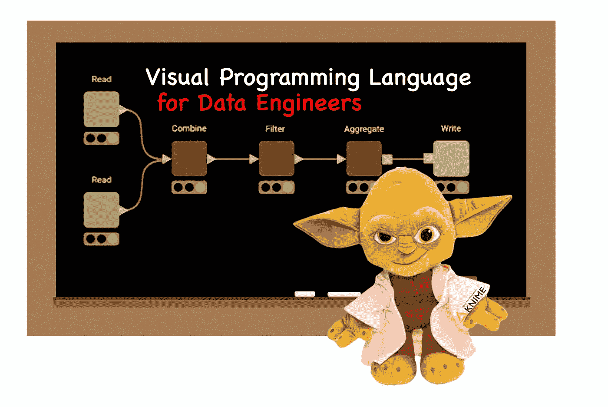

# 为什么每个数据工程师都应该学习像 KNIME 这样的可视化编程语言

> 原文：<https://medium.com/mlearning-ai/why-every-data-engineer-should-learn-a-visual-programming-language-like-knime-a42af53b050?source=collection_archive---------0----------------------->

如果你想在**的数据工程**中取得成功，或者甚至想成为**的商业分析师**，而不是仅仅专注于 Excel 和 Python，那么学习一门可视化编程语言，比如 **KNIME** 。

Fig 1: Yodime teaching a Visual Programming Language for Data Engineers (image by author)

# Excel-过滤器

我称之为 **Excel 过滤器**:越来越多寻找数据工程师的公司正在筛选应聘者…