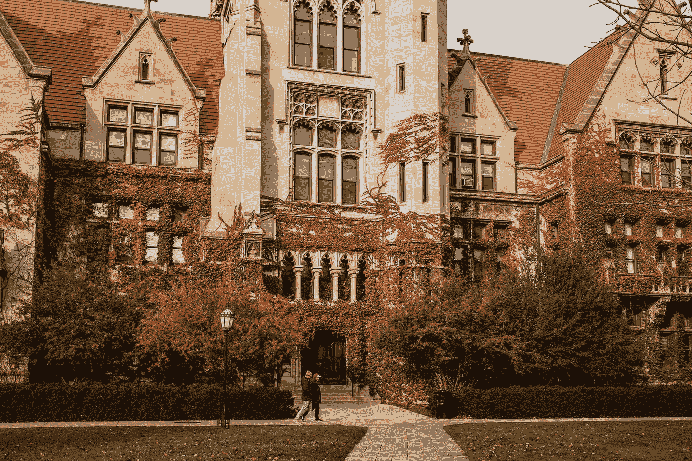

# 为什么我选择芝加哥大学攻读分析学硕士学位

> 原文：<https://medium.com/mlearning-ai/why-i-chose-the-university-of-chicago-for-my-m-s-in-analytics-79621d0ef870?source=collection_archive---------2----------------------->

## 分析学硕士|数据科学

## 概述我如何用你在学校网站上找不到的因素来衡量这个项目

Photo by [Alisa Anton](https://unsplash.com/@alisaanton?utm_source=medium&utm_medium=referral) on [Unsplash](https://unsplash.com?utm_source=medium&utm_medium=referral)

我最近接受了芝加哥大学(University of Chicago)的一个分析硕士(MScA)职位。在我接受之前，我对这个项目的价值/投资回报率和总体看法有所保留。我想概述一些我收集的关于这个项目的轶事信息，以及最终说服我接受这些想法并与正在看这个项目或类似项目的其他人分享这些想法以帮助他们更容易做出决定的原因。

*更新:如果你想知道我的第一季度过得怎么样，* [*看看这篇文章吧！*](/@HillSnow/quarter-1-review-university-of-chicago-m-s-analytics-3b1a4d131cfe)

# 计划概述

UChicago MScA 课程提供在线和现场两种方式。我在网上注册了非全日制课程，这意味着我每个季度要上 2 门课(UChicago 是四分之一制的)，为期 1 年半。毕业需要完成 12 门课程，非全日制学生每季度可以选修 1-2 门课程。

该课程涵盖了线性代数和统计等预期的基础课程，以及实时分析、ML 和 AI、NLP、计算机视觉、贝叶斯方法等高级选修主题。这些都是学生在学习快结束时利用真实世界公司提供的数据完成的顶点项目。

虽然大学网站上没有提到，但录取是有竞争力的，该项目的录取率约为 6-8%；我向目前注册的 2 名学生证实了这一点。

# **投资回报(ROI)**

很自然，我的主要问题是我的投资回报是什么样的，这个项目值这个费用吗？**该项目每门课程收费 4965 美元。将此乘以 12 门必修课得出大约 60，000 美元。额外费用包括 1500 美元的押金和基础级别的季度前课程，如果您有相关经验，可以免除这些费用。总的来说，如果你需要参加季度前课程，费用大约是 65，000 美元——绝对不是一个便宜的项目……毕竟这是芝加哥大学。**

但是有了这个学位，学生/毕业生能指望得到什么呢？与我交谈过的一位即将毕业的学生能够向我提供他们几个同学的工资信息，这些同学要么获得了晋升/加薪，要么找到了一份新的高薪工作。以下是他们向我报告的 5 个不同同事的年薪数据:

*   7 万美元到 11.5 万美元 **(+49%)**
*   7.5 万美元到 13 万美元+3 万美元奖金= 16 万美元 **(+72.3%)**
*   10.8 万美元到 16 万美元+奖金+股权= 18 万美元预计 **(+50%)**
*   13 万美元到 20 万美元 **(+42%)**
*   12 万美元到 15.5 万美元 **(+25%)**

## 平均来看，学生的工资有望增长 48%

除了这些巨大的工资上涨，雇用 UChicago MScA 学生的公司都是久负盛名的知名公司，如耐克、麦肯锡、Expedia、卡夫亨氏、西门罗、IRI 等等。

从这些数字来看，很明显，该计划的高额前期成本基本上可以在几年内用平均工资的增长来偿还或弥补。

# 要考虑的其他因素

下面列出了我与当前学生讨论的其他信息，其中一些在网上找不到:

*   从内部来看，该计划并不激烈。鼓励学生以 3-4 人为一组，合作完成许多作业。同时，与其他同学的联系和人际网络对于获得工作机会、推荐以及最终获得你想要的高薪工作也是至关重要的。
*   很多教授除了教书，还是行业从业者；如果学生表现特别好或者觉得他们很适合，教授们会经常让他们的公司雇佣他们。
*   UChicago 在纸面上的名气很大——**的学生几乎可以保证获得他们申请的任何一家公司的初步面试机会。该学院还因其技术课程和教学而闻名，这意味着高级分析和数据科学主题的教学将通过严格的课程、协作和接触领先的工具和技术来教授。[*有关课程的更多信息，请点击此处*](https://professional.uchicago.edu/find-your-fit/masters/master-science-analytics-online/curriculum) *。***
*   该计划不属于格雷厄姆继续专业和自由研究学院；它隶属于**自然科学部门**以及其他科技项目，如应用数学、物理学、计算机科学、金融数学、统计学等等。
*   每门课程都要上一个季度，也就是大约 10 周。这意味着在这个项目大约 1.5 年的时间里，你会比传统的学期形式接触到更多的课程。此外，如果你对某个特定的课程没有兴趣，你只需要坚持 2.5 个月。
*   **学生的构成是一个混合体(50/50)，既有来自以技术/数据为中心的背景的人，也有刚起步的人**。这促进了课堂上思想的多样性，也显示了不同背景的学生在追求这样一个学位时所发现的价值。

# 结论

这个项目的课程设置看起来很平衡，既不像计算机科学或数学学位那样过于技术性，也不像 MBA 或商业分析硕士那样以商业为导向或一般化。我也喜欢不需要像 GMAT/GRE 这样的标准化考试。

我不认为这样的项目会有什么问题。是的，它很贵，也有更便宜的项目，但 UChicago 的名字和教育质量，加上强大的工资/投资回报率预测和当前学生对该项目的积极反馈，最终使我相信这是追求的正确的高等学位。

随着芝加哥大学的媒体硕士项目在今年秋季的逐渐升温，我将分享我对该项目的看法——如果你感兴趣，请继续关注。

*第一季度回顾:* [*点击此处阅读*](http://f you want to read how my 1st quarter went, check out this article!)

 [## Mlearning.ai 提交建议

### 如何成为 Mlearning.ai 上的作家

medium.com](/mlearning-ai/mlearning-ai-submission-suggestions-b51e2b130bfb)