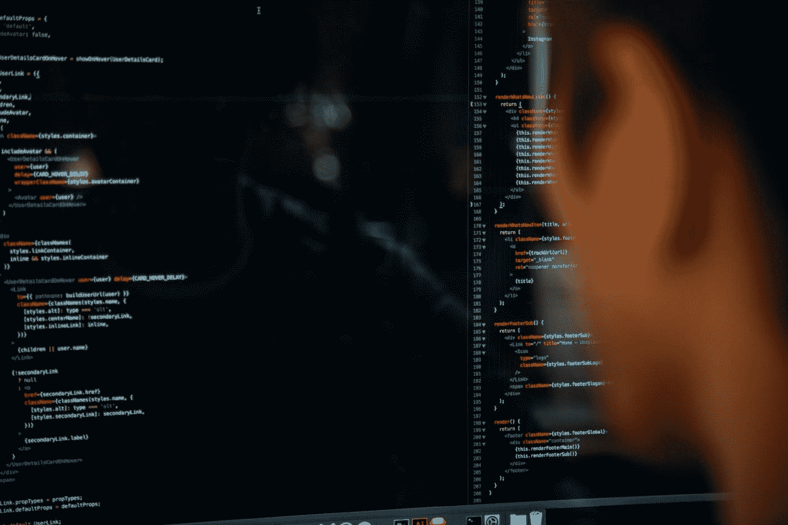
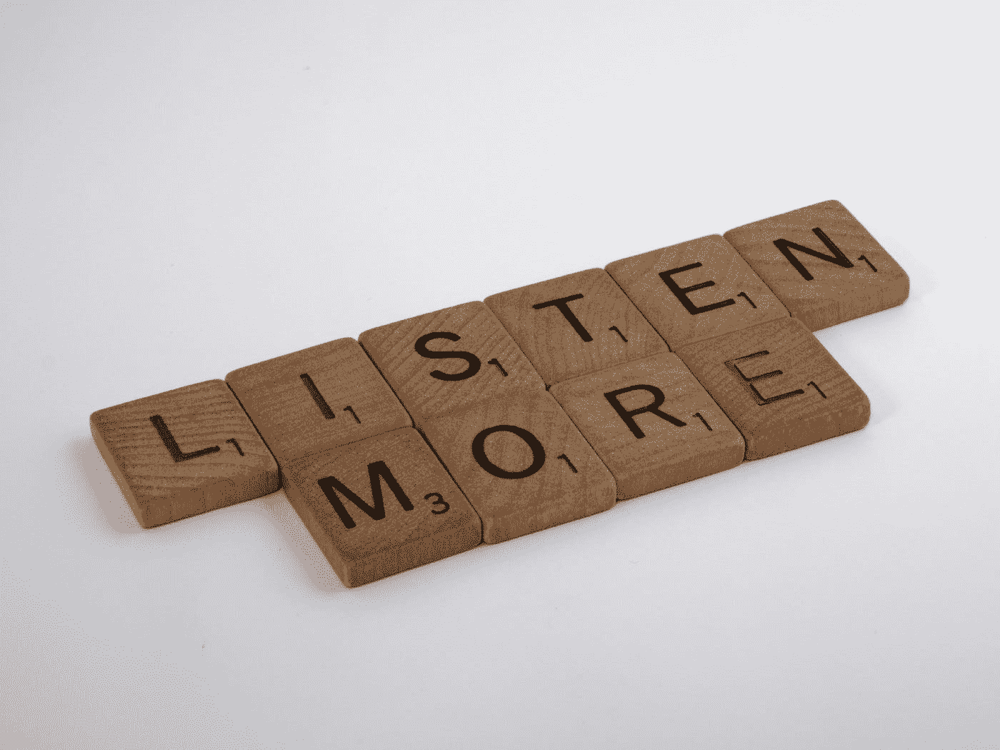
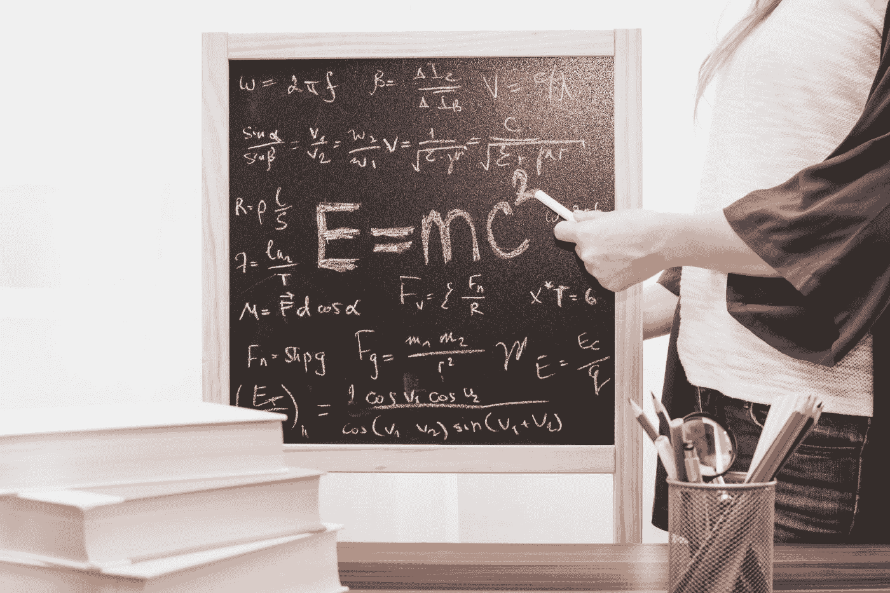

# 为什么我停止学习 ML 课程

> 原文：<https://medium.com/mlearning-ai/why-i-stopped-taking-ml-courses-a15ef8f0509d?source=collection_archive---------0----------------------->

## 我上课的时候很迷惑

Photo by [Charles Deluvio](https://unsplash.com/@charlesdeluvio?utm_source=medium&utm_medium=referral) on [Unsplash](https://unsplash.com/?utm_source=medium&utm_medium=referral)

# 我已经知道了:

我内心深处知道，这些课程中的大多数对我的学习没有任何好处。

因为我 6 年前学编程，就已经知道怎么学的艺术了，而且我也不是一门课接一门课的学编程。

事情是这样的:我从一门关于 ML 的 Udemy 课程开始并完成了它。然后我继续下一门课，学习更多的东西。我还免费上了几堂 YouTube 课程，是关于 ML 中的算法的，然后像往常一样完成并编码。

> “我心想，该死的，这太简单了，但我内心深处知道我是在妄想。”

过了几个月，我发现了一个新的深度学习课程。我觉得这太酷了，于是我开始了这个课程，并在里面呆了几个星期。

最后，我想通了:*我什么都不知道……*

接下来发生的事情是，我自己去启动了一个项目；一些简单的线性回归和类似的东西。发生了什么事？我坐在那里，不知道该做什么…

Photo by [Brett Jordan](https://unsplash.com/@brett_jordan?utm_source=medium&utm_medium=referral) on [Unsplash](https://unsplash.com/?utm_source=medium&utm_medium=referral)

我没有从后面的课程中学习。

我边做边学；试错；一头扎进深水区自己想办法解决。

这就是我开始编程时的情况。我是在我住的镇上的一个当地晚会上认识它的，于是我决定建立一个网站，在那里你可以查看世界上任何一个城市的天气。

我必须学习 HTML、CSS 和 javascript、后端、API、请求；一切。

这太难了，但我做到了。

之后我搭建了下一个网站，下一个后端，下一个 rest API 等等。

我很擅长这个。

# 我想说什么？

Photo by [Brett Jordan](https://unsplash.com/@brett_jordan?utm_source=medium&utm_medium=referral) on [Unsplash](https://unsplash.com/?utm_source=medium&utm_medium=referral)

我想说的是我不再上 ML 课程了。

我做了什么？

项目项目项目。

我想到了一些我想做的东西，无论是从零开始的线性回归还是从零开始的反向传播或者聊天机器人，我走出去开始做。

就像以前一样，当我陷入困境时，我找到了原因，知道了我需要什么。

这种方法要好得多。

我真的不知道为什么，但感觉信息棒 10 倍，你真的明白你到底想做什么，为什么。

# 重要的知识

Photo by [JESHOOTS.COM](https://unsplash.com/@jeshoots?utm_source=medium&utm_medium=referral) on [Unsplash](https://unsplash.com/?utm_source=medium&utm_medium=referral)

数学，数学，数学。

幸运的是，当我开始学习数学时，我已经知道了数学。

数学对于理解算法和模型是如何工作的非常重要。

我每天花 2-3 个小时自学数学，已经将近两年了。

为什么？我想知道电磁是如何工作的，电子是如何在导线中流动的，基本上是这个物理世界中所有神秘的事情。

我已经踏上了旅程，但还有很长的路要走。

我不是要你记住每一个公式和规则，不。

但我确实认为，对于那些希望他们的模型发挥最大作用的人来说，重要的是他们能够在更深的层次上学习所有这些概念，比如梯度下降，它是如何找到最小值的？

为什么微积分在这种情况下如此有用？

我知道有些人可能会说(可能有很好的理由)，“但是，嘿，我们将只使用一行代码的库！不需要数学。”对此我会回答:“如果你的算法陷入局部最小值怎么办？”

如果发生这种情况是因为没有什么可以计算，那么你已经失去了大好时光。有很多方法可以解决这个问题，但是我真的不认为如果你不深入了解这里的数学是如何工作的，你会走得很远。

> “这是理解模型如何在幕后工作的关键。”

# 课程有什么问题？

问题是我以为我在学习。而实际上，我只是在“跟随”。

甚至可能是我自己的错。

我只是觉得，当我参加一个课程时，我想得不够多，我跟的比我想的要多。

这就是为什么当我开始一个项目并建造一些东西时，我学到了 10 倍多的东西。因为我一直在思考我在做什么，这是我自己的解决方案和代码。

# 我现在如何学习:

我查找我想要和需要学习的东西，看视频/读文章，边做边学。

我可能会在这里或那里参加一两门课程，我看到它包含了我一直在寻找的部分，我认为它的质量很好。

我觉得对我来说，仅仅为了获得一个数字学位/认证而去上很长的课程是不值得的。

我认为知识和现实世界的项目比任何学位都更有价值。

# 我的建议是:

如果你懂编程，并且想从 ML 开始，我建议你在学习 ML 概念的同时顺便学习数学。

但是不要陷入那种你需要仅仅为了学习而学习一门课程的范式。你可以这样做，但最好 50%的时间做你自己的事情。

ML 中的信息和概念是复杂的。有很多东西需要接受和理解。所以一致性是关键。每天还在学。

祝你旅途好运，请跟我来，以便我们保持联系。