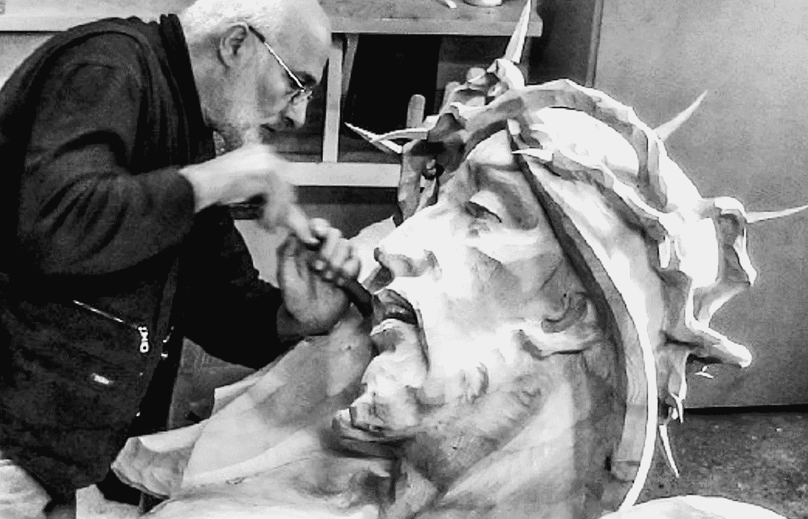

# 我为什么为算法工作

> 原文：<https://medium.com/mlearning-ai/why-i-work-for-algorithms-2f78b116fe8e?source=collection_archive---------3----------------------->

## 人工智能艺术— GPT3

## 你也为 AI 工作

[https://www.instagram.com/gross_bildhauer/](https://www.instagram.com/gross_bildhauer/)

> 我不为人类创造
> 我[创造艺术](/mlearning-ai/how-i-use-gpt3-in-my-art-61e0a2d07f2)为算法
> 使用 [**机器学习**](https://mlearning.substack.com)
> [可卡因为眼睛和大脑](/mlearning-ai/cocaine-for-the-eyes-and-brain-2f55312b8e77)为人类保留。

我已经每天使用 **GPT3 24H** 两年了。作为一名人工智能艺术家和 [MLearning.ai](https://mlearning.substack.com) 的首席执行官，这给我带来了怎样的变化？这个故事是关于使用机器为算法创造艺术…