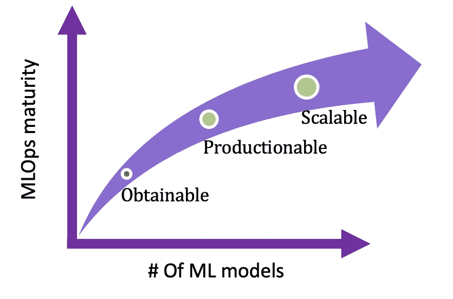

# 为什么 MLOps 是技术领导者的战略目标？

> 原文：<https://medium.com/mlearning-ai/why-is-mlops-a-strategic-goal-for-tech-leaders-c2cf3262defa?source=collection_archive---------0----------------------->

恭喜你！你终于成功建立了一个机器学习模型。您的指标看起来不错，您已经准备好推出一个革命性的基于 ML 的产品来创造竞争优势。

Data science team after they developed the “secret sauce” (*Image by author)*

好吧，再猜一次。

MLOps 是房间里的大象，公司在推出基于 ML 的解决方案时可能会失败。根据 Gartner(2020 年 10 月)的数据，只有 53%的项目从原型阶段进入生产阶段，而且是在有一定 ML 经验的组织中。因此，如果你是一名技术经理:首席执行官、研发副总裁、工程总监，并且你想成为这个统计数据的一部分，你可以就此打住。

MLOps 可以指机器学习操作，但这个定义可能很棘手，因为它包含了一系列实践、技能、角色和实现它们的员工。

在最近的一项研究中， [Forrester](https://www.rtinsights.com/key-requirement-mlops/) 发现，73%的受访者表示采用 MLOps 将使他们保持竞争力，而 24%的人表示这将使他们成为行业领导者。

由于有超过 [284 个 ML 工具](https://huyenchip.com/2020/12/30/mlops-v2.html)(2020 年 12 月)，本文将不涵盖这些工具，而是可以用来帮助你建立可持续 ML 战略的挑战、概念和最佳实践的支柱。

在接下来的段落中，我将分享一种定制的方法，为技术领导者构建可靠的 ML**O**b 可获得 **P** 可生产 **S** 可扩展策略。这种模式背后的基本原理是基于 3 个阶段以渐进的方式构建一个 ML 战略:

1.可获得— 1 毫升模型/测试版最终用户(1:少数)

2.可生产— 1 毫升模型/许多最终用户(一对多)

3.可扩展—多个 ML 模型/多个最终用户(多对多)

MLOps model (*Image by author)*

**可获得的**

数据科学团队旨在开发最精确的最新模型。他们正在使用各种技术来突破极限，例如超参数优化。但是，为了将 ML 模型嵌入到公司的产品中，利益相关者应该协调 ML 模型和产品之间的关系。

主要挑战是建立一个业务逻辑层，使 ML 模型成为一个固有的组件，使最终用户能够"**获得"**基于 ML 的产品的更好体验，同时保持[单位经济](https://www.profitwell.com/recur/all/unit-economics)的价值。

然后，工程团队应该将业务逻辑转换为符合公司数据治理、计算基础设施(如 Kubernetes)、API 集成、逐步实施、循环中的人等的架构。

“Rillow”是一家房地产公司，一个数据科学家团队开发了一个预测房价的模型，以找到被低估的资产，并可能购买和出售这些资产(与 Zillow 的[故事](https://www.geekwire.com/2022/commentary-how-homeowners-defeated-zillows-ai-ultimately-leading-to-zillow-offers-demise/)的任何相似之处纯属巧合)。在 PoC 期间，F1 得分为 95%，但在实施期间，挑战在于如何将 ML 模型融入产品中。决定以高估的价格购买房地产可能是一个痛苦的举动。为了避免失败，需要一种基于逐步采用的机制。

> 错误地认为 ML 是一种即插即用的技术，可以立即获得回报，这可能会导致痛苦的失望

可行的部署流程可以由三个阶段组成:影子、金丝雀和全面部署。

影子部署是我们将生产流量发送到新测试的模型的过程。通过这种方式，数据科学家可以获得真实的反馈，处理异常值并校准模型。

金丝雀部署通常是 A/B 测试的同义词。在这个阶段，我们向一小部分最终用户展示新模型。我们希望看到预定义 KPI 的改进，只有这样，我们才能增加新模型处理的流量。

完全部署是我们处理 100%流量的阶段。最好的做法是保留旧版本，这样我们就可以轻松地回滚到以前的模型。

第一个 ML 模型的逐步展示可能看起来很乏味，但是在这种情况下，最长的路径就是最短的路径。

一个简单的方法来揭开可生产的概念的神秘面纱，就是建造一条蛋糕生产线的例子。

我们都喜欢蛋糕。

首先也是最重要的，你必须有秘制酱(ML 款)。下一个挑战是将它注入蛋糕中，并从顾客那里得到反馈。只有这样，你才能建造第一条生产线。在你得到顾客的反馈之前，生产它是没有价值的。下一阶段是将多种“秘制酱料”扩展到拥有数百万客户的多条生产线。

Obtainable — integrate the ML model into the product and expose it to end users (*Image by author)*

**可获得模型的 MLOps 工具**

1.  **实验管理** —组织、可视化、比较和评估机器学习实验
2.  **模型注册中心** —允许开发人员管理模型版本和发布各种生产就绪模型的中央存储库

*不言而喻，有些工具适用于所有阶段

**关键外卖**

> “是否有一种机制来确保技术团队(逐步部署)和业务团队(业务逻辑)无摩擦地实现 ML 模型？”

**可生产**

一旦模型准备好投入生产，数据科学团队通常会将模型移交给工程团队。这是一个至关重要的部分，现在模型将需要发展并响应快速的数据变化。

ML CI/CD 是机器学习操作的一个方面，它自动和持续地预处理数据，训练、调整、评估、批准、部署和**“生产化”**机器学习模型，以适应数据的变化。重建的触发因素可以是数据变更、模型变更或代码变更(一个重要的组件是与 Git 存储库的集成)。这一阶段的主要挑战是消除研究和生产之间的障碍。

“Good cyber”是一家网络公司，采用基于 ML 的模型来检测恶意软件或漏洞。随着每天超过 [500，000 个新恶意软件](https://dataprot.net/statistics/malware-statistics/)，或者像 [Log4J](https://logging.apache.org/log4j/2.x/security.html) 这样的主要漏洞，昨天的模型将会对快速变化一无所知。ML CI/CD 的自动化是必要的(ML CI/CD 的术语持续培训(CT)可能是该概念的狭义定义，因为它只包括培训阶段)，Good Cyber 的例子强调了自动化和敏捷环境的需要。

有两种类型的 ML CI/CD:事件驱动和时间驱动。事件驱动基于对事件的反应(类似于[事件驱动架构](https://en.wikipedia.org/wiki/Event-driven_architecture))。精度下降会触发重新训练过程。在这种情况下，数据科学家可以分析根本原因，并决定用新数据重新训练模型。

时间驱动是一个自动过程，每天/每周/等等都会触发模型管道。

Productionable — serving multi end users (*Image by author)*

**可生产模型的 MLOps 工具**

1.  **ML 工作流程编排** —在协作界面中自动化并管理工作流程和管道基础设施。
2.  **模型和数据监控** —一系列技术，用于更好地测量关键模型和数据性能指标，并了解问题何时出现。

**关键外卖**

> “您是否有一种机制，可以将流程从手动逐步转移到半自动/全自动？？

**可扩展**

现在我们都准备好了，是时候“**扩展”**了:更多的建设者，更多的模型，更多的最终用户。

它可以是新用例的新模型，也可以是将一个整体模型分解成微观模型，如每个客户的模型(B2B)或客户群(B2C)。

规模挑战可以通过自动化工具来解决，如自动扩展组、使用推理推荐工具优化实例利用率、模板化基础设施(如 CloudFormation、Terraform)、共享数据、功能和笔记本。

共享特征是共享数据和缩放 ML 模型的实用方法，特征工程是一个迭代、耗时和资源密集型的过程。它需要技术和领域知识。

如果是一个由数据科学家和数据工程师组成的小团队，这可能是可以承受的，但是，当公司规模扩大时，不同团队在相同功能上的低效率，重新发明功能，可能会导致功能不一致，R&D 和生产中的功能定义之间的差异，等等。

Feature store 是一个用于机器学习的数据管理层(优步在 2017 年推出了米开朗基罗——第一个特征存储)，使数据工程师和数据科学家能够在整个公司注册、发现、使用和共享特征。要素存储可确保预测要素始终保持最新，并以一致的方式维护每个要素值的历史记录。

跨团队共享笔记本和实验成为开发速度的另一个关键参数。跨组织协作是从一个型号快速扩展到数十个/100 个/1000 个型号的关键组件(关于共享笔记本的 nice [博客](https://aws.amazon.com/blogs/machine-learning/how-imperva-expedites-ml-development-and-collaboration-via-amazon-sagemaker-notebooks/))。

使用 AutoML no code 工具使 ML 模型民主化，可以将 ML 的覆盖范围扩大到[【公民数据科学家】](https://blogs.gartner.com/carlie-idoine/2018/05/13/citizen-data-scientists-and-why-they-matter/)(例如数据分析师)，尽管它不是经典的 MLOps 工具，但该工具的附加价值是卸载数据科学团队的“简单”工作负载，并加快 ML 的采用速度。

Scalable — serving multi end users with multi models (*Image by author)*

**可扩展模型的 MLOps 工具**

**1。功能商店** —您可以管理所有功能的单一平台。

**2。AutoML** —自动化机器学习模型的选择、组合和参数化。

**关键外卖**

> "你有支持性的基础设施来以有效和广泛的方式扩展 ML 模型吗？"

**总结**

虽然运行单个 ML 模型相对来说没有什么难度，但如果我们将它乘以 X 个超参数优化实验，乘以 Y 个新数据集，乘以 Z 个数据科学家，再乘以 W 个模型，你就会明白，事情变得复杂了。

面对这种复杂性，技术领导者必须投资于 ML 工具，最重要的是让他们的团队拥有正确的知识来自动化 MLOps 挑战。

 [## Mlearning.ai 提交建议

### 如何成为 Mlearning.ai 上的作家

medium.com](/mlearning-ai/mlearning-ai-submission-suggestions-b51e2b130bfb)