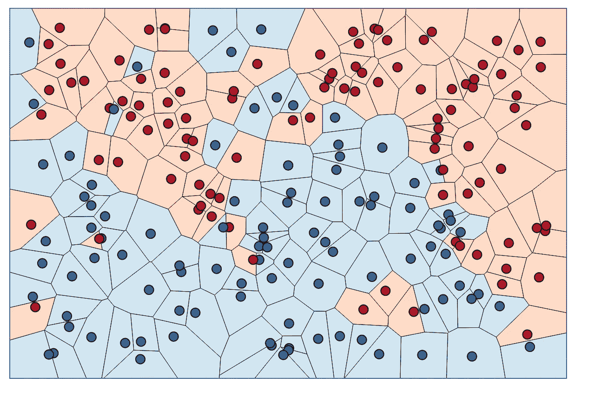
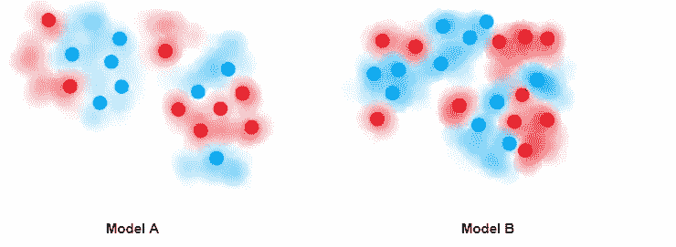

# 为什么过度拟合会导致高方差？

> 原文：<https://medium.com/mlearning-ai/why-overfitting-leads-to-high-variance-73c994723bc9?source=collection_archive---------9----------------------->

很多人不理解过度拟合和高方差之间的关系。让我们在正确的上下文中探讨一下高方差的含义。

Photo by [JESHOOTS.COM](https://unsplash.com/@jeshoots?utm_source=medium&utm_medium=referral) on [Unsplash](https://unsplash.com?utm_source=medium&utm_medium=referral)

# 什么是过度拟合？

假设您想将数据分为*正类和负类*。
对于一组给定的训练数据，*如果模型创建了一个决策边界，使得每一个数据点都被正确分类，那么它就被称为过拟合*。

***让，蓝点=正类&红点=负类***

Credit: Kevin Zakka’s Blog

你知道，过度拟合的问题是，每个数据点都被模型看得太重，以至于决策边界看起来非常混乱，而且明显不正确。
模型没有大脑认为一些数据点可能是异常值和噪音，为这些点创建决策边界是错误的！
*过度拉伸过度过度拟合！*

## 解决方案:

我们需要通过说“没关系，宝贝，不要爱上你周围的每个男人，放过一些坏人”来放松这个模型😃我将在另一篇博客中讨论解决方案部分。

# 那又怎样？高方差是怎么回事？

**一个事实:** *这里的高方差与很多人混淆的统计方差无关。*

**高方差:** *如果您在另一组训练数据上训练模型时，模型的决策边界变化很大，则该模型被称为具有高方差。*

比较*模型 A* 和*模型 b 的决策边界* 模型 A 的训练数据集与模型 b 的不同

两个模型都有过拟合，因此模型 A 和模型 b 的决策边界不同。

*你看，由于过度拟合，每次你在不同的训练数据集上训练模型时，模型都会创建一个特定于该特定训练数据集的新决策边界，但我们希望模型也为未来看不见的数据推广决策边界，对吗？这就是为什么高方差是不好的，嗯？*

高方差将使模型无法处理未来看不见的数据点。减少模型方差将确保由模型创建的决策边界对于真实世界的情况更通用。
***还有我们如何降低高方差？*** 不要把每一个单独的训练数据点看得太重，放过一些嘈杂和离群的点，简而言之，停止过度拟合。

这就是为什么过度拟合会导致高方差，酷。🙌

# 结论:

1.  *过拟合发生在模型挑选坏人，建立决策边界的时候。*
2.  *在过度拟合期间，决策边界特定于给定的训练数据集，因此如果您使用新的训练数据集再次构建模型，它肯定会改变。*
3.  *当每次使用新的训练数据集构建模型时决策边界都发生变化时，则该模型具有很高的方差。*
4.  *因此，过度拟合→高方差。*
5.  *快乐学习！* ❤️

# 与我联系:

***邮箱****:saurav@guptasaurav.com* ***LinkedIn****:*[*https://www.linkedin.com/in/sauravgupta20*](https://www.linkedin.com/in/sauravgupta20/)

 [## Mlearning.ai 提交建议

### 如何成为 Mlearning.ai 上的作家

medium.com](/mlearning-ai/mlearning-ai-submission-suggestions-b51e2b130bfb)