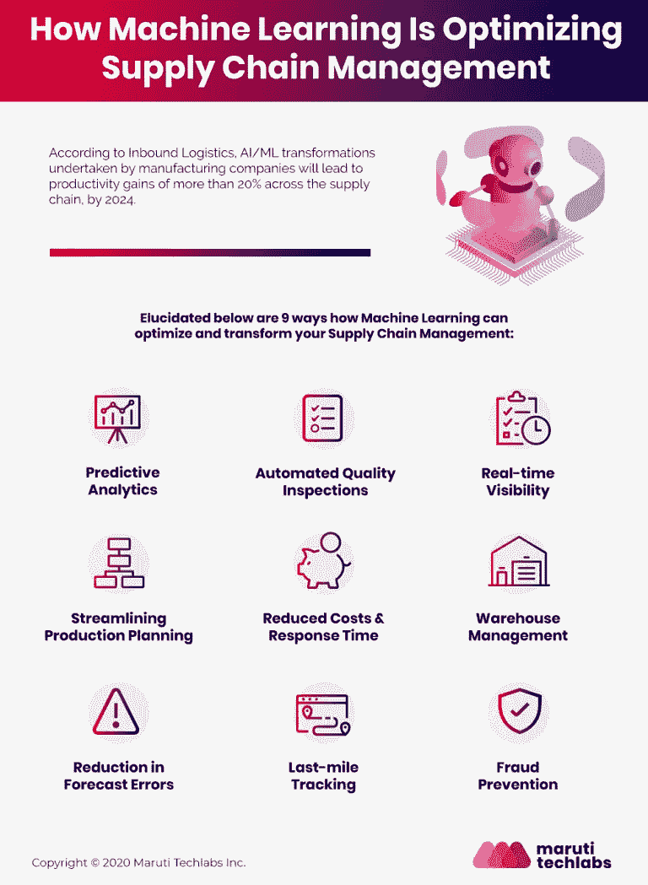

# 为什么供应链管理需要机器学习

> 原文：<https://medium.com/mlearning-ai/why-supply-chain-management-needs-machine-learning-da610ec5647?source=collection_archive---------0----------------------->

像[机器学习(ML)和人工智能(AI)](https://marutitech.com/artificial-intelligence-and-machine-learning/?utm_source=medium&utm_medium=content_promotion&utm_campaign=ML_in_supplychain) 这样的现代颠覆性技术让它们在当今竞争激烈的市场中崭露头角。组织不断尝试提高利润率、削减开支并提供卓越的客户体验。

很明显，人工智能和机器学习已经成为各种行业的流行语，但它们的作用是什么，当涉及到供应链管理时，它们意味着什么？

在物流和供应链管理中使用[机器学习](https://marutitech.com/machine-learning-in-supply-chain/?utm_source=medium&utm_medium=content_promotion&utm_campaign=ML_in_supplychain)可能有助于各种常规流程的自动化，使企业能够专注于更具战略意义的重大业务运营。人工智能和机器学习应用可以在供应链流程的每个元素中看到，包括生产、库存管理、采购、仓储、运输和客户支持。

经理们可能会使用智能供应链机器学习工具来优化库存，并发现最佳供应商，以保持他们的业务顺利运营。在物流中使用[机器学习服务](https://marutitech.com/machine-learning-services/?utm_source=medium&utm_medium=content_promotion&utm_campaign=ML_in_supplychain)激起了越来越多企业的兴趣，因为它有许多好处，包括能够充分利用仓库、运输网络和工业产生的大量数据。

它还可以帮助企业开发一个完整的机器智能驱动的供应链模型，以降低风险，增加洞察力，提高绩效，所有这些都是全球竞争供应链的关键组成部分。

# 为什么供应链管理需要机器学习

为了更好地了解物流中的机器学习如何越来越多地帮助企业检修供应链，我们需要首先看看供应链流程面临的挑战，以了解机器学习正在解决的痛点。

*   **库存管理:**库存管理对于供应链管理至关重要，因为它帮助企业应对和应对意外短缺。没有一个供应链组织愿意在寻找新的供应商时暂停生产。同样，他们也不希望库存过多，因为这会降低盈利能力。因此，在物流中使用机器学习可以大大减轻库存管理的负担。
*   **产品质量与安全:**维持对质量与安全的双重检查以及对准时生产物品的不断提高的要求以保持供应链装配线的运转成为供应链组织的一个重大问题。接受不符合质量或安全要求的劣质零件可能会带来重大安全风险。此外，环境变化、贸易冲突和供应链上的其他此类压力可能会扩散为问题和危险，给整个供应链造成严重困难。
*   **稀缺资源:**供应链管理经常受到各种约束的挑战，比如存储、供应商、制造、运输等约束。然而，物流和供应链中的[人工智能使得理解许多方面变得更加容易。基于各种参数估计需求和供应的算法允许进行早期规划和库存。](https://marutitech.com/artificial-intelligence-in-logistics/?utm_source=medium&utm_medium=content_promotion&utm_campaign=ML_in_supplychain)
*   **供应商关系管理:**物流公司面临的另一个问题是供应链专业知识的严重缺乏，这使得供应商关系管理效率低下且无成效。人工智能和 ML 物流可以为供应商数据提供有用的见解，并帮助供应链企业做出实时选择。

# 机器学习如何惠及供应链

[物流领域的机器学习服务](https://marutitech.com/machine-learning-services/?utm_source=medium&utm_medium=content_promotion&utm_campaign=ML_in_supplychain)为供应链流程和运营带来非凡的好处，从资源优化、风险缓解、改善现金流到更快的交付、更好的预测、改善合规性和卓越的客户服务。供应链机器学习算法也有助于洞察自动化在哪里可以提供最大规模的好处。下面提到的是机器学习可以提供的各种好处:

*   检测异常
*   [利用机器学习防止欺诈](https://marutitech.com/machine-learning-in-supply-chain/?utm_source=medium&utm_medium=content_promotion&utm_campaign=ML_in_supplychain)
*   请求预报
*   交货预测
*   实时路线优化
*   实时包裹跟踪
*   实时问题解决
*   成本优化
*   产品流程的优化
*   自动化手动任务
*   动态决策
*   探伤
*   改善客户服务
*   强化采购管理
*   计划和维护

# 结论

在物流中使用机器学习可以减少浪费和提高质量，从而提高成本效率。人工智能和其他创新技术简化了应对波动和正确预测全球供应链需求的过程。

然而，为了充分受益于[机器学习服务](https://marutitech.com/machine-learning-services/?utm_source=medium&utm_medium=content_promotion&utm_campaign=ML_in_supplychain)，企业必须计划并开始投资机器学习和相关技术，以体验供应链部门中增强的盈利能力、效率和资源可用性。点击这里与我们联系[了解更多关于机器学习的好处及其对你的业务的影响。](https://marutitech.com/contact-us/?utm_source=medium&utm_medium=content_promotion&utm_campaign=ML_in_supplychain)

 [## Mlearning.ai 提交建议

### 如何成为 Mlearning.ai 上的作家

medium.com](/mlearning-ai/mlearning-ai-submission-suggestions-b51e2b130bfb)