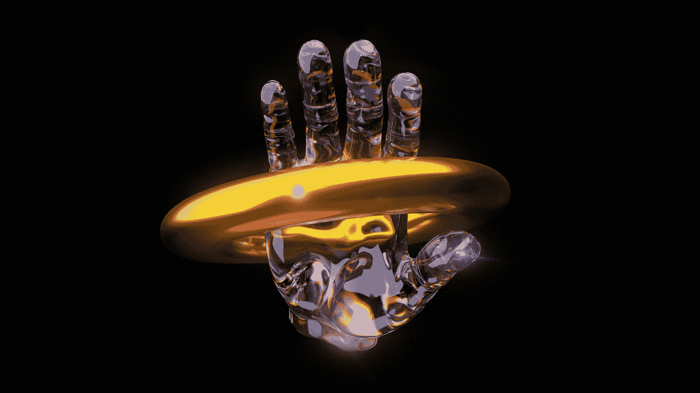

# 为什么科技在人工智能艺术进入新的一年上下了大赌注

> 原文：<https://medium.com/mlearning-ai/why-tech-is-betting-big-on-ai-generated-art-going-into-the-new-year-c9ab93bfad8d?source=collection_archive---------6----------------------->

## 比你想象的要复杂

Photo by [Axel Ruffini](https://unsplash.com/es/@4xel?utm_source=medium&utm_medium=referral) on [Unsplash](https://unsplash.com?utm_source=medium&utm_medium=referral)

硅谷正在热烈讨论一种新的人工智能——生殖人工智能。

这是一个有点新的领域，最近几周受到了广泛的欢迎和关注，这要归功于社交媒体上源源不断的新奇——有时非常怪异——的数字艺术作品。的…