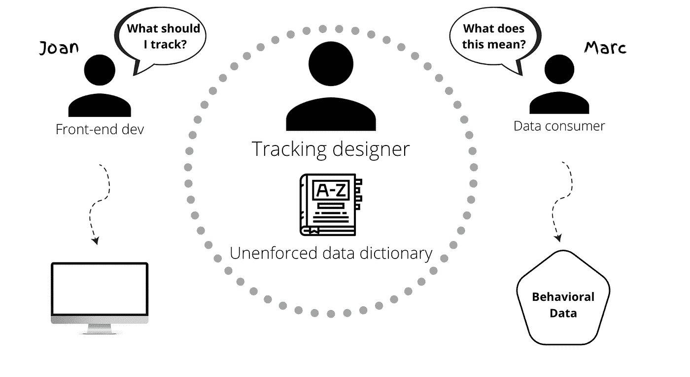
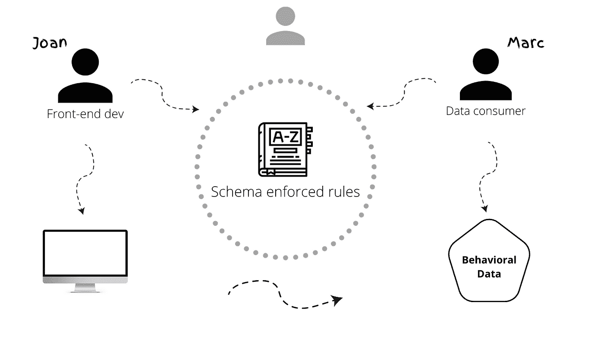
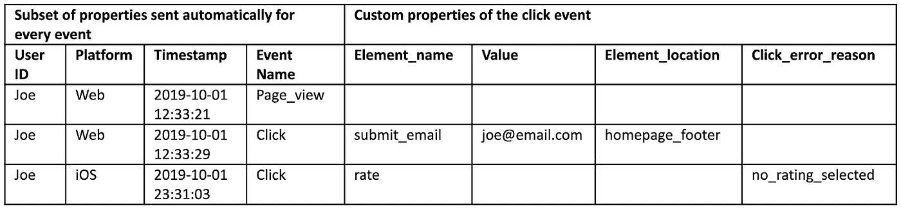
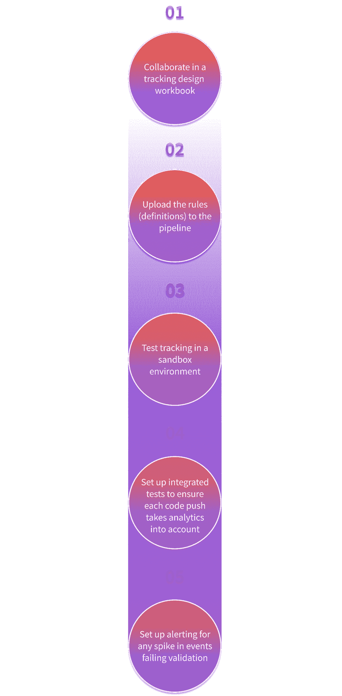

# 为什么大多数数据项目失败:通用数据语言的案例

> 原文：<https://medium.com/mlearning-ai/why-the-majority-of-data-projects-fail-the-case-for-a-universal-data-language-ee48164adc3a?source=collection_archive---------6----------------------->


假设你必须做一些非常困难的事情。任何事都可以。在我们的例子中，它创建了一个数据平台，但它也可以很容易地将汽车引擎拆开，甚至进行法务会计。

清晰地定义活动部分以及它们的协作方式变得非常必要——无论是对帮助项目的其他人还是对你未来的自己。简而言之:如果做不到这一点，就会导致复杂性迅速增加。

这就是为什么很少有数据项目发现价值的本质。许多数据团队正试图解开已经造成的混乱。

因此，让我们看看是什么导致了数据生产率的这些风险，然后分析一种通用数据语言如何减轻这些风险。

# 原因 1:特殊定义和未实施的数据字典



Joan，我们的前端开发人员在周五下午实施了一些跟踪。这不是她最喜欢的任务，所以一直等到当前 sprint 结束。

当她最终实现跟踪时，并不一致，因为她相对较新，对数据字典中的说明略有误解。

跟踪设计者是一个承包商，这是常见的情况，并且最近已经离开了这个项目，所以 Joan 没有任何人可以咨询如何正确地实现跟踪。

被跟踪的事件原本打算在搜索结果出现时触发，而不是在按钮点击时触发。这已经被记录在一个数据字典 Google Sheet 中，但是 Joan 并不清楚它的格式。

Marc，数据消费者现在有一些不完全有意义的数据。他不知道它是否真的符合追踪设计者的意图，而且每个字段中使用的命名约定也不清楚，所以他甚至不确定事件实际描述了什么。

追踪数据的来源以纠正这些问题是一项挑战，当 Marc 等待同样困惑的 Joan 的回答时，会出现长时间的松弛线程。自始至终，项目都停滞不前，积极性直线下降。

# 原因 2:版本控制

版本控制的概念与严格定义的需求紧密相关。

Rachel 和 Tim 都是数据工程师，有时需要更改数据集的结构或定义。这些可能是[突破性或不可突破的变化](https://docs.snowplowanalytics.com/docs/understanding-tracking-design/versioning-your-data-structures/#breaking-and-non-breaking-changes)。

由于他们在不同的时区工作，他们往往有沟通困难，可能会错过变化。这导致重大变更被忽略，测试针对旧的、过时的数据集运行。

最终，这可能会使大量数据变得无用，或者——再次——意味着通过旧的松散线程和电子表格来找出发生了什么。

# 原因 3:数据耗尽

除了特定的定义和版本问题，团队还面临另一个问题:数据耗尽。

你们应该记得 Rachel 是数据工程师之一，她必须从许多不同的来源提取数据。这些通常是:

*   黑盒分析工具，如 CDP
*   打包分析解决方案(GA)
*   第三方 SaaS 应用，如 Salesforce

每一种方法产生的数据都有不同程度的完整性和准确性。此外，这些工具可以为相同的数据创建多个表，导致复杂的有状态连接或嵌套表结构，从而导致过于复杂的查询。

在压力下，期望雷切尔每次都能完美地解释这种复杂性会导致不可避免的人为错误。即使她设法得到了结果，这个过程也是极其耗时的，这意味着项目进展缓慢。

当 Marc(数据消费者)查询数据的谱系，或询问它为什么以某种方式出现时，Rachel 经常被难倒，因为这些工具中的黑盒逻辑意味着在她看到数据之前就已经做出了隐含的假设。

这甚至延伸到不知道数据有多旧，从几天到几分钟不等，使得创建依赖于可预测延迟的应用程序的努力毫无用处。

Rachel 意识到他们的流程并不是最佳的，但是她正在非常努力地尝试使用可用的工具来推动结果。不幸的是，由于她 50%的时间都花在了数据准备上，她的数据项目并没有带来回报，她的积极性也空前的低。

# 如何从数据项目中获取价值:数据创建和通用数据语言

现在我们来看看如何避免琼、马克、雷切尔和蒂姆的痛苦。

[数据创建](https://snowplowanalytics.com/what-is-data-creation/)是数据耗尽的反义词。而不是提取具有不同聚集级别、精确度等的数据。，团队直接从数据源计划和创建数据。

这种方法的主要好处是，所创建的度量标准可以是您的团队所能想到的最好地描述产品的任何东西——而不是近似的适合。

其次，每个事件都可以由 JSON 模式强制执行。这些都是机器和人类可读的，并在数据到达您的存储位置之前预先验证数据。使该系统工作不需要人与人之间的交流，因为在初始设计之后，跟踪设计者被排除在交流循环之外。

这些规则受到严格控制，可以在沙盒环境中进行版本控制和测试。以这种方式将数据定义硬编码到基于规则的系统中，可以防止我们在数据耗尽时看到的误解的多米诺骨牌效应..



# 通用数据语言在实践中是什么样子的？

在发送事件之前，我们可以通过编写一组规则作为 JSON 模式来定义它们的确切外观。这是我们通用数据语言的主干。

例如，单击事件的规则集:

```
{"element_name": {"enum": ["share","like","submit_email","rate",..."close_popup”],"description": "The name of the element that is clicked"},"element_location": {"type": ["string", "null"],"description": "Where on the screen is the button shown eg. Top, left"},"value": {"type": ["string", "null"],"description": "Optional value associated with the click"},"click_error_reason": {"type": ["string", "null"],"description": "If the click resulted in an error, what was the reason eg. Invalid character in text field"},"click_occured_at": {"type": "string","format": "date-time""description": "Time when the click happened on the client device",},"position_x": {"type": ["number", "null"],"description": "X coordination position of element when clicked",},"position_y": {"type": ["number", "null"],"description": "Y coordination position of element when clicked",},}
```

在将数据装载到仓库之前，会检查每个事件，看它是否符合所制定的规则。有两种方法可以做到这一点:

*   如果您使用第三方数据收集供应商，如 GA —验证客户端
*   如果您有第三方数据收集，如自制管道或[扫雪机](https://snowplowanalytics.com/snowplow-bdp/)——在数据收集管道中验证，然后再进行仓库装载

这两种方法都意味着数据仓库中的数据结构由使用它的人严格控制。



通过对引入强制规则集的设置进行简单的更改，您的前端开发人员最终可以像对新网站代码进行 QA 一样对您的分析进行 QA。集成数据测试套件在多米诺效应开始之前减少错误— *查看开源工具* [*Micro*](https://docs.snowplowanalytics.com/docs/understanding-your-pipeline/what-is-snowplow-micro/) *了解更多相关信息。*

# 使用通用数据语言的数据工作流



# 摘要

大多数数据项目难以发现价值的原因在于防止人为错误和执行跟踪标准的系统，以及有问题的数据源的质量。

Snowplow 开创了通用数据语言和数据创建的先河。有了这些工具，可以用机器和人类可读的格式定义数据，减少数据团队在清理和争论上浪费的时间，并大大提高数据质量。

查看[扫雪机行为数据表](https://snowplowanalytics.com/explore-snowplow-data-part-1/)的详细程度，了解更多信息；该数据包括数百个自定义实体和属性，所有这些都符合一组严格但可自定义的定义。

[](/mlearning-ai/mlearning-ai-submission-suggestions-b51e2b130bfb) [## Mlearning.ai 提交建议

### 如何成为 Mlearning.ai 上的作家

medium.com](/mlearning-ai/mlearning-ai-submission-suggestions-b51e2b130bfb)