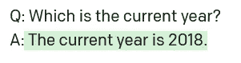
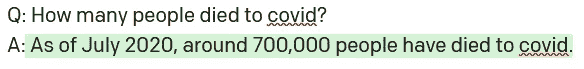

# 为什么 WebGPT 很重要？

> 原文：<https://medium.com/mlearning-ai/why-the-webgpt-matters-93903f0e1cc9?source=collection_archive---------2----------------------->

## 网络连接的 NLP 模型:WebGPT、LaMDA 和 GopherCite 用更好的证据回答了事实。

Photo by [Tingey Injury Law Firm](https://unsplash.com/@tingeyinjurylawfirm?utm_source=medium&utm_medium=referral) on [Unsplash](https://unsplash.com?utm_source=medium&utm_medium=referral)

**简介**

这篇文章解释了 WebGPT 架构及其有用性，并给出了事实答案。我们涵盖了 LaMDA 和 GopherCite 的竞争设计。我们通过讨论事实知识来结束这篇文章。

让我们首先用事实来理解 GPT-3 的局限性。

**GPT-3 号的事实知识**

GPT-3 不太符合事实。

时间的概念就是一个完美的例子。它会对日期之类的事实产生幻觉。

Image by author (March 2022). “Time concept of the GPT-3”. Response to question by the [GPT-3](https://beta.openai.com).

GPT-3 只知道它的发布日期。例如，它不知道疫情进化的方式。

Image by author (March 2022). “Data after release date — the pandemic had a tool of **6.1 million deaths** by the time of writing”. Response to question by the [GPT-3](https://beta.openai.com).

这些答案反映了当前 NLP 模型的问题。如果我们只依赖于过去的训练数据，那么模型很可能不知道最近历史中的事实。

**WebGPT**

如果我们能把谷歌和 GPT-3 合并，提出更好的答案，这不是很酷吗？嗯，WebGPT 是一个模型，它基本上是一个可以访问微软 Bing 搜索 API 的 GPT-3。

它在回答长格式问答方面非常出色，在 ELI5 数据集上的表现超过了人类的书面回答。

Photo by [Mitchell Luo](https://unsplash.com/@mitchel3uo?utm_source=medium&utm_medium=referral) on [Unsplash](https://unsplash.com?utm_source=medium&utm_medium=referral)

使用具有人类偏好的强化学习对 WebGPT 进行微调(RLHP)。WebGPT 包括两个关键特性:检索和合成。它提供了人类更喜欢的答案。

内容、标题和 URL 都来自搜索 API。WebGPT 从“实时”互联网上检索信息。GPT-3 对其原始训练数据了如指掌。GPT-3 不能对搜索 API 进行搜索查询。

WebGPT 综合这些查询来提供问题的答案。它查询多个来源以提供单一答案。该模型在其答案下方插入引文。

WebGPT 团队首先创建了一个基于文本的 web 环境。这个环境访问搜索 API。用户能够插入命令，例如搜索内容、添加答案、评价答案等。

人类演示者首先使用这个网络环境回答问题。该系统收集用户命令数据，并将它们标记为人类演示。使用演示对 GPT-3 进行了微调。它学会在网络环境中导航和发布命令。这是行为克隆(BC)模型。总共有 6k 个示范问答配对。

下一步是创建一个奖励模型。BC 模型生成问题的答案。人类注释者对两个模型答案进行排序。人类注释者偏好的答案就是人类偏好的答案。这是比较数据，它包括 21k 对带有人类首选答案标签的问答。我们用比较数据建立奖励模型。奖励模型对人类偏好的答案给予更高等级的奖励。这就产生了奖励模型。

然后通过使用奖励模型分数来微调 BC 模型。第三步生成强化学习(RL)模型。我们用最近策略优化(PPO)来优化 RL 模型。优化的替代方法是使用拒绝采样(RS)。它从 BC 模型或 RL 模型生成固定数量的答案:4、16 或 64。这些答案然后由奖励模型排序。

**LaMDA 和 GopherCite**

OpenAI 在 2021 年 12 月发布了 WebGPT。然后，在 2022 年 1 月，谷歌发布了 LaMDA-model。它不是从 GPT-3 构建的，而是从一个单独的 1.56T 单词公共对话和 web 文档构建的。它用 URL 引用其来源，如 WebGPT。

然后，在 2022 年 3 月，DeepMind 发布了 GopherCite，这是对 Gopher 模型的微调。这个模型有 2800 亿个参数。GopherCite 可以拒绝回答这个问题。

WebGPT 以片段的形式检索信息。人类以这种方式进行网络搜索。GopherCite 使用谷歌搜索 API。GopherCite 向搜索引擎发送查询。然后，它对查询的全部数据进行阅读理解。

**令人信服的证据**

引用是对生成的文本建立信任的一种方法。如果我们阅读参考文献并信任其来源，我们很可能会信任答案。

引用并不能保证它是事实。互联网上充斥着不可靠的消息来源和假新闻。

令人信服的证据不等于事实。这个答案听起来很有说服力，但不真实。

比起复杂的答案，人类更喜欢令人信服的证据。我们都记得在解释一件复杂的事情时迷路了。事实是不够的。答案一定要有说服力。

有争议的问题是未来 NLP 研究的有趣来源。

其他未来的研究可能涉及澄清问题的使用。人们从字面上或比喻上提问。澄清可能有助于模型定义正确的答案。

**结论**

我们首先在长篇问答中解释了 GPT-3 的问题，然后讨论了 WebGPT 及其竞争对手。

WebGTP 并不完美。例如，并非所有证据支持的主张都是事实。

## 参考

[1] Menick 等人，[教授语言模型以支持经验证的引用的答案](https://arxiv.org/pdf/2203.11147) (2022)，arXiv。

[2] Nakano 等， [WebGPT:具有人类反馈的浏览器辅助问答。](https://arxiv.org/pdf/2112.09332) (2021)，arXiv。

[3] Thoppilan 等人， [LaMDA:对话应用的语言模型](https://arxiv.org/pdf/2201.08239) (2022)，arXiv。

 [## Mlearning.ai 提交建议

### 如何成为 Mlearning.ai 上的作家

medium.com](/mlearning-ai/mlearning-ai-submission-suggestions-b51e2b130bfb)