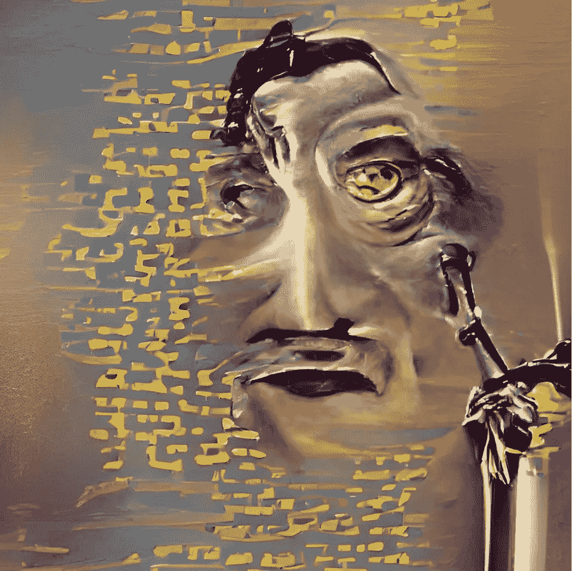

# 为什么明天的诗人会使用人工智能

> 原文：<https://medium.com/mlearning-ai/why-tomorrows-poets-will-use-artificial-intelligence-5b71ae22d4fe?source=collection_archive---------4----------------------->

Image produced by Wombo.Art Ai (used with permission).

明天的诗人会用 Ai 创作原创诗歌，因为昨天的伟大诗歌总是从一个事物的网络中涌现出来。

太多时候，我们认为诗歌仅仅来自个人的内心或思想。但是就像任何其他写作一样…诗歌不能离开其他人、其他诗歌以及这些技术和语言网络而存在…